# Design Document: Cinematic Onboarding Experience

## Overview

The Cinematic Onboarding Experience is a GPU-accelerated, scroll-driven 3D journey built with React Three Fiber and Three.js that transforms users' understanding of the Software Intelligence Platform. The experience visualizes the transformation of raw source code into structured intelligence through eight interconnected scenes rendered in WebGL.

**Core Technologies:**
- **React Three Fiber (R3F)**: React renderer for Three.js providing declarative 3D scene composition
- **Three.js**: WebGL abstraction library for 3D graphics rendering
- **GSAP ScrollTrigger**: Scroll-to-animation synchronization engine
- **@react-three/drei**: Helper components for camera controls, loaders, and effects
- **Framer Motion**: Supplementary animations for 2D UI overlays
- **Zustand**: Lightweight state management for scene and interaction state

**Key Design Principles:**
1. **Performance-first architecture**: 60 FPS target across hardware tiers through LOD, instancing, and frustum culling
2. **Progressive enhancement**: Core experience degrades gracefully for lower-powered devices
3. **Modular scene composition**: Each scene is an isolated React component with defined lifecycle
4. **Data-driven configuration**: Scene parameters, camera paths, and particle behaviors defined in JSON
5. **Accessibility without compromise**: Full keyboard navigation and reduced-motion modes without removing the experience


**Visual Narrative Flow:**
```
Scene 1 (0%) → Scene 2 (17%) → Scene 3 (33%) → Scene 4 (50%) → 
Scene 5 (67%) → Scene 6 (83%) → Scene 7 (100%) → Scene 8 (Completion)

The Chaos → Stardust → Constellations → Planets → Solar Systems → 
Decision Rings → Reasoning Network → Knowledge Universe
```

## Architecture

### High-Level System Architecture

```mermaid
graph TB
    subgraph "Presentation Layer"
        UI[UI Overlay Components]
        Canvas[R3F Canvas Container]
    end
    
    subgraph "Control Layer"
        ScrollCtrl[Scroll Controller]
        CameraCtrl[Camera Controller]
        SceneMgr[Scene Manager]
        InteractionMgr[Interaction Handler]
        AccessibilityCtrl[Accessibility Controller]
    end
    
    subgraph "Rendering Layer"
        Scene1[Scene 1: Chaos]
        Scene2[Scene 2: Stardust]
        Scene3[Scene 3: Constellations]
        Scene4[Scene 4: Planets]
        Scene5[Scene 5: Solar Systems]
        Scene6[Scene 6: Decision Rings]
        Scene7[Scene 7: Reasoning Network]
        Scene8[Scene 8: Universe]
        PostFX[Post-Processing Pipeline]
    end
    
    subgraph "Support Systems"
        ParticleSys[Particle System Engine]
        AssetLoader[Asset Loader]
        PerfMonitor[Performance Monitor]
        AudioSys[Audio System]
        Analytics[Analytics Tracker]
    end
    
    subgraph "Data Layer"
        SceneConfig[Scene Configuration JSON]
        CameraRails[Camera Rail Definitions]
        ParticleData[Particle Behavior Data]
        InteractionHotspots[Interaction Metadata]
    end
    
    UI --> Canvas
    ScrollCtrl --> CameraCtrl
    ScrollCtrl --> SceneMgr
    CameraCtrl --> Scene1
    CameraCtrl --> Scene2
    CameraCtrl --> Scene3
    CameraCtrl --> Scene4
    CameraCtrl --> Scene5
    CameraCtrl --> Scene6
    CameraCtrl --> Scene7
    CameraCtrl --> Scene8
    SceneMgr --> AssetLoader
    ParticleSys --> Scene1
    ParticleSys --> Scene2
    ParticleSys --> Scene3
    ParticleSys --> Scene4
    ParticleSys --> Scene5
    ParticleSys --> Scene6
    ParticleSys --> Scene7
    InteractionMgr --> UI
    Scene8 --> PostFX
    PerfMonitor --> ParticleSys
    PerfMonitor --> PostFX
    AccessibilityCtrl --> ScrollCtrl
    AccessibilityCtrl --> UI
    SceneConfig --> SceneMgr
    CameraRails --> CameraCtrl
    ParticleData --> ParticleSys
    InteractionHotspots --> InteractionMgr
```




### Component Hierarchy

```
<OnboardingApp>
  ├── <ProgressIndicator />
  ├── <AudioToggle />
  ├── <SkipButton />
  ├── <NavigationHints />
  ├── <Canvas> (R3F Canvas)
  │   ├── <CameraRig>
  │   │   └── <PerspectiveCamera />
  │   ├── <SceneContainer>
  │   │   ├── <ChaosScene active={scene===1} />
  │   │   ├── <StardustScene active={scene===2} />
  │   │   ├── <ConstellationScene active={scene===3} />
  │   │   ├── <PlanetScene active={scene===4} />
  │   │   ├── <SolarSystemScene active={scene===5} />
  │   │   ├── <DecisionRingScene active={scene===6} />
  │   │   ├── <ReasoningNetworkScene active={scene===7} />
  │   │   └── <UniverseScene active={scene===8} />
  │   ├── <ParticleSystemManager />
  │   ├── <InteractionRaycaster />
  │   ├── <EffectComposer>
  │   │   ├── <Bloom />
  │   │   ├── <DepthOfField />
  │   │   └── <SSAO />
  │   └── <PerformanceMonitor />
  ├── <InfoCard />
  └── <AnalyticsProvider />
</OnboardingApp>
```


### Architecture Layers

**1. Presentation Layer**
- React components for 2D UI overlays (progress indicators, info cards, navigation hints)
- R3F Canvas wrapper providing WebGL context
- Framer Motion animations for overlay transitions

**2. Control Layer**
- **Scroll Controller**: Maps scroll position (0-100%) to journey progress
- **Camera Controller**: Interpolates camera position/rotation along predefined rails
- **Scene Manager**: Handles scene activation, asset loading, and transitions
- **Interaction Handler**: Raycasting, hover detection, click handling for 3D objects
- **Accessibility Controller**: Keyboard navigation, reduced motion, skip functions

**3. Rendering Layer**
- Eight scene components, each responsible for rendering a specific narrative segment
- Post-processing pipeline for bloom, depth of field, SSAO effects
- Shared particle system for code fragments, entities, and visual effects

**4. Support Systems**
- **Particle System Engine**: GPU-accelerated instanced mesh rendering for 10k-100k particles
- **Asset Loader**: Lazy loading, caching, and preloading of 3D models and textures
- **Performance Monitor**: Frame rate tracking and automatic quality adjustment
- **Audio System**: Ambient soundtrack, spatial audio, and sound effects
- **Analytics Tracker**: User engagement, scene transitions, interaction events


**5. Data Layer**
- Scene configurations stored as JSON defining particle counts, colors, animations
- Camera rail definitions with position/rotation keyframes
- Particle behavior parameters (velocity, gravity, clustering algorithms)
- Interaction hotspot metadata (tooltips, entity details, decision rationales)

## Components and Interfaces

### 1. Scroll Controller

**Responsibility:** Translates user scroll input into normalized journey progress (0-1)

**Interface:**
```typescript
interface ScrollController {
  // Current scroll position normalized to [0, 1]
  progress: number;
  
  // Subscribe to scroll progress changes
  onProgressChange(callback: (progress: number) => void): UnsubscribeFn;
  
  // Manually set scroll position (for keyboard navigation)
  setProgress(progress: number): void;
  
  // Get current scene based on progress
  getCurrentScene(): SceneNumber;
}
```

**Key Design Decisions:**
- Uses GSAP ScrollTrigger with scrub enabled for 1:1 scroll-to-progress mapping
- Implements smooth interpolation with 200ms settling time when scroll stops
- Clamps progress to [0, 1] preventing over-scroll
- Provides scene boundaries at [0, 0.17, 0.33, 0.50, 0.67, 0.83, 1.0]


### 2. Camera Controller

**Responsibility:** Manages camera position and rotation along predefined rails synchronized with scroll

**Interface:**
```typescript
interface CameraController {
  // Update camera based on current progress
  updateCamera(progress: number): void;
  
  // Get camera position at specific progress
  getCameraState(progress: number): CameraState;
  
  // Add manual camera offset (for mouse parallax)
  addOffset(offset: Vector3): void;
}

interface CameraState {
  position: Vector3;
  rotation: Euler;
  fov: number;
  target: Vector3; // Look-at target
}
```

**Key Design Decisions:**
- Camera rails defined as Catmull-Rom splines for smooth curvature
- Each scene has 3-5 keyframes defining camera positions
- Interpolation uses cubic easing for natural acceleration/deceleration
- Supports look-at targets for automatic rotation toward focal points
- Allows additive offsets for subtle mouse-driven parallax without breaking main animation


### 3. Scene Manager

**Responsibility:** Orchestrates scene lifecycle, asset loading, and transitions

**Interface:**
```typescript
interface SceneManager {
  // Load scene assets
  loadScene(sceneNumber: SceneNumber): Promise<void>;
  
  // Activate scene rendering
  activateScene(sceneNumber: SceneNumber): void;
  
  // Deactivate and unload scene
  unloadScene(sceneNumber: SceneNumber): void;
  
  // Get scene loading status
  getSceneStatus(sceneNumber: SceneNumber): SceneStatus;
  
  // Preload next scene in background
  preloadNextScene(currentScene: SceneNumber): void;
}

enum SceneStatus {
  UNLOADED = 'unloaded',
  LOADING = 'loading',
  READY = 'ready',
  ACTIVE = 'active'
}
```

**Key Design Decisions:**
- Implements lazy loading: only current scene + next scene are loaded
- Unloads scenes >2 positions away to conserve memory
- Scene transitions overlap: new scene fades in while old fades out (500ms crossfade)
- Loading states prevent jarring pop-in with placeholder low-poly geometry
- Caches loaded assets in IndexedDB for repeat visits


### 4. Particle System Engine

**Responsibility:** GPU-accelerated rendering of massive particle arrays with instanced meshes

**Interface:**
```typescript
interface ParticleSystem {
  // Create particle instance pool
  createParticles(config: ParticleConfig): ParticleGroup;
  
  // Update particle positions/colors per frame
  updateParticles(groupId: string, updateFn: ParticleUpdateFn): void;
  
  // Apply animation to particle group
  animateParticles(groupId: string, animation: ParticleAnimation): void;
  
  // Destroy particle group
  destroyParticles(groupId: string): void;
}

interface ParticleConfig {
  count: number;
  geometry: BufferGeometry;
  material: Material;
  initialPositions: Float32Array | PositionGenerator;
  initialColors?: Float32Array;
  instanceAttributes?: Record<string, Float32Array>;
}

type ParticleUpdateFn = (index: number, deltaTime: number) => {
  position?: Vector3;
  color?: Color;
  scale?: number;
  visible?: boolean;
};
```


**Key Design Decisions:**
- Uses `THREE.InstancedMesh` for rendering 10k-100k particles in single draw call
- Particle attributes stored in instanced buffer attributes for GPU-side updates
- Compute shaders (via CustomShaderMaterial) handle physics simulations (gravity, velocity, attraction)
- LOD system: particles far from camera use billboarded quads, close particles use low-poly geometry
- Frustum culling implemented at instance level to skip off-screen particles
- Texture atlases reduce material switches when rendering diverse particle types

**Performance Characteristics:**
- Scene 1 (Chaos): 50,000-100,000 particles at 60 FPS
- Scene 2 (Stardust): 10,000-50,000 particles at 60 FPS
- Scene 3-8: 5,000-30,000 particles depending on complexity

### 5. Interaction Handler

**Responsibility:** Detects user interactions with 3D objects through raycasting

**Interface:**
```typescript
interface InteractionHandler {
  // Register interactive object
  registerInteractive(object: Object3D, metadata: InteractionMetadata): void;
  
  // Unregister interactive object
  unregisterInteractive(object: Object3D): void;
  
  // Subscribe to hover events
  onHover(callback: (object: Object3D | null, metadata?: InteractionMetadata) => void): UnsubscribeFn;
  
  // Subscribe to click events
  onClick(callback: (object: Object3D, metadata: InteractionMetadata) => void): UnsubscribeFn;
}

interface InteractionMetadata {
  type: 'particle' | 'planet' | 'decision' | 'node';
  title: string;
  description: string;
  details?: Record<string, any>;
}
```


**Key Design Decisions:**
- Uses `THREE.Raycaster` updated on mouse move with throttling (60ms)
- Maintains spatial index (octree) of interactive objects for fast intersection tests
- Hover highlights applied via outline shader (edge detection post-process)
- Click events pause camera progression while info card is expanded
- Supports both mouse and keyboard interactions (tab navigation + enter/space to activate)

### 6. Asset Loader

**Responsibility:** Progressive loading and caching of 3D assets

**Interface:**
```typescript
interface AssetLoader {
  // Load 3D model
  loadModel(url: string, format: 'gltf' | 'glb'): Promise<Group>;
  
  // Load texture with compression
  loadTexture(url: string, format: 'webp' | 'basis'): Promise<Texture>;
  
  // Preload asset in background
  preload(urls: string[]): Promise<void>;
  
  // Check if asset is cached
  isCached(url: string): boolean;
  
  // Clear cache
  clearCache(): Promise<void>;
}
```

**Key Design Decisions:**
- Implements IndexedDB caching for assets with cache-busting based on version hash
- Uses draco compression for GLTF models (60-80% size reduction)
- Loads textures in WebP format with basis universal fallback
- Priority queue: critical scene assets load first, decorative assets load last
- Shows loading progress with granular percentage updates
- Implements retry logic with exponential backoff for failed loads


### 7. Performance Monitor

**Responsibility:** Tracks rendering performance and triggers quality adjustments

**Interface:**
```typescript
interface PerformanceMonitor {
  // Get current FPS
  getCurrentFPS(): number;
  
  // Get quality tier
  getQualityTier(): QualityTier;
  
  // Subscribe to quality changes
  onQualityChange(callback: (tier: QualityTier) => void): UnsubscribeFn;
  
  // Manually set quality tier
  setQualityTier(tier: QualityTier): void;
}

enum QualityTier {
  ULTRA = 'ultra',    // >60 FPS: Full particle counts, all effects
  HIGH = 'high',      // 50-60 FPS: 80% particles, all effects
  MEDIUM = 'medium',  // 30-50 FPS: 50% particles, reduced effects
  LOW = 'low'         // <30 FPS: 30% particles, no post-processing
}
```

**Key Design Decisions:**
- Measures frame time every 1000ms, averages over 3 samples
- Automatic quality downgrade when FPS drops below threshold for 3 consecutive measurements
- Gradual quality upgrade when FPS stabilizes above threshold for 10 seconds
- Particle count adjustments happen incrementally (20% steps) to avoid jarring transitions
- Post-processing effects toggle immediately for maximum impact
- Provides manual override for users who want specific quality settings


## Data Models

### Scene Configuration Schema

Each scene is defined by a JSON configuration file that specifies visual parameters, camera paths, and interaction data.

```typescript
interface SceneConfig {
  sceneNumber: number;
  name: string;
  progressRange: [number, number]; // [start, end] in [0, 1]
  
  camera: {
    keyframes: CameraKeyframe[];
    lookAtTarget?: 'origin' | Vector3;
    fov?: number;
  };
  
  particles: {
    enabled: boolean;
    count: {
      ultra: number;
      high: number;
      medium: number;
      low: number;
    };
    geometry: ParticleGeometryConfig;
    material: ParticleMaterialConfig;
    behavior: ParticleBehaviorConfig;
  };
  
  models?: ModelConfig[];
  
  interactions: InteractionHotspot[];
  
  lighting: {
    ambient: { color: string; intensity: number };
    directional?: DirectionalLightConfig[];
    point?: PointLightConfig[];
  };
  
  postProcessing: {
    bloom?: BloomConfig;
    depthOfField?: DofConfig;
    ssao?: SSAOConfig;
  };
  
  audio?: {
    ambient?: string; // URL to audio file
    effects?: AudioEffectConfig[];
  };
}
```


### Camera Rail Data Structure

Camera movement is defined as splines with position and rotation keyframes.

```typescript
interface CameraKeyframe {
  progress: number; // Scene-relative progress [0, 1]
  position: Vector3;
  rotation?: Euler;
  fov?: number;
  easing?: EasingFunction; // 'linear' | 'easeInOut' | 'easeIn' | 'easeOut'
}

interface CameraRailDefinition {
  sceneNumber: number;
  splineType: 'catmullRom' | 'bezier' | 'linear';
  tension?: number; // For Catmull-Rom splines
  keyframes: CameraKeyframe[];
}
```

**Example: Scene 1 Camera Rail**
```json
{
  "sceneNumber": 1,
  "splineType": "catmullRom",
  "tension": 0.5,
  "keyframes": [
    {
      "progress": 0.0,
      "position": [0, 0, -50],
      "rotation": [0, 0, 0],
      "fov": 75,
      "easing": "easeInOut"
    },
    {
      "progress": 0.5,
      "position": [20, 10, -30],
      "rotation": [0.1, 0.3, 0],
      "easing": "linear"
    },
    {
      "progress": 1.0,
      "position": [0, 0, 0],
      "rotation": [0, 0, 0],
      "fov": 75,
      "easing": "easeOut"
    }
  ]
}
```


### Particle Behavior Configuration

Particle animations are defined by physics parameters and animation curves.

```typescript
interface ParticleBehaviorConfig {
  animation: 'static' | 'drift' | 'orbit' | 'explosion' | 'cluster' | 'network';
  
  // For drift animation
  drift?: {
    velocity: Vector3Range;
    turbulence: number;
  };
  
  // For orbit animation
  orbit?: {
    center: Vector3;
    radius: NumberRange;
    speed: NumberRange;
  };
  
  // For explosion animation
  explosion?: {
    origin: Vector3;
    force: NumberRange;
    gravity: Vector3;
    damping: number;
  };
  
  // For cluster animation
  cluster?: {
    centers: Vector3[];
    attractionStrength: number;
    clusterRadius: number;
  };
  
  // For network animation
  network?: {
    nodes: NetworkNode[];
    connectionThreshold: number;
    flowSpeed: number;
  };
}

type NumberRange = [min: number, max: number];
type Vector3Range = [minVec: Vector3, maxVec: Vector3];
```


### Interaction Hotspot Metadata

Interactive elements are defined with 3D positions and metadata for info cards.

```typescript
interface InteractionHotspot {
  id: string;
  position: Vector3;
  radius: number; // Interaction detection radius
  type: 'particle' | 'planet' | 'constellation' | 'decision' | 'node';
  
  metadata: {
    title: string;
    description: string;
    icon?: string;
    details?: {
      label: string;
      value: string | number;
    }[];
    actions?: {
      label: string;
      href?: string;
      onClick?: string; // Function name to call
    }[];
  };
}
```

**Example: Capability Planet Hotspot**
```json
{
  "id": "planet-auth",
  "position": [15, 5, -10],
  "radius": 2.5,
  "type": "planet",
  "metadata": {
    "title": "Authentication",
    "description": "User authentication and authorization capability",
    "icon": "shield",
    "details": [
      { "label": "Entities", "value": 127 },
      { "label": "Lines of Code", "value": 15420 },
      { "label": "Health Score", "value": "92%" },
      { "label": "Last Modified", "value": "2 days ago" }
    ],
    "actions": [
      { "label": "View in Architecture Studio", "href": "/architecture/auth" }
    ]
  }
}
```


## Scroll-to-Camera Position Mapping Algorithm

The core challenge is mapping scroll position (a single scalar value) to camera position and rotation (6 degrees of freedom) smoothly across scene transitions.

### Algorithm Overview

```typescript
function updateCameraFromScroll(scrollProgress: number): void {
  // 1. Determine current scene based on progress
  const scene = getSceneFromProgress(scrollProgress);
  
  // 2. Calculate scene-local progress
  const sceneProgress = getSceneLocalProgress(scrollProgress, scene);
  
  // 3. Get camera rail for current scene
  const rail = getCameraRail(scene.sceneNumber);
  
  // 4. Find surrounding keyframes
  const { prev, next } = findSurroundingKeyframes(rail.keyframes, sceneProgress);
  
  // 5. Calculate interpolation factor with easing
  const t = calculateEasingFactor(sceneProgress, prev, next);
  
  // 6. Interpolate position along spline
  const position = interpolatePosition(rail, prev, next, t);
  
  // 7. Interpolate rotation
  const rotation = interpolateRotation(prev.rotation, next.rotation, t);
  
  // 8. Apply look-at target if specified
  if (scene.camera.lookAtTarget) {
    rotation = calculateLookAt(position, scene.camera.lookAtTarget);
  }
  
  // 9. Update camera
  camera.position.copy(position);
  camera.rotation.copy(rotation);
  camera.fov = THREE.MathUtils.lerp(prev.fov, next.fov, t);
  camera.updateProjectionMatrix();
}
```


### Scene Progress Mapping

```typescript
// Scene boundaries defined as progress checkpoints
const SCENE_BOUNDARIES = [
  { scene: 1, start: 0.00, end: 0.17 },
  { scene: 2, start: 0.17, end: 0.33 },
  { scene: 3, start: 0.33, end: 0.50 },
  { scene: 4, start: 0.50, end: 0.67 },
  { scene: 5, start: 0.67, end: 0.83 },
  { scene: 6, start: 0.83, end: 1.00 },
  { scene: 7, start: 1.00, end: 1.00 }, // Final scene
];

function getSceneFromProgress(progress: number): SceneInfo {
  for (const boundary of SCENE_BOUNDARIES) {
    if (progress >= boundary.start && progress <= boundary.end) {
      return boundary;
    }
  }
  return SCENE_BOUNDARIES[SCENE_BOUNDARIES.length - 1];
}

function getSceneLocalProgress(globalProgress: number, scene: SceneInfo): number {
  const sceneRange = scene.end - scene.start;
  if (sceneRange === 0) return 1.0;
  return (globalProgress - scene.start) / sceneRange;
}
```

### Spline Interpolation

For smooth camera paths, we use Catmull-Rom splines that pass through all keyframe positions.

```typescript
function interpolatePosition(
  rail: CameraRailDefinition,
  prevKeyframe: CameraKeyframe,
  nextKeyframe: CameraKeyframe,
  t: number
): Vector3 {
  if (rail.splineType === 'catmullRom') {
    // Get 4 control points for Catmull-Rom spline
    const p0 = getPreviousKeyframe(rail.keyframes, prevKeyframe) || prevKeyframe;
    const p1 = prevKeyframe;
    const p2 = nextKeyframe;
    const p3 = getNextKeyframe(rail.keyframes, nextKeyframe) || nextKeyframe;
    
    return catmullRomInterpolation(p0.position, p1.position, p2.position, p3.position, t, rail.tension);
  } else if (rail.splineType === 'linear') {
    return new Vector3().lerpVectors(prevKeyframe.position, nextKeyframe.position, t);
  }
  // ... other spline types
}
```


### Easing Functions

Each keyframe can specify an easing function to control acceleration curves.

```typescript
function calculateEasingFactor(
  sceneProgress: number,
  prevKeyframe: CameraKeyframe,
  nextKeyframe: CameraKeyframe
): number {
  // Map scene progress to [0, 1] between keyframes
  const keyframeRange = nextKeyframe.progress - prevKeyframe.progress;
  const t = (sceneProgress - prevKeyframe.progress) / keyframeRange;
  
  // Apply easing function
  const easing = nextKeyframe.easing || 'linear';
  return applyEasing(t, easing);
}

function applyEasing(t: number, easing: string): number {
  switch (easing) {
    case 'linear':
      return t;
    case 'easeInOut':
      return t < 0.5 ? 2 * t * t : 1 - Math.pow(-2 * t + 2, 2) / 2;
    case 'easeIn':
      return t * t * t;
    case 'easeOut':
      return 1 - Math.pow(1 - t, 3);
    default:
      return t;
  }
}
```

### GSAP Integration

The scroll controller uses GSAP ScrollTrigger to drive the animation:

```typescript
function setupScrollTrigger(): void {
  gsap.to(scrollProxy, {
    scrollTrigger: {
      trigger: scrollContainer,
      start: 'top top',
      end: 'bottom bottom',
      scrub: 0.5, // Smooth scrubbing with 0.5s delay
      onUpdate: (self) => {
        const progress = self.progress;
        updateCameraFromScroll(progress);
        updateSceneTransitions(progress);
      }
    },
    progress: 1,
    ease: 'none'
  });
}
```


## Particle System Architecture

### Instanced Mesh Rendering

The particle system uses `THREE.InstancedMesh` for efficient rendering of thousands of identical geometries.

```typescript
class ParticleSystemEngine {
  private instancedMeshes: Map<string, THREE.InstancedMesh> = new Map();
  private particleData: Map<string, ParticleInstanceData[]> = new Map();
  
  createParticles(id: string, config: ParticleConfig): void {
    // Create instanced mesh
    const geometry = config.geometry;
    const material = config.material;
    const count = this.getCountForQuality(config.count);
    
    const instancedMesh = new THREE.InstancedMesh(geometry, material, count);
    instancedMesh.frustumCulled = false; // We do manual frustum culling
    
    // Initialize instance matrices
    const dummy = new THREE.Object3D();
    const positions = this.generatePositions(config.initialPositions, count);
    
    for (let i = 0; i < count; i++) {
      dummy.position.copy(positions[i]);
      dummy.updateMatrix();
      instancedMesh.setMatrixAt(i, dummy.matrix);
      
      // Set instance color if provided
      if (config.initialColors) {
        instancedMesh.setColorAt(i, new THREE.Color().fromArray(config.initialColors, i * 3));
      }
    }
    
    instancedMesh.instanceMatrix.needsUpdate = true;
    if (instancedMesh.instanceColor) {
      instancedMesh.instanceColor.needsUpdate = true;
    }
    
    this.instancedMeshes.set(id, instancedMesh);
    scene.add(instancedMesh);
  }
  
  updateParticles(id: string, updateFn: ParticleUpdateFn, deltaTime: number): void {
    const mesh = this.instancedMeshes.get(id);
    if (!mesh) return;
    
    const dummy = new THREE.Object3D();
    const count = mesh.count;
    
    for (let i = 0; i < count; i++) {
      const update = updateFn(i, deltaTime);
      
      if (update.position || update.scale) {
        mesh.getMatrixAt(i, dummy.matrix);
        dummy.matrix.decompose(dummy.position, dummy.quaternion, dummy.scale);
        
        if (update.position) dummy.position.copy(update.position);
        if (update.scale) dummy.scale.setScalar(update.scale);
        
        dummy.updateMatrix();
        mesh.setMatrixAt(i, dummy.matrix);
      }
      
      if (update.color && mesh.instanceColor) {
        mesh.setColorAt(i, update.color);
      }
    }
    
    mesh.instanceMatrix.needsUpdate = true;
    if (mesh.instanceColor) {
      mesh.instanceColor.needsUpdate = true;
    }
  }
}
```


### GPU-Accelerated Physics

Particle physics simulations run on GPU via custom shaders to handle large particle counts.

```glsl
// Vertex shader for particle drift animation
uniform float uTime;
uniform float uTurbulence;
uniform vec3 uWindDirection;

attribute vec3 aInitialPosition;
attribute vec3 aVelocity;
attribute float aPhase; // Random phase offset for variation

varying vec3 vColor;

// Simplex noise function for turbulence
float noise(vec3 p) {
  // ... noise implementation
}

void main() {
  vec3 position = aInitialPosition;
  
  // Apply drift velocity
  position += aVelocity * uTime;
  
  // Add turbulence using noise
  vec3 turbulence = vec3(
    noise(position * 0.1 + aPhase),
    noise(position * 0.1 + aPhase + 100.0),
    noise(position * 0.1 + aPhase + 200.0)
  ) * uTurbulence;
  
  position += turbulence;
  
  // Apply wind
  position += uWindDirection * uTime * 0.1;
  
  vec4 mvPosition = modelViewMatrix * vec4(position, 1.0);
  gl_Position = projectionMatrix * mvPosition;
  gl_PointSize = 2.0 * (300.0 / -mvPosition.z); // Size attenuation
  
  vColor = instanceColor;
}
```


### Frustum Culling Implementation

Manual frustum culling at instance level improves performance by skipping off-screen particles.

```typescript
class FrustumCuller {
  private frustum = new THREE.Frustum();
  private projScreenMatrix = new THREE.Matrix4();
  
  cullInstances(camera: THREE.Camera, instancedMesh: THREE.InstancedMesh): void {
    // Update frustum from camera
    this.projScreenMatrix.multiplyMatrices(
      camera.projectionMatrix,
      camera.matrixWorldInverse
    );
    this.frustum.setFromProjectionMatrix(this.projScreenMatrix);
    
    const dummy = new THREE.Object3D();
    const boundingSphere = new THREE.Sphere();
    const count = instancedMesh.count;
    let visibleCount = 0;
    
    for (let i = 0; i < count; i++) {
      // Get instance position
      instancedMesh.getMatrixAt(i, dummy.matrix);
      dummy.matrix.decompose(dummy.position, dummy.quaternion, dummy.scale);
      
      // Create bounding sphere for instance
      boundingSphere.center.copy(dummy.position);
      boundingSphere.radius = 0.5; // Approximate particle size
      
      // Test against frustum
      if (this.frustum.intersectsSphere(boundingSphere)) {
        visibleCount++;
        // Mark instance as visible (could use visibility array)
      } else {
        // Move instance far away to skip rendering
        dummy.position.set(9999, 9999, 9999);
        dummy.updateMatrix();
        instancedMesh.setMatrixAt(i, dummy.matrix);
      }
    }
    
    instancedMesh.instanceMatrix.needsUpdate = true;
    // console.log(`Culled ${count - visibleCount} / ${count} instances`);
  }
}
```


### LOD System

Level of Detail adjusts particle geometry complexity based on distance from camera.

```typescript
interface ParticleLOD {
  distance: number;
  geometry: THREE.BufferGeometry;
  particleSize: number;
}

const PARTICLE_LOD_LEVELS: ParticleLOD[] = [
  { distance: 0, geometry: lowPolySphere, particleSize: 1.0 },      // Close
  { distance: 20, geometry: billboard, particleSize: 0.8 },         // Medium
  { distance: 50, geometry: singlePoint, particleSize: 0.5 },       // Far
];

function selectLODForDistance(distance: number): ParticleLOD {
  for (let i = PARTICLE_LOD_LEVELS.length - 1; i >= 0; i--) {
    if (distance >= PARTICLE_LOD_LEVELS[i].distance) {
      return PARTICLE_LOD_LEVELS[i];
    }
  }
  return PARTICLE_LOD_LEVELS[0];
}

function updateParticleLOD(
  instancedMesh: THREE.InstancedMesh,
  cameraPosition: THREE.Vector3
): void {
  const dummy = new THREE.Object3D();
  
  for (let i = 0; i < instancedMesh.count; i++) {
    instancedMesh.getMatrixAt(i, dummy.matrix);
    dummy.matrix.decompose(dummy.position, dummy.quaternion, dummy.scale);
    
    const distance = dummy.position.distanceTo(cameraPosition);
    const lod = selectLODForDistance(distance);
    
    // Adjust scale based on LOD
    dummy.scale.setScalar(lod.particleSize);
    dummy.updateMatrix();
    instancedMesh.setMatrixAt(i, dummy.matrix);
  }
  
  instancedMesh.instanceMatrix.needsUpdate = true;
}
```


## Asset Loading Strategy

### Progressive Loading Pipeline

Assets load in priority-based stages to minimize initial load time while ensuring smooth transitions.

**Stage 1: Critical Assets (0-2s)**
- Scene 1 particle geometry and materials
- Camera rail definitions for all scenes
- Core UI components (progress indicator, skip button)
- Loading screen assets

**Stage 2: Immediate Preview (2-5s)**
- Scene 2 assets (preload while user views Scene 1)
- Ambient audio file (starts buffering)
- Post-processing shaders

**Stage 3: Progressive Enhancement (5-10s)**
- Scene 3-4 assets (loaded as user progresses)
- Interaction metadata for Scenes 1-4
- High-resolution textures (if bandwidth allows)

**Stage 4: Background Loading (10s+)**
- Scene 5-8 assets (lowest priority)
- Audio effects library
- Analytics scripts

### Asset Bundling Strategy

```typescript
interface AssetBundle {
  name: string;
  priority: 'critical' | 'high' | 'medium' | 'low';
  assets: AssetDefinition[];
  dependencies?: string[]; // Other bundles that must load first
}

const ASSET_BUNDLES: AssetBundle[] = [
  {
    name: 'scene1-core',
    priority: 'critical',
    assets: [
      { type: 'geometry', url: '/models/particle-sphere-low.glb' },
      { type: 'texture', url: '/textures/particle-atlas.webp' },
      { type: 'json', url: '/config/scene1-config.json' }
    ]
  },
  {
    name: 'scene2-core',
    priority: 'high',
    dependencies: ['scene1-core'],
    assets: [
      { type: 'geometry', url: '/models/entity-particles.glb' },
      { type: 'json', url: '/config/scene2-config.json' }
    ]
  },
  // ... more bundles
];
```


### Caching Strategy

```typescript
class AssetCache {
  private static CACHE_NAME = 'onboarding-assets-v1';
  private static CACHE_VERSION_KEY = 'asset-version';
  
  async cacheAsset(url: string, data: ArrayBuffer): Promise<void> {
    if (!('indexedDB' in window)) return;
    
    const db = await this.openDatabase();
    const tx = db.transaction('assets', 'readwrite');
    const store = tx.objectStore('assets');
    
    await store.put({
      url,
      data,
      timestamp: Date.now(),
      version: this.getCurrentVersion()
    });
  }
  
  async getCachedAsset(url: string): Promise<ArrayBuffer | null> {
    if (!('indexedDB' in window)) return null;
    
    const db = await this.openDatabase();
    const tx = db.transaction('assets', 'readonly');
    const store = tx.objectStore('assets');
    const record = await store.get(url);
    
    if (!record) return null;
    
    // Check if cached version is still valid
    if (record.version !== this.getCurrentVersion()) {
      await this.deleteCachedAsset(url);
      return null;
    }
    
    return record.data;
  }
  
  private getCurrentVersion(): string {
    return process.env.REACT_APP_ASSET_VERSION || '1.0.0';
  }
}
```

### Compression and Optimization

- **3D Models**: GLTF with Draco compression (60-80% size reduction)
- **Textures**: WebP for color textures, Basis Universal for normal/roughness maps
- **Audio**: MP3 at 128kbps for ambient tracks, OGG for short sound effects
- **JSON Config**: Minified with gzip compression at server level


## State Management Approach

### Zustand Store Architecture

The application uses Zustand for lightweight, performant state management without React Context overhead.

```typescript
interface OnboardingState {
  // Scroll and scene state
  scrollProgress: number;
  currentScene: number;
  sceneTransitioning: boolean;
  
  // Quality and performance
  qualityTier: QualityTier;
  currentFPS: number;
  
  // Asset loading
  loadingProgress: number;
  loadedScenes: Set<number>;
  
  // Interaction state
  hoveredObject: InteractionMetadata | null;
  expandedCard: InteractionMetadata | null;
  cameraPaused: boolean;
  
  // Accessibility
  reducedMotion: boolean;
  keyboardNavigation: boolean;
  
  // Audio
  audioEnabled: boolean;
  audioVolume: number;
  
  // Actions
  setScrollProgress: (progress: number) => void;
  setCurrentScene: (scene: number) => void;
  setQualityTier: (tier: QualityTier) => void;
  setHoveredObject: (metadata: InteractionMetadata | null) => void;
  expandCard: (metadata: InteractionMetadata) => void;
  closeCard: () => void;
  toggleAudio: () => void;
  skipToScene: (scene: number) => void;
}
```


```typescript
const useOnboardingStore = create<OnboardingState>((set, get) => ({
  scrollProgress: 0,
  currentScene: 1,
  sceneTransitioning: false,
  qualityTier: QualityTier.HIGH,
  currentFPS: 60,
  loadingProgress: 0,
  loadedScenes: new Set([1]),
  hoveredObject: null,
  expandedCard: null,
  cameraPaused: false,
  reducedMotion: false,
  keyboardNavigation: false,
  audioEnabled: false,
  audioVolume: 0.7,
  
  setScrollProgress: (progress) => {
    set({ scrollProgress: progress });
    
    // Update current scene based on progress
    const scene = getSceneFromProgress(progress);
    if (scene !== get().currentScene) {
      set({ currentScene: scene, sceneTransitioning: true });
      setTimeout(() => set({ sceneTransitioning: false }), 500);
    }
  },
  
  setCurrentScene: (scene) => set({ currentScene: scene }),
  
  setQualityTier: (tier) => {
    set({ qualityTier: tier });
    // Trigger particle system adjustments
    eventBus.emit('quality-changed', tier);
  },
  
  setHoveredObject: (metadata) => set({ hoveredObject: metadata }),
  
  expandCard: (metadata) => set({ 
    expandedCard: metadata, 
    cameraPaused: true 
  }),
  
  closeCard: () => set({ 
    expandedCard: null, 
    cameraPaused: false 
  }),
  
  toggleAudio: () => set((state) => ({ 
    audioEnabled: !state.audioEnabled 
  })),
  
  skipToScene: (scene) => {
    const progress = SCENE_BOUNDARIES.find(b => b.scene === scene)?.start || 0;
    set({ scrollProgress: progress, currentScene: scene });
    window.scrollTo({ top: progress * document.body.scrollHeight, behavior: 'smooth' });
  }
}));
```

### Performance Considerations

- **Selective Subscriptions**: Components subscribe only to specific state slices to minimize re-renders
- **Transient Updates**: High-frequency updates (scroll position, FPS) use transient updates outside React render cycle
- **Batched Updates**: Multiple state changes batched into single update


## Performance Optimization Techniques

### 1. GPU Instancing

**Benefit:** Reduces draw calls from 100,000 to 1 for identical particle geometries

**Implementation:**
- All code fragment particles share single `InstancedMesh`
- Instance matrices updated via buffer attributes
- Color variations stored in `instanceColor` attribute

**Measured Impact:** 10x improvement in frame rate for Scene 1 (100k particles)

### 2. Frustum Culling

**Benefit:** Skips rendering particles outside camera view

**Implementation:**
- Manual culling at instance level using `THREE.Frustum`
- Bounding sphere tests for each instance
- Off-screen instances moved to far position (9999, 9999, 9999)

**Measured Impact:** 30-50% FPS improvement in dense scenes

### 3. Level of Detail (LOD)

**Benefit:** Reduces polygon count for distant objects

**Implementation:**
- Three LOD levels based on distance: high-poly sphere, billboard quad, single point
- Automatic switching at 20m and 50m thresholds
- Scale adjusted proportionally to distance

**Measured Impact:** 40% reduction in triangle count without visible quality loss


### 4. Texture Atlasing

**Benefit:** Minimizes texture binding overhead

**Implementation:**
- All particle types packed into single 2048x2048 texture atlas
- UV coordinates assigned per instance via instanced attributes
- Atlas generated at build time from individual textures

**Measured Impact:** Reduces material switches from 20 to 1 per frame

### 5. Lazy Scene Loading

**Benefit:** Reduces initial load time and memory usage

**Implementation:**
- Only current scene + next scene loaded in memory
- Scenes >2 positions away unloaded automatically
- Assets cached in IndexedDB for instant subsequent loads

**Measured Impact:** Initial load time reduced from 15s to 3s, memory usage reduced by 60%

### 6. Shader Optimizations

**Benefit:** Moves computation to GPU, freeing CPU for other tasks

**Implementation:**
- Particle physics (drift, orbit, explosion) computed in vertex shader
- Noise functions for turbulence run on GPU
- Per-instance attributes avoid CPU-side matrix updates

**Measured Impact:** CPU usage reduced from 80% to 30% during particle animations


### 7. Adaptive Quality System

**Benefit:** Maintains 60 FPS across hardware tiers

**Implementation:**
```typescript
class AdaptiveQualityManager {
  private fpsHistory: number[] = [];
  private readonly SAMPLE_SIZE = 3;
  private readonly CHECK_INTERVAL = 1000; // ms
  
  measurePerformance(currentFPS: number): void {
    this.fpsHistory.push(currentFPS);
    if (this.fpsHistory.length > this.SAMPLE_SIZE) {
      this.fpsHistory.shift();
    }
    
    const avgFPS = this.fpsHistory.reduce((a, b) => a + b) / this.fpsHistory.length;
    
    if (avgFPS < 50 && this.fpsHistory.length === this.SAMPLE_SIZE) {
      this.downgradeQuality();
    } else if (avgFPS > 60 && this.canUpgrade()) {
      this.upgradeQuality();
    }
  }
  
  private downgradeQuality(): void {
    const current = useOnboardingStore.getState().qualityTier;
    
    switch (current) {
      case QualityTier.ULTRA:
        this.setQuality(QualityTier.HIGH, { particles: 0.8 });
        break;
      case QualityTier.HIGH:
        this.setQuality(QualityTier.MEDIUM, { particles: 0.5, effects: ['bloom'] });
        break;
      case QualityTier.MEDIUM:
        this.setQuality(QualityTier.LOW, { particles: 0.3, effects: [] });
        break;
    }
  }
}
```

**Quality Tier Specifications:**
- **ULTRA**: 100% particles, all post-processing, full shadows
- **HIGH**: 80% particles, bloom + DOF, simplified shadows
- **MEDIUM**: 50% particles, bloom only, no shadows
- **LOW**: 30% particles, no post-processing, no shadows


### 8. Memory Management

**Benefit:** Prevents memory leaks and OOM crashes on long sessions

**Implementation:**
- Explicit disposal of geometries, materials, textures when scenes unload
- WeakMap references for cached data to allow garbage collection
- Texture memory pooling with max budget of 512MB

```typescript
class MemoryManager {
  private textureMemory = 0;
  private readonly MAX_TEXTURE_MEMORY = 512 * 1024 * 1024; // 512 MB
  
  disposeScene(sceneNumber: number): void {
    const scene = this.scenes.get(sceneNumber);
    if (!scene) return;
    
    scene.traverse((object) => {
      if (object instanceof THREE.Mesh) {
        object.geometry.dispose();
        
        if (Array.isArray(object.material)) {
          object.material.forEach(m => this.disposeMaterial(m));
        } else {
          this.disposeMaterial(object.material);
        }
      }
    });
    
    this.scenes.delete(sceneNumber);
  }
  
  private disposeMaterial(material: THREE.Material): void {
    const textureProperties = ['map', 'normalMap', 'roughnessMap', 'metalnessMap'];
    
    textureProperties.forEach(prop => {
      if (material[prop]) {
        const texture = material[prop] as THREE.Texture;
        this.textureMemory -= this.estimateTextureSize(texture);
        texture.dispose();
      }
    });
    
    material.dispose();
  }
  
  private estimateTextureSize(texture: THREE.Texture): number {
    const { width, height } = texture.image;
    const bytesPerPixel = 4; // RGBA
    return width * height * bytesPerPixel;
  }
}
```


## Integration Points with Platform Features

### 1. Repository Context Passing

When user completes onboarding, the selected repository context transfers to main platform.

```typescript
interface RepositoryContext {
  repositoryId: string;
  repositoryName: string;
  lastAnalyzedDate: string;
  capabilityCount: number;
  entityCount: number;
}

function navigateToUniverseView(context: RepositoryContext): void {
  const params = new URLSearchParams({
    repo: context.repositoryId,
    source: 'onboarding',
    scene: 'universe'
  });
  
  // Store context in session storage for immediate access
  sessionStorage.setItem('repo-context', JSON.stringify(context));
  
  // Navigate to 3D universe view
  window.location.href = `/universe?${params.toString()}`;
}
```

### 2. Scene Element Click Handlers

Clicking specific elements in Scene 8 navigates to corresponding platform features.

```typescript
const SCENE_ELEMENT_ROUTES: Record<string, string> = {
  'planet-auth': '/architecture/capabilities/auth',
  'planet-payments': '/architecture/capabilities/payments',
  'decision-kafka': '/decisions/adr-002',
  'reasoning-node': '/reasoning/evidence',
  'solar-system-frontend': '/architecture/domains/frontend'
};

function handleElementClick(elementId: string, context: RepositoryContext): void {
  const route = SCENE_ELEMENT_ROUTES[elementId];
  if (!route) return;
  
  const fullUrl = `${route}?repo=${context.repositoryId}`;
  window.location.href = fullUrl;
}
```


### 3. Progress Persistence

User progress saved to resume onboarding on subsequent visits.

```typescript
interface OnboardingProgress {
  repositoryId: string;
  lastScene: number;
  lastProgress: number;
  completedAt?: string;
  totalTimeSpent: number; // seconds
}

class ProgressPersistence {
  private readonly STORAGE_KEY = 'onboarding-progress';
  
  saveProgress(progress: OnboardingProgress): void {
    localStorage.setItem(this.STORAGE_KEY, JSON.stringify(progress));
  }
  
  loadProgress(repositoryId: string): OnboardingProgress | null {
    const stored = localStorage.getItem(this.STORAGE_KEY);
    if (!stored) return null;
    
    const progress = JSON.parse(stored) as OnboardingProgress;
    return progress.repositoryId === repositoryId ? progress : null;
  }
  
  markComplete(repositoryId: string): void {
    const progress = this.loadProgress(repositoryId);
    if (progress) {
      progress.completedAt = new Date().toISOString();
      progress.lastScene = 8;
      progress.lastProgress = 1.0;
      this.saveProgress(progress);
    }
  }
  
  offerResume(): boolean {
    const progress = this.loadProgress(getCurrentRepoId());
    if (!progress || progress.completedAt) return false;
    
    // Only offer resume if user got past Scene 3
    return progress.lastScene >= 3;
  }
}
```


### 4. Analytics Integration

Track engagement metrics for product insights.

```typescript
interface OnboardingAnalytics {
  trackSceneEntry(scene: number, timestamp: number): void;
  trackSceneExit(scene: number, timeSpent: number): void;
  trackInteraction(elementType: string, elementId: string): void;
  trackPerformance(fps: number, qualityTier: QualityTier): void;
  trackCompletion(totalTime: number, skipped: boolean): void;
  trackDropoff(scene: number, progress: number): void;
}

class OnboardingAnalyticsTracker implements OnboardingAnalytics {
  private sceneStartTimes: Map<number, number> = new Map();
  
  trackSceneEntry(scene: number, timestamp: number): void {
    this.sceneStartTimes.set(scene, timestamp);
    
    this.sendEvent('onboarding_scene_entry', {
      scene_number: scene,
      scene_name: SCENE_NAMES[scene],
      timestamp
    });
  }
  
  trackSceneExit(scene: number, timeSpent: number): void {
    this.sendEvent('onboarding_scene_exit', {
      scene_number: scene,
      scene_name: SCENE_NAMES[scene],
      time_spent_seconds: timeSpent
    });
  }
  
  trackInteraction(elementType: string, elementId: string): void {
    this.sendEvent('onboarding_interaction', {
      element_type: elementType,
      element_id: elementId,
      scene: useOnboardingStore.getState().currentScene
    });
  }
  
  private sendEvent(eventName: string, properties: Record<string, any>): void {
    // Integration with analytics service (e.g., Amplitude, Mixpanel)
    if (window.analytics) {
      window.analytics.track(eventName, {
        ...properties,
        repository_id: getCurrentRepoId(),
        user_id: getCurrentUserId()
      });
    }
  }
}
```


## Error Handling

### WebGL Initialization Failures

```typescript
function initializeWebGL(): WebGLContext | FallbackMode {
  const canvas = document.createElement('canvas');
  const gl = canvas.getContext('webgl2') || canvas.getContext('webgl');
  
  if (!gl) {
    return handleWebGLUnsupported();
  }
  
  // Test for required extensions
  const requiredExtensions = ['OES_texture_float', 'WEBGL_depth_texture'];
  const missingExtensions = requiredExtensions.filter(
    ext => !gl.getExtension(ext)
  );
  
  if (missingExtensions.length > 0) {
    console.warn('Missing WebGL extensions:', missingExtensions);
    return handleLimitedWebGL(gl, missingExtensions);
  }
  
  return { gl, mode: 'full' };
}

function handleWebGLUnsupported(): FallbackMode {
  // Display static image slideshow with text descriptions
  return {
    mode: 'fallback',
    render: () => {
      showStaticSceneImages();
      showTextNarrative();
    }
  };
}
```

### Asset Loading Failures

```typescript
class AssetLoaderWithRetry {
  private readonly MAX_RETRIES = 3;
  private readonly RETRY_DELAY = 2000; // ms
  
  async loadWithRetry<T>(
    loadFn: () => Promise<T>,
    assetUrl: string
  ): Promise<T | null> {
    for (let attempt = 1; attempt <= this.MAX_RETRIES; attempt++) {
      try {
        return await loadFn();
      } catch (error) {
        console.warn(`Asset load failed (attempt ${attempt}/${this.MAX_RETRIES}):`, assetUrl);
        
        if (attempt === this.MAX_RETRIES) {
          this.reportLoadFailure(assetUrl, error);
          return null;
        }
        
        await this.delay(this.RETRY_DELAY * attempt); // Exponential backoff
      }
    }
    
    return null;
  }
  
  private reportLoadFailure(assetUrl: string, error: any): void {
    // Log to error tracking service
    console.error('Asset load failed permanently:', assetUrl, error);
    
    // Show user-friendly message
    showNotification('Some 3D assets failed to load. Experience may be limited.', 'warning');
    
    // Attempt to continue with placeholder assets
    this.loadPlaceholderAsset(assetUrl);
  }
}
```


### Performance Degradation Handling

```typescript
class PerformanceGuard {
  private crashCount = 0;
  private readonly MAX_CRASHES = 3;
  
  monitorForCrashes(): void {
    window.addEventListener('error', (event) => {
      if (this.isWebGLError(event)) {
        this.crashCount++;
        
        if (this.crashCount >= this.MAX_CRASHES) {
          this.enterSafeMode();
        } else {
          this.attemptRecovery();
        }
      }
    });
  }
  
  private isWebGLError(event: ErrorEvent): boolean {
    return event.message.includes('WebGL') || 
           event.message.includes('GPU') ||
           event.message.includes('context lost');
  }
  
  private attemptRecovery(): void {
    console.warn('WebGL context lost, attempting recovery...');
    
    // Force quality downgrade
    useOnboardingStore.getState().setQualityTier(QualityTier.LOW);
    
    // Clear and reinitialize renderer
    this.reinitializeRenderer();
  }
  
  private enterSafeMode(): void {
    console.error('Multiple WebGL failures detected, entering safe mode');
    
    // Disable 3D rendering entirely
    showStaticFallback();
    
    showNotification(
      'Your browser is having trouble with 3D graphics. Switching to simplified view.',
      'error'
    );
  }
}
```

### Graceful Degradation Strategy

**Degradation Levels:**
1. **Full Experience**: All features enabled (WebGL 2.0, all extensions)
2. **Reduced Quality**: Lower particle counts, no post-processing (WebGL 1.0)
3. **Static Slideshow**: Image-based scenes with text narrative (no WebGL)
4. **Text-Only**: Complete text descriptions with skip to platform (extreme fallback)


## Testing Strategy

### Unit Testing

**Test Framework:** Vitest + React Testing Library

**Key Unit Test Suites:**

1. **Scene Configuration Parsing** (Property-Based Tests - if applicable to configuration parsing logic)
   - Tests for JSON parsing of scene configuration files
   - Tests for camera rail keyframe interpolation
   - Tests for particle behavior parameter validation

2. **Camera Controller**
   - Tests for scroll-to-progress mapping accuracy
   - Tests for keyframe interpolation (linear, easeInOut, easeIn, easeOut)
   - Tests for spline path generation (Catmull-Rom, Bezier)
   - Tests for look-at target calculation

3. **Particle System**
   - Tests for instanced mesh creation with correct counts
   - Tests for particle update functions (position, color, scale)
   - Tests for LOD selection based on distance
   - Tests for frustum culling logic

4. **Interaction Handler**
   - Tests for raycasting intersection detection
   - Tests for hover state management
   - Tests for click event handling
   - Tests for info card positioning

5. **Asset Loader**
   - Tests for retry logic with exponential backoff
   - Tests for cache retrieval and invalidation
   - Tests for loading priority queue ordering

6. **Performance Monitor**
   - Tests for FPS calculation accuracy
   - Tests for quality tier adjustment thresholds
   - Tests for particle count reduction calculations


**Example Unit Tests:**

```typescript
describe('CameraController', () => {
  it('should map scroll progress 0 to scene 1 start position', () => {
    const controller = new CameraController(cameraRails);
    const state = controller.getCameraState(0);
    
    expect(state.position).toEqual(new Vector3(0, 0, -50));
    expect(state.rotation.y).toBeCloseTo(0);
  });
  
  it('should interpolate position between keyframes with easeInOut', () => {
    const controller = new CameraController(cameraRails);
    const state = controller.getCameraState(0.5); // Middle of scene 1
    
    // Position should be between first and last keyframe, but not linear
    expect(state.position.x).toBeGreaterThan(0);
    expect(state.position.z).toBeLessThan(-25); // Not exactly halfway due to easing
  });
});

describe('ParticleSystem', () => {
  it('should create instanced mesh with correct particle count for quality tier', () => {
    const config: ParticleConfig = {
      count: { ultra: 100000, high: 80000, medium: 50000, low: 30000 },
      geometry: sphereGeometry,
      material: particleMaterial,
      initialPositions: randomPositions
    };
    
    const system = new ParticleSystemEngine();
    system.setQualityTier(QualityTier.HIGH);
    system.createParticles('test-group', config);
    
    const mesh = system.getInstancedMesh('test-group');
    expect(mesh.count).toBe(80000);
  });
});
```

### Integration Testing

**Test Framework:** Playwright for end-to-end testing

**Key Integration Test Scenarios:**

1. **Full Journey Flow**
   - User loads onboarding page
   - Scrolls through all 8 scenes
   - Reaches completion screen
   - Clicks "Explore Your Universe" button
   - Verifies navigation to main platform with correct repository context

2. **Interaction Flow**
   - User hovers over planet in Scene 4
   - Info card appears with correct metadata
   - User clicks planet
   - Expanded card shows detailed information
   - User closes card
   - Camera progression resumes

3. **Accessibility Flow**
   - User with prefers-reduced-motion enabled loads page
   - Static scene screenshots displayed instead of animations
   - User navigates with keyboard (arrow keys, number keys)
   - Screen reader announcements verified


4. **Performance Adaptation Flow**
   - Simulate low FPS environment
   - Verify automatic quality downgrade
   - Verify particle count reduction
   - Verify post-processing effects disabled

5. **Asset Loading Flow**
   - Simulate slow network
   - Verify loading indicators displayed
   - Verify progressive scene loading
   - Verify cached assets used on second visit

### Visual Regression Testing

**Tool:** Percy or Chromatic for visual diffing

**Captured Scenes:**
- Each of the 8 scenes at key camera positions
- Info card UI states (hover, expanded)
- Loading screens and progress indicators
- Fallback views (reduced motion, WebGL unsupported)

### Performance Testing

**Metrics to Track:**
- Initial load time: Target <3s for Scene 1
- Frame rate: Target 60 FPS at HIGH quality on mid-tier GPUs
- Memory usage: Target <512MB texture memory
- Scene transition smoothness: Target <16ms frame time during transitions

**Testing Tools:**
- Chrome DevTools Performance profiler
- WebGL Inspector for draw call analysis
- Lighthouse for load time metrics

**Test Devices:**
- High-end: RTX 3080, 32GB RAM (ULTRA quality)
- Mid-range: GTX 1660, 16GB RAM (HIGH quality)
- Low-end: Integrated GPU, 8GB RAM (MEDIUM quality)
- Mobile: iPad Pro (MEDIUM quality)


## Correctness Properties

*A property is a characteristic or behavior that should hold true across all valid executions of a system—essentially, a formal statement about what the system should do. Properties serve as the bridge between human-readable specifications and machine-verifiable correctness guarantees.*

### Property Reflection

After analyzing all acceptance criteria, we identified the following properties suitable for property-based testing:

**Candidates:**
1. Scroll down advances camera forward (2.1)
2. Scroll up moves camera backward (2.2)
3. Interpolation produces values between keyframes (2.3)
4. Scroll percentage maps to valid camera position (2.4)
5. Scroll clamping keeps values in [0, 1] (2.6)
6. Raycast detection for interactive objects (11.1)
7. Highlight application on intersection (11.2)
8. Performance degradation triggers particle reduction (12.2)
9. JSON configuration parsing (17.1)
10. Schema validation (17.2)
11. Configuration round-trip preservation (18.3)
12. Numeric precision preservation (18.4)
13. Array ordering preservation (18.5)
14. Nested structure preservation (18.6)
15. Error messages for invalid configs (18.7)

**Redundancy Analysis:**
- Properties 11, 12, 13, 14 are all subsumed by property 10 (configuration round-trip). If round-trip works, all these properties are automatically satisfied.
- Properties 1 and 2 (scroll direction) can be combined into a single monotonicity property
- Properties 3 and 4 can be combined - interpolation correctness implies valid camera positions

**Final Properties After Consolidation:**
1. Scroll position monotonicity (combines 2.1, 2.2)
2. Camera interpolation correctness (combines 2.3, 2.4)
3. Scroll clamping (2.6)
4. Raycast detection (11.1)
5. Interaction highlighting (11.2)
6. Adaptive quality adjustment (12.2)
7. Configuration round-trip identity (18.3 - subsumes 18.4, 18.5, 18.6)
8. Schema validation (17.2)
9. Configuration error messages (18.7)


### Property 1: Scroll Position Monotonicity

*For any* two scroll positions p1 and p2 where p1 < p2, the camera position along the rail SHALL progress forward such that the distance from the journey start for p2 is greater than or equal to the distance for p1.

**Validates: Requirements 2.1, 2.2**

### Property 2: Camera Interpolation Correctness

*For any* scroll progress value within a scene, the interpolated camera position SHALL lie within the bounding volume defined by that scene's keyframe positions, and rotation values SHALL be within the range defined by surrounding keyframes.

**Validates: Requirements 2.3, 2.4**

### Property 3: Scroll Position Clamping

*For any* scroll input value (including negative and values >1), the normalized scroll position output SHALL be clamped to the range [0, 1].

**Validates: Requirements 2.6**

### Property 4: Raycast Intersection Detection

*For any* registered interactive 3D object and any ray direction that geometrically intersects the object's bounding volume, the Interaction_Handler SHALL detect the intersection.

**Validates: Requirements 11.1**

### Property 5: Interaction Highlighting

*For any* detected raycast intersection with an interactive object, the object SHALL have a highlight visual effect applied (outline or glow) within one render frame.

**Validates: Requirements 11.2**


### Property 6: Adaptive Quality Adjustment

*For any* sequence of FPS measurements where 3 consecutive measurements are below 50 FPS, the particle count SHALL be reduced by 20% from the current count.

**Validates: Requirements 12.2**

### Property 7: Configuration Round-Trip Identity

*For any* valid scene configuration object, serializing it to JSON via pretty printing, then parsing the JSON back to an object SHALL produce an equivalent configuration object (preserving all properties, numeric precision, array ordering, and nested structures).

**Validates: Requirements 18.3, 18.4, 18.5, 18.6**

### Property 8: Configuration Schema Validation

*For any* scene configuration object that conforms to the defined schema, validation SHALL return success; for any configuration object that violates the schema, validation SHALL return failure with specific constraint violations identified.

**Validates: Requirements 17.2**

### Property 9: Configuration Parse Error Messages

*For any* invalid JSON configuration that fails parsing, the error message SHALL contain the property path identifying where the invalidity occurs.

**Validates: Requirements 18.7**


### Property Testing Implementation Notes

**Property-Based Testing Library:** fast-check (for JavaScript/TypeScript)

**Test Configuration:**
- Minimum 100 iterations per property test
- Each test must include a comment tag referencing the design property:
  ```typescript
  // Feature: cinematic-onboarding-experience, Property 7: Configuration Round-Trip Identity
  ```

**Generator Strategies:**

1. **For Property 1-2 (Camera properties):**
   - Generate random scroll positions in range [-0.5, 1.5] to test clamping
   - Generate random scene configurations with varying keyframe counts

2. **For Property 4-5 (Interaction properties):**
   - Generate random 3D object positions and sizes
   - Generate random ray directions including edge cases (grazing angles, behind camera)

3. **For Property 6 (Performance properties):**
   - Generate FPS sequences with varying patterns (gradual decline, sudden drops, oscillations)

4. **For Property 7-9 (Configuration properties):**
   - Generate valid scene configurations with random but schema-conforming values
   - Generate invalid configurations with specific constraint violations
   - Test with extreme values (very large numbers, empty arrays, deep nesting)

**Property Test Scope:**
These property tests focus on the pure functional core of the system (camera math, configuration parsing, validation logic). UI rendering, WebGL context, and asset loading are tested separately with integration tests since they involve external dependencies and side effects.


## Visual Style Guide

### Color Palette

**Primary Colors:**
- Deep Space Black: `#0a0e1a`
- Nebula Purple: `#8b5cf6`
- Cosmic Blue: `#3b82f6`
- Stellar Orange: `#f97316`
- Pink Nebula: `#ec4899`

**Accent Colors:**
- Neon Green (Health): `#10b981`
- Warning Yellow: `#fbbf24`
- Critical Red: `#ef4444`
- Ghost White (Text): `#f9fafb`

### Typography

- **Headers**: Inter Bold, 48px-72px
- **Scene Titles**: Inter Semi-Bold, 32px
- **Body Text**: Inter Regular, 16px
- **Info Card Metadata**: Inter Medium, 14px

### 3D Visual Effects

**Glow Effects:**
- Particle glow: Bloom intensity 0.4-0.8
- Planet atmospheres: Radial gradient with alpha falloff
- Decision node indicators: Pulsing glow at 0.5Hz frequency

**Particle Styling:**
- Code fragments: Monospace text texture on billboards
- Semantic entities: Colored spheres with categorical colors
- Network nodes: Glowing orbs with connection beams

**Post-Processing Stack:**
1. Bloom (selective - only glowing objects)
2. Depth of Field (f-stop 1.4, focal length varies by scene)
3. SSAO (radius 0.5, intensity 0.3)
4. Color Grading (slight blue tint for space aesthetic)


## Implementation Phases

### Phase 1: Core Infrastructure (Week 1-2)
- Set up React Three Fiber canvas and basic scene structure
- Implement Scroll Controller with GSAP ScrollTrigger
- Implement Camera Controller with spline interpolation
- Create Scene Manager with asset loading skeleton
- Build Performance Monitor with quality tier system

**Deliverable:** Basic scrollable 3D environment with camera movement

### Phase 2: Particle System (Week 3-4)
- Implement Particle System Engine with instanced meshes
- Create GPU shaders for particle physics (drift, orbit, explosion, cluster)
- Implement LOD system for particle rendering
- Add frustum culling optimization
- Build particle animation system

**Deliverable:** Functional particle system capable of rendering 50k+ particles at 60 FPS

### Phase 3: Scene Implementation (Week 5-8)
- Implement Scene 1: Chaos (Week 5)
- Implement Scene 2: Stardust (Week 5)
- Implement Scene 3: Constellations (Week 6)
- Implement Scene 4: Planets (Week 6)
- Implement Scene 5: Solar Systems (Week 7)
- Implement Scene 6: Decision Rings (Week 7)
- Implement Scene 7: Reasoning Network (Week 8)
- Implement Scene 8: Universe (Week 8)

**Deliverable:** All 8 scenes implemented with transitions

### Phase 4: Interaction & UI (Week 9-10)
- Implement Interaction Handler with raycasting
- Build Info Card component with metadata display
- Add hover and click interactions
- Implement camera pause/resume on card expansion
- Build progress indicator and navigation UI
- Add audio system with spatial sound

**Deliverable:** Fully interactive onboarding experience


### Phase 5: Accessibility & Optimization (Week 11-12)
- Implement Accessibility Controller with reduced motion mode
- Add keyboard navigation (arrow keys, number keys)
- Implement screen reader support with announcements
- Add skip button and scene jump functionality
- Optimize asset loading with caching strategy
- Implement memory management and disposal
- Add WebGL fallback modes

**Deliverable:** Accessible, optimized experience for all users

### Phase 6: Platform Integration (Week 13)
- Implement repository context passing
- Add click handlers for platform navigation
- Implement progress persistence
- Add analytics tracking
- Integrate with main platform navigation

**Deliverable:** Seamless integration with platform

### Phase 7: Testing & Polish (Week 14-15)
- Write unit tests for all core components
- Write property-based tests for correctness properties
- Conduct integration testing with Playwright
- Perform visual regression testing
- Conduct performance testing on various hardware
- Bug fixing and polish

**Deliverable:** Production-ready onboarding experience

### Phase 8: Launch Preparation (Week 16)
- Final QA and user acceptance testing
- Documentation and developer handoff
- Performance monitoring setup
- Gradual rollout plan
- Launch to production

**Deliverable:** Launched feature with monitoring


## Security Considerations

### Content Security Policy

The application requires specific CSP directives for WebGL and asset loading:

```
script-src 'self' 'unsafe-eval'; /* Required for GSAP and Three.js */
style-src 'self' 'unsafe-inline'; /* Required for styled-components */
img-src 'self' data: blob:; /* For textures and dynamic images */
connect-src 'self' https://api.analytics.com; /* For analytics */
worker-src 'self' blob:; /* For Web Workers in asset loading */
```

### Data Privacy

- **No PII in 3D scenes:** Ensure repository visualizations don't expose sensitive code or credentials
- **Analytics opt-out:** Respect user privacy settings and provide clear opt-out
- **Local storage:** Only store non-sensitive progress data, clear on logout
- **Session management:** Repository context cleared after session ends

### Asset Integrity

- **Subresource Integrity (SRI):** All CDN assets use SRI hashes
- **Asset verification:** 3D models and textures verified against checksums
- **CORS configuration:** Assets served with appropriate CORS headers

### Performance Security

- **Memory limits:** Enforce 512MB texture budget to prevent DoS via memory exhaustion
- **Draw call limits:** Cap maximum draw calls to prevent GPU lockup
- **Timeout protection:** Asset loading times out after 30s to prevent hanging


## Monitoring and Observability

### Performance Metrics

**Client-Side Monitoring:**
- Average FPS per scene
- Frame time distribution (histogram)
- Quality tier distribution across users
- Asset load times (per asset and total)
- Memory usage peaks
- WebGL context loss events

**User Engagement Metrics:**
- Scene completion rates (% reaching each scene)
- Average time per scene
- Interaction rates (hover, click)
- Skip button usage
- Audio enable/disable rates
- Reduced motion mode usage

### Error Tracking

**Critical Errors:**
- WebGL initialization failures
- Asset loading failures (with specific URLs)
- Shader compilation errors
- Memory overflow events
- Frame rate crashes (FPS → 0)

**Error Reporting Integration:**
```typescript
function reportError(error: Error, context: ErrorContext): void {
  if (window.Sentry) {
    Sentry.captureException(error, {
      tags: {
        feature: 'onboarding',
        scene: context.currentScene,
        quality: context.qualityTier,
        browser: context.browserInfo
      },
      extra: {
        fps: context.currentFPS,
        memoryUsage: context.memoryUsage,
        loadedScenes: Array.from(context.loadedScenes)
      }
    });
  }
}
```

### Analytics Dashboard

Key metrics to display in real-time dashboard:
1. **Completion funnel:** Users reaching each scene (1→2→3→...→8)
2. **Average journey time:** Median time to complete full experience
3. **Drop-off points:** Where users abandon the experience
4. **Performance distribution:** FPS and quality tier across user base
5. **Browser/device breakdown:** WebGL support and performance by platform
6. **Accessibility usage:** Reduced motion, keyboard nav, skip rates


## Open Questions and Future Enhancements

### Open Questions for User Input

1. **Audio Strategy:** Should ambient audio be opt-in or opt-out by default? Autoplay policies vary by browser.

2. **Mobile Support:** Should we provide a mobile-optimized version with simplified 3D, or redirect mobile users to a text-based tour?

3. **Repository Selection:** Should users select a repository before starting onboarding, or use a demo repository for the experience?

4. **Replay Access:** Where should the "Replay Onboarding" link be placed in the main platform navigation?

5. **Completion Incentive:** Should completing onboarding unlock any platform features or achievements?

### Future Enhancements

**V2 Features:**
- **VR Mode:** Immersive onboarding in VR headsets using WebXR
- **Interactive Editing:** Allow users to manipulate 3D elements (rotate planets, zoom into constellations)
- **Branching Narratives:** Different onboarding paths based on user role (developer, architect, manager)
- **Multiplayer:** Multiple users experiencing onboarding together in shared 3D space
- **AI Narration:** Voice-over narration explaining each scene using text-to-speech
- **Custom Repositories:** Real-time visualization of user's actual repository during onboarding
- **Progressive Complexity:** Simplified mode for first-time users, advanced mode showing technical details
- **Gamification:** Achievement badges for exploring all interactive elements

**Performance Enhancements:**
- **WebGPU Support:** Use WebGPU when available for better performance
- **Streaming Geometry:** Stream high-detail geometry progressively
- **Predictive Preloading:** ML model predicting user scroll behavior to preload scenes

**Accessibility Enhancements:**
- **Multi-language Support:** Localized text and audio for global users
- **Haptic Feedback:** Vibration feedback on mobile for interaction events
- **Audio-First Mode:** Complete experience deliverable through audio description only


## References and Resources

### Technical Documentation

- [React Three Fiber Official Docs](https://docs.pmnd.rs/react-three-fiber) - R3F API and patterns
- [Three.js Documentation](https://threejs.org/docs/) - Core WebGL abstraction library
- [GSAP ScrollTrigger](https://gsap.com/docs/v3/Plugins/ScrollTrigger/) - Scroll-based animation
- [drei Components](https://github.com/pmndrs/drei) - Helper components for R3F
- [fast-check Documentation](https://github.com/dubzzz/fast-check) - Property-based testing library

### Design Inspiration

- [Codrops: Cinematic 3D Scroll Experiences](https://tympanus.net/codrops/2025/11/19/how-to-build-cinematic-3d-scroll-experiences-with-gsap/) - Referenced for scroll animation patterns
- [WebGL Fundamentals](https://webglfundamentals.org/) - Optimization techniques
- [Brad Woods: Scroll-driven camera animation](https://garden.bradwoods.io/notes/javascript/three-js/scroll-driven-camera-animation) - Camera rail implementation patterns

### Performance Resources

- [Three.js Performance Best Practices](https://www.utsubo.com/blog/threejs-best-practices-100-tips) - 100 optimization tips
- [React Three Fiber Scaling Performance](https://r3f.docs.pmnd.rs/advanced/scaling-performance) - Official performance guide
- [WebGL Optimization Techniques](https://www.tripo3d.ai/blog/explore/smart-mesh-mesh-optimization-for-webgl-performance) - Mesh optimization strategies

### Accessibility Standards

- [WCAG 2.1 Guidelines](https://www.w3.org/WAI/WCAG21/quickref/) - Web accessibility standards
- [MDN: prefers-reduced-motion](https://developer.mozilla.org/en-US/docs/Web/CSS/@media/prefers-reduced-motion) - Reduced motion implementation
- [WebAIM Screen Reader Testing](https://webaim.org/articles/screenreader_testing/) - Screen reader compatibility

---

**Document Version:** 1.0  
**Last Updated:** 2025-01-21  
**Authors:** AI Design Assistant  
**Status:** Ready for Review

