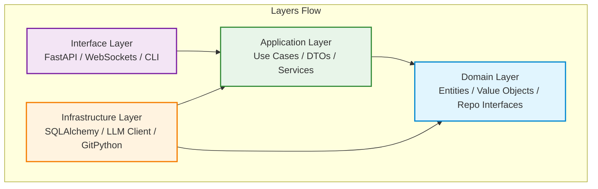
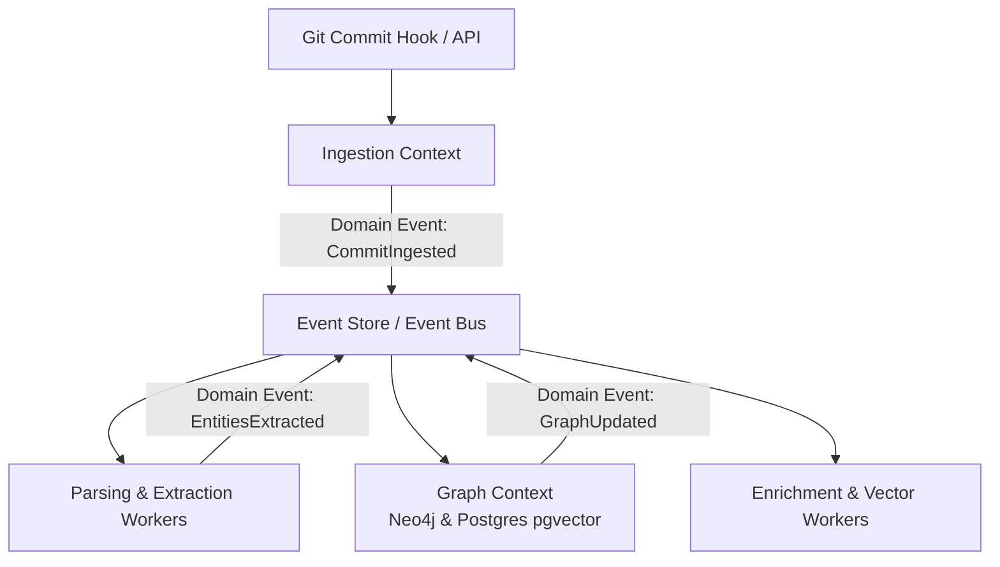

# Architecture Specification: Temporal Code Knowledge Graph Platform

This document outlines the software architecture, folder structure, system boundaries, and design conventions for the AI-powered Temporal Code Knowledge Graph platform. The design is based on **Clean Architecture** and **Domain-Driven Design (DDD)** principles, structured as a **Modular Monolith** to support future microservices extraction.

---

## 1. Project Folder Hierarchy

Below is the complete project directory structure representing the Modular Monolith architecture.

```text
git-graph/
├── .github/                       # CI/CD pipelines & GitHub templates
│   └── workflows/
│       └── ci.yml                 # Run tests, linter (Ruff), and type checks (MyPy)
├── deployment/                    # Containerization & production orchestration
│   ├── docker/
│   │   ├── Dockerfile.api         # Lightweight production build for FastAPI
│   │   └── Dockerfile.worker      # Image configuration for Celery workers
│   ├── k8s/                       # Production Kubernetes manifests (future)
│   │   ├── deployment.yaml
│   │   └── configmap.yaml
│   └── docker-compose.prod.yml    # Multi-container production compose (API, Workers, PostgreSQL, Redis)
├── docs/                          # Platform documentation and RFCs
│   ├── ARCHITECTURE.md            # This architecture document
│   ├── adr/                       # Architectural Decision Records
│   │   ├── 0001-modular-monolith-clean-architecture.md
│   │   ├── 0002-postgresql-pgvector-adjacency-lists.md
│   │   └── 0003-event-driven-temporal-graph-building.md
│   └── openapi.json               # Static API specifications
├── infrastructure/                # Local development & orchestration services
│   ├── docker/
│   │   └── docker-compose.local.yml # Local development database, Redis, pgvector
│   └── local-dev/
│       └── init-db.sql            # Local DB initialization (enabling pgvector)
├── migrations/                    # Database migrations (Alembic)
│   ├── env.py                     # Alembic configuration
│   ├── script.py.mako             # Alembic migration template
│   └── versions/                  # Individual SQL migrations
├── scripts/                       # DevOps, provisioning, and seeding tools
│   ├── bootstrap.sh               # Install dependencies, Tree-sitter grammars
│   ├── setup_treesitter.py        # Clones and compiles Tree-sitter language grammars
│   └── seed_graph.py              # Seeds the database with a test repository
├── src/                           # Platform source code
│   ├── main.py                    # Entry point for FastAPI application
│   ├── config.py                  # Environment-specific configuration using Pydantic Settings
│   ├── core/                      # Shared kernel: utilities, logging, abstract base classes
│   │   ├── exceptions.py          # Shared business exceptions
│   │   ├── logging.py             # Structlog configuration
│   │   ├── security.py            # API key and auth utilities
│   │   └── telemetry.py           # OpenTelemetry and Prometheus integration
│   └── contexts/                  # Bounded Contexts (Loose coupling, modular slices)
│       ├── ingestion/             # Context: Git repository cloning & commit history tracking
│       │   ├── domain/
│       │   │   ├── entities.py       # Repository, Commit, FileChange
│       │   │   ├── value_objects.py  # CommitHash, FilePath
│       │   │   ├── events.py         # CommitIngested, RepositoryCloned
│       │   │   └── repositories.py   # Interfaces for repository and commit storage
│       │   ├── application/
│       │   │   ├── use_cases/        # CloneRepoUseCase, IngestCommitHistoryUseCase
│       │   │   ├── services.py       # Domain-facing application services
│       │   │   └── dtos.py           # Data Transfer Objects
│       │   ├── infrastructure/
│       │   │   ├── persistence/      # SQLAlchemy repository implementations
│       │   │   └── git/              # Wrapper around GitPython
│       │   └── interface/
│       │       ├── api/              # FastAPI router (ingestion-specific routes)
│       │       └── cli/              # CLI interface (Typer/Click) for manual runs
│       │
│       ├── parsing/               # Context: AST extraction using Tree-sitter
│       │   ├── domain/
│       │   │   ├── entities.py       # SyntaxTree, ASTNode, CodeSpan
│       │   │   └── services.py       # CodeParser interface
│       │   ├── application/
│       │   │   ├── use_cases/        # ParseSourceFileUseCase
│       │   │   └── dtos.py
│       │   ├── infrastructure/
│       │   │   └── treesitter/       # Tree-sitter bindings and AST traversal engines
│       │   └── interface/
│       │       └── worker/           # Parsing consumer jobs (Celery tasks)
│       │
│       ├── extraction/            # Context: Entity and Relationship extraction
│       │   ├── domain/
│       │   │   ├── entities.py       # ExtractedEntity, ExtractedRelationship
│       │   │   ├── value_objects.py  # EntityType (CLASS, FUNCTION, etc.), RelationType (CALLS, etc.)
│       │   │   └── services.py       # LanguageExtractor interfaces
│       │   ├── application/
│       │   │   ├── use_cases/        # ExtractCodeSemanticsUseCase
│       │   │   └── dtos.py
│       │   ├── infrastructure/
│       │   │   └── extractors/       # Python, TypeScript, Go specific extraction strategies
│       │   └── interface/
│       │
│       ├── graph/                 # Context: Temporal Knowledge Graph and Entity Versioning
│       │   ├── domain/
│       │   │   ├── entities.py       # GraphNode, GraphEdge, EntityVersion
│       │   │   ├── value_objects.py  # ModificationState (CREATED, MODIFIED, DELETED)
│       │   │   ├── events.py         # GraphMutatedEvent
│       │   │   └── repositories.py   # Graph repository interfaces (IEntityVersionRepository)
│       │   ├── application/
│       │   │   ├── use_cases/        # BuildTemporalSnapshotUseCase, FindEntityEvolutionUseCase
│       │   │   └── queries/          # Read-optimized queries (CQRS patterns)
│       │   ├── infrastructure/
│       │   │   └── persistence/      # Adjacency list and temporal modeling in SQLAlchemy
│       │   └── interface/
│       │       └── api/              # Graph traversal & visualization API endpoints
│       │
│       ├── enrichment/            # Context: AI agent summarization & vector embeddings
│       │   ├── domain/
│       │   │   ├── entities.py       # SemanticSummary, VectorEmbedding
│       │   │   └── services.py       # ILLMProvider, IEmbeddingProvider
│       │   ├── application/
│       │   │   ├── use_cases/        # EnrichEntityUseCase, GenerateEmbeddingsUseCase
│       │   │   └── dtos.py
│       │   ├── infrastructure/
│       │   │   ├── llm/              # Anthropic/OpenAI client implementation
│       │   │   └── embeddings/       # pgvector persistence implementation
│       │   └── interface/
│       │
│       ├── retrieval/             # Context: RAG context compiler & hybrid search
│       │   ├── domain/
│       │   │   ├── entities.py       # RetrievalContext, MatchResult
│       │   │   └── services.py       # ISearchRanker
│       │   ├── application/
│       │   │   ├── use_cases/        # ExecuteHybridSearchUseCase, GetRAGContextUseCase
│       │   │   └── dtos.py
│       │   ├── infrastructure/
│       │   │   └── search/           # Execution of graph walks + vector query execution
│       │   └── interface/
│       │       └── api/              # Semantic and contextual lookup APIs
│       │
│       └── agentic/               # Context: Multi-agent reasoners and query runners
│           ├── domain/
│           │   ├── entities.py       # AgentSession, Plan
│           │   └── state.py          # State representation for LangGraph flows
│           ├── application/
│           │   ├── agents/           # Agent blueprints (e.g., CodebaseAnalystAgent)
│           │   └── tools/            # LangGraph tool definitions wrapping other context use cases
│           ├── infrastructure/
│           │   └── framework/        # LangGraph runtimes, checkpointers
│           └── interface/
│               └── api/              # WebSocket or streaming API endpoints for agents
├── tests/                         # Automated tests mirroring the structure of src/
│   ├── conftest.py                # Global fixtures (mocks for external clients, test database)
│   ├── integration/               # Multi-context orchestration tests
│   │   └── test_ingestion_pipeline.py
│   └── unit/                      # Isolated unit tests for business logic
│       ├── contexts/
│       │   ├── test_ingestion/
│       │   ├── test_parsing/
│       │   └── test_graph/
│       └── test_core/
├── .gitignore                     # Git exclusion rules
├── pyproject.toml                 # Poetry dependencies and tool configurations (Ruff, Black, MyPy)
├── README.md                      # General setup instructions
└── requirements.txt               # Exported dependencies for Docker
```

---

## 2. Directory Purpose Directory Map

### Platform Directories

| Directory | Primary Purpose |
| :--- | :--- |
| `docs/` | Contains the architectural specification, ADRs (Architectural Decision Records), OpenAPIs, and user-facing/developer documentation. |
| `scripts/` | Shell and Python helper scripts for bootstrapping the developer environment, compilation of Tree-sitter binaries, database seeding, and migrations wrapper. |
| `tests/` | Contains the unit, integration, and performance test suites. Mocks database nodes and external LLMs. Contains `conftest.py` for global test fixtures. |
| `migrations/` | Manages relational database evolution using Alembic. Contains SQL-generation templates and history files tracking pgvector schema and graph entity tables. |
| `infrastructure/` | Focuses on platform orchestration tools for developer environments. Keeps Docker Compose configurations isolated from production scripts. |
| `deployment/` | Houses production-ready deployment assets, containing targeted `Dockerfiles` for API/worker processes and orchestrations for cloud clusters (Kubernetes). |

### Core Source Directories (`src/`)

*   `src/main.py`: Bootstrapping entry point. Aggregates FastAPI routers from all Bounded Contexts, handles global middleware (CORS, OpenTelemetry tracer, error handlers), and coordinates lifespan event management (db connections pool initialization).
*   `src/config.py`: Global runtime config powered by Pydantic Settings. Loads environment variables, validates LLM parameters, database connection URLs, Redis pools, and path locations.
*   `src/core/`: Contains cross-cutting domain concerns that do not contain application-level business logic. Represents the "Shared Kernel" in DDD. Avoids dependencies on specific contexts.

### Bounded Contexts (`src/contexts/`)

To support isolation and easy decoupling into microservices later, all business domains are separated into self-contained "contexts." Each context follows Clean Architecture layers:

1.  **`ingestion/`**: Clones and updates external Git repositories. Interacts directly with GitPython to pull history, extract commits, and compute tree diffs.
2.  **`parsing/`**: Abstract code structure analyzer. Leverages compiled Tree-sitter grammars to generate raw Abstract Syntax Trees (AST) from text.
3.  **`extraction/`**: Contextual semantic layer. Inspects AST nodes to identify distinct code elements (entities) and the connections between them (relationships) relative to programming language semantics.
4.  **`graph/`**: Holds the logic for building the temporal network graph. Tracks modifications, maps graph entities to specific commits, coordinates entity lifecycle changes (`CREATED`, `MODIFIED`, `DELETED`), and traverses versioned states.
5.  **`enrichment/`**: AI metadata layer. Enriches graph nodes with LLM-generated summaries and computes vector representation using provider-agnostic embeddings configurations.
6.  **`retrieval/`**: Context retrieval framework for RAG. Combines vector semantic search with graph traversals (hybrid search) to construct relevant prompt context windows.
7.  **`agentic/`**: Houses intelligent systems (via LangGraph). Exposes reasoning loops, tools, and planners to answer complex codebase questions.

---

## 3. Clean Architecture: Layer Boundaries and Dependency Rules

Every Bounded Context enforces strict Clean Architecture layers. The core principle is that **dependencies flow inward**. High-level policies (Domain) must never depend on low-level details (Infrastructure or Interfaces).



### 1. Domain Layer (`/domain`)
*   **Definition**: The heart of the application. Contains enterprise-wide business rules and domain models.
*   **Rules**:
    *   **NO EXTERNAL DEPENDENCIES**: It must not import code from external packages like SQLAlchemy, FastAPI, GitPython, or OpenAI. It must consist of plain Python objects (typically `dataclasses` or pure domain objects).
    *   **Inversion of Control**: Defines interfaces (abstract base classes) for data persistence or external services (e.g., `IRepositoryStore`).
*   **Contents**:
    *   *Entities*: Mutable models with unique IDs (e.g., `CodeEntity` with a UUID).
    *   *Value Objects*: Immutable models identified only by their attributes (e.g., `CodeSpan` representing file offsets).
    *   *Domain Events*: Simple signals emitted when important domain changes occur (e.g., `EntityModifiedEvent`).
    *   *Repository Interfaces*: Abstract protocols declaring storage contracts.

### 2. Application Layer (`/application`)
*   **Definition**: Orchestrates domain logic and coordinates input/output flows to fulfill specific use cases.
*   **Rules**:
    *   Depends **only** on the Domain layer.
    *   Never interacts directly with database connections, web frameworks, or third-party SDKs.
    *   Contains specific transactional units of work.
*   **Contents**:
    *   *Use Cases*: Execution logic containing single application tasks (e.g., `ExtractCommitEntitiesUseCase`).
    *   *DTOs*: Unstructured, plain data shapes representing inputs and outputs to use cases (often using `pydantic` models without domain logic).
    *   *Application Services*: Orchestrations that bridge multiple repositories and emit events.

### 3. Infrastructure Layer (`/infrastructure`)
*   **Definition**: The technical implementation detail layer. Adapts external libraries and databases to the application interfaces.
*   **Rules**:
    *   Implements interfaces defined in the Domain and Application layers.
    *   Dependencies can import from the Domain and Application layers to map schemas to domain shapes.
*   **Contents**:
    *   *Database Persistence*: ORM schemas (SQLAlchemy models), SQL builders, repository implementations, migration definitions, and vector stores.
    *   *External Integrations*: API clients (OpenAI API, Anthropic client), Git wrapper tools (GitPython wrappers).

### 4. Interface Layer (`/interface`)
*   **Definition**: Entry points for external interaction with the application.
*   **Rules**:
    *   Acts as a shallow adapter mapping HTTP requests, WebSocket packets, CLI commands, or Celery queues to Application use cases.
    *   Responsible for serialization, validation (Pydantic payload parsing), and status code assignment.
*   **Contents**:
    *   *HTTP Controllers*: FastAPI routers.
    *   *Command Line Interfaces*: Typer/Click tasks.
    *   *Event Handlers / Workers*: Celery tasks consuming background queues.

---

## 4. Responsibility Mapping

Here is the exact mapping detailing where critical components of the system live:

| System Component | Bounded Context | File/Folder Path | Layer | Rationale |
| :--- | :--- | :--- | :--- | :--- |
| **Git Repository Analysis** | `ingestion` | `src/contexts/ingestion/infrastructure/git/` | Infrastructure | Performs operations on system storage, cloning repositories, and parsing commit diffs via GitPython. |
| **Source Parsing (AST)** | `parsing` | `src/contexts/parsing/infrastructure/treesitter/` | Infrastructure | Tree-sitter logic and grammar compilations are hardware/runtime specifics. |
| **Entity Extraction** | `extraction` | `src/contexts/extraction/domain/services.py` | Domain | Translates AST structures into semantic domain entities (classes, methods, relationships). |
| **Temporal Graph Building** | `graph` | `src/contexts/graph/application/use_cases/build_graph.py` | Application | Coordinates version changes (CREATED, DELETED) over successive git commits. |
| **Semantic Summaries** | `enrichment` | `src/contexts/enrichment/infrastructure/llm/` | Infrastructure | Summaries are created using LLMs, which are external APIs. |
| **Vector Embeddings** | `enrichment` | `src/contexts/enrichment/infrastructure/embeddings/` | Infrastructure | Coordinates generation and persistence into the pgvector database. |
| **RAG Retrieval Engine** | `retrieval` | `src/contexts/retrieval/application/use_cases/` | Application | Integrates graph traversals with vector distance matches. |
| **APIs** | `All contexts` | `src/contexts/<context>/interface/api/` | Interface | Keeps HTTP routes close to the logical domains they manage. Exposes them through `src/main.py`. |
| **Agentic Framework** | `agentic` | `src/contexts/agentic/application/agents/` | Application | Orchestrates multiple tools and executes LangGraph routing. |

---

## 5. Architectural Design Conventions

To maintain uniformity across the modular monolith, developers must follow these strict conventions.

### A. Naming Conventions

*   **Files / Modules**: Snake-case (`entity_repository.py`, `clone_repo_use_case.py`).
*   **Classes**: PascalCase (`CommitEntity`, `PostgresRepository`).
*   **Repository Interfaces**: Prefixed with capital `I` (`ICommitRepository`).
*   **Use Cases**: Suffixed with `UseCase` (`BuildGraphUseCase`).
*   **Data Transfer Objects**: Suffixed with `DTO` or `Request`/`Response` (`RepoCloneRequest`, `GraphTraversalResponse`).
*   **Domain Events**: Suffixed with `Event` (`RepositoryIngestedEvent`).

### B. Module and Import Conventions

*   **Strict No-Loop Rule**: Circular dependencies are strictly forbidden. Use dependency injection to share services.
*   **Import Hierarchy**:
    1. Standard library (`import sys`)
    2. Third-party packages (`from fastapi import APIRouter`)
    3. Core module references (`from src.core.logging import logger`)
    4. Bounded Context imports: Relative within context, absolute across contexts.
*   **Bounded Context Isolation**: A context cannot import infrastructure classes from another context. It may only interact via Application Use Cases, Domain interfaces, or Event-driven triggers.

### C. Repository Conventions

*   Repositories must inherit from a domain-defined interface.
*   Transactions must be handled at the Application layer using a Unit of Work (`IUnitOfWork`) pattern to avoid exposing ORM sessions to business logic.

#### Example Interface (`src/contexts/ingestion/domain/repositories.py`)
```python
from abc import ABC, abstractmethod
from typing import Optional
from src.contexts.ingestion.domain.entities import RepositoryEntity

class IRepositoryRepository(ABC):
    @abstractmethod
    def save(self, repo: RepositoryEntity) -> None:
        """Persist a repository entity."""
        pass

    @abstractmethod
    def find_by_id(self, repo_id: str) -> Optional[RepositoryEntity]:
        """Fetch repository by unique identifier."""
        pass
```

#### Example Implementation (`src/contexts/ingestion/infrastructure/persistence/postgres_repository.py`)
```python
from typing import Optional
from sqlalchemy.orm import Session
from src.contexts.ingestion.domain.entities import RepositoryEntity
from src.contexts.ingestion.domain.repositories import IRepositoryRepository

class PostgresRepositoryRepository(IRepositoryRepository):
    def __init__(self, session: Session):
        self.session = session

    def save(self, repo: RepositoryEntity) -> None:
        # Convert Domain Entity to SQLAlchemy ORM model representation
        orm_model = PostgresRepositoryModel.from_domain(repo)
        self.session.add(orm_model)

    def find_by_id(self, repo_id: str) -> Optional[RepositoryEntity]:
        orm_model = self.session.query(PostgresRepositoryModel).filter_by(id=repo_id).first()
        return orm_model.to_domain() if orm_model else None
```

### D. Service Conventions

*   **Domain Services**: Contain business logic that does not naturally belong to a single entity (e.g., resolving code relationship graphs). Declared in `/domain/services.py`.
*   **Application Services**: Coordinate control flow, publish domain events to buses, and do not contain validation rules. Declared in `/application/services.py`.

#### Example Use Case (`src/contexts/ingestion/application/use_cases/clone_repo.py`)
```python
from pydantic import BaseModel
from src.contexts.ingestion.domain.repositories import IRepositoryRepository
from src.contexts.ingestion.domain.entities import RepositoryEntity

class CloneRepoInputDTO(BaseModel):
    git_url: str
    branch: str = "main"

class CloneRepoUseCase:
    def __init__(self, repo_store: IRepositoryRepository, git_adapter: "IGitAdapter"):
        self.repo_store = repo_store
        self.git_adapter = git_adapter

    def execute(self, input_dto: CloneRepoInputDTO) -> str:
        # 1. Clone repository to temp directory
        local_path = self.git_adapter.clone(input_dto.git_url, input_dto.branch)
        
        # 2. Build Domain Entity
        repo_entity = RepositoryEntity.create(
            git_url=input_dto.git_url,
            branch=input_dto.branch,
            local_path=local_path
        )
        
        # 3. Persist entity using inverted repository
        self.repo_store.save(repo_entity)
        
        return repo_entity.id
```

---

## 6. Future-Ready Architecture

The platform architecture is designed to accommodate four major future evolutions:



### A. Neo4j Integration (No-SQL Graph Transition)

To transition from PostgreSQL adjacency lists to Neo4j for deep graph traversals (multi-hop relationships):
1.  Introduce `INeo4jSession` under `src/contexts/graph/infrastructure/persistence/neo4j/`.
2.  Implement a Neo4j version of `ITemporalGraphRepository` (e.g., `Neo4jTemporalGraphRepository`).
3.  Inject this Neo4j repository via dependency injection inside `src/main.py` without modifying any Application-level code (e.g. `BuildTemporalSnapshotUseCase`).

### B. Multi-Agent Workflows (LangGraph Integration)

To support future agent workflows:
1.  The `agentic` context houses LangGraph state models (`State`) in `/domain/state.py` and node logic in `/application/agents/`.
2.  Each Node in the LangGraph graph represents an Application Service that receives current execution state, calls Application Use Cases of other contexts (e.g., `ExecuteHybridSearchUseCase` from the `retrieval` context), and outputs modified agent state.
3.  The agent framework relies entirely on the application's clean interfaces, ensuring it remains decoupleable from LLM schema changes.

### C. Event Sourcing (Git History Timeline Tracking)

To achieve precise timeline reconstruction:
1.  All modifications to entities (CREATED, MODIFIED, MOVED, RENAMED, DELETED) are represented as immutable Event records in the database.
2.  The `graph` domain defines a chronological log of these mutations.
3.  Reconstructing the code graph state at a specific commit hash $C_n$ involves reading all mutations up to $C_n$ and projecting them onto an in-memory graph or dynamic database view.

### D. Distributed Processing (Redis + Celery Scaleout)

To handle large repositories like Linux or Kubernetes:
1.  Use Cases do not block the web server thread. The interface layer (`/interface/worker/tasks.py`) maps incoming HTTP requests to background Celery tasks.
2.  Tasks represent units of execution (e.g., "Parse specific file content").
3.  A queue topology separates lightweight tasks (Git cloning) from CPU-intensive tasks (Tree-sitter parsing and LLM API batch operations).

---

## 7. Architectural Decisions & Rationale

### Decision 1: Modular Monolith vs. Microservices (Initial State)
*   **Rationale**: Microservices introduce latency and operational complexity (network failures, service-to-service auth, distributed tracing). A Modular Monolith allows rapid iteration, shared code compile-time safety (type checking), and single-pipeline deployments. By strictly separating contexts into directories, we can easily split them into distinct services when scaling bottlenecks require it.

### Decision 2: PostgreSQL + pgvector as the Initial Storage Engine
*   **Rationale**: Storing AST structures, entity attributes, commits, and embeddings in PostgreSQL avoids maintaining multiple databases early. By using **pgvector**, we query metadata, graph relations (via adjacency tables), and semantic vector dimensions in single SQL queries.

### Decision 3: Code Parsing Boundary (Tree-sitter Separation)
*   **Rationale**: Source code parsing is slow and compiler-heavy. Isolating Tree-sitter compilation and grammar setup behind the `parsing` bounded context keeps the rest of the application platform-agnostic and makes it simple to add future support for new programming languages.
