# Supported Logics, Languages, and Schemas

This document lists the active behavioral logics, programming languages, configuration schemas, and the complete relational database design supported by the **Temporal Code Knowledge Graph Platform**.

---

## 1. Supported Programming Languages

The platform parses codebase source trees and extracts entities using Tree-sitter. The following programming languages are supported:

| Language | Tree-sitter Parser | File Extensions | status |
| :--- | :--- | :--- | :--- |
| **Python** | `tree-sitter-python` | `.py` | Active |
| **JavaScript** | `tree-sitter-javascript` | `.js`, `.jsx`, `.mjs` | Active |
| **TypeScript** | `tree-sitter-typescript` | `.ts`, `.tsx` | Active |
| **Go** | `tree-sitter-go` | `.go` | Active |
| **Java** | `tree-sitter-java` | `.java` | Active |
| **C#** | `tree-sitter-csharp` | `.cs` | Active |
| **Rust** | `tree-sitter-rust` | `.rs` | Active |
| **Kotlin** | `tree-sitter-kotlin` | `.kt` | Active |
| **Swift** | `tree-sitter-swift` | `.swift` | Registered |
| **PHP** | `tree-sitter-php` | `.php` | Registered |
| **Scala** | `tree-sitter-scala` | `.scala` | Registered |
| **Ruby** | `tree-sitter-ruby` | `.rb` | Registered |
| **Elixir** | `tree-sitter-elixir` | `.ex`, `.exs` | Registered |
| **HTML** | `tree-sitter-html` | `.html`, `.htm` | Registered |
| **CSS** | `tree-sitter-css` | `.css` | Registered |

---

## 2. Supported Behavioral Logics (Ontology Patterns)

The behavioral intelligence engine supports **33 active detection patterns** classified under four primary domain areas:

### 🔒 Security (Authentication & Authorization)
* **`auth_direct_compare`** (Direct Credential Comparison): Detects raw equality comparisons (`==` / `!=`) of secret parameters without hashing.
* **`auth_sha256_verification`** (SHA256 Password Verification): Detects password verification using `hashlib.sha256` and hex digests with password parameters flowing into the sink.
* **`auth_bcrypt_verification`** (Bcrypt Password Verification): Detects password checks via `bcrypt.checkpw`.
* **`auth_bcrypt_hash`** (Bcrypt Password Hashing): Detects password salt-generation and hashing via `bcrypt.hashpw` / `bcrypt.gensalt`.
* **`auth_jwt_generation`** (JWT Token Generation): Detects token generation via `jwt.encode`.
* **`auth_jwt_verification`** (JWT Token Verification): Detects token validation via `jwt.decode`.
* **`auth_passlib_verify`** (Passlib Password Verification): Detects password verification using `passlib.context`.
* **`auth_argon2_verification`** (Argon2 Password Verification): Detects password checks via `argon2`.
* **`authz_permission_check`** (Permission Check): Detects calls verifying scopes or permissions (e.g., `has_permission`, `check_permission`, `is_authorized`).
* **`authz_rbac`** (Role-Based Access Control Check): Detects calls verifying user role memberships (e.g., `has_role`, `check_role`, `is_in_role`).

### 💾 Data Management (Caching, Database, Serialization)
* **`cache_memory_dict`** (In-Memory Dictionary Cache): Detects local process dictionary lookup structures.
* **`cache_lru_cache`** (LRU Cache): Detects local caching using Python's `functools.lru_cache` or `functools.cache` decorators.
* **`cache_redis_lookup`** (Redis Cache Lookup): Detects cache read operations via `redis.get` / `Redis.get`.
* **`cache_redis_set`** (Redis Cache Write): Detects cache writes via `redis.set` / `Redis.set`.
* **`cache_redis_cluster`** (Redis Cluster Cache): Detects caching operations on clustered nodes (`redis.cluster.RedisCluster`).
* **`cache_invalidation`** (Cache Invalidation): Detects cache deletion or clearing (e.g., `redis.delete`, `cache.clear`).
* **`db_raw_sql_execute`** (Raw SQL Execution): Detects direct SQL execution on connection cursors (e.g., `cursor.execute`, `connection.execute`).
* **`db_orm_sqlalchemy_query`** (SQLAlchemy ORM Query): Detects SQLAlchemy database queries (`session.query`, `query`, `filter`).
* **`db_repository_pattern`** (Repository Pattern): Detects repository classes wrapping database operations.
* **`db_transaction`** (Database Transaction): Detects explicit transactional boundaries (e.g., `commit`, `rollback`, `begin`).

### 🔄 Reliability (Retry & Circuit Breaker)
* **`circuit_breaker_pybreaker`** (Circuit Breaker via Pybreaker): Detects circuit breaker policies using `pybreaker`.
* **`circuit_breaker_manual`** (Manual Circuit Breaker): Detects custom state-based circuit checking.
* **`retry_tenacity`** (Retry with Tenacity): Detects automated method retries using `@retry` decorators from the `tenacity` library.
* **`retry_manual_loop`** (Manual Retry Loop): Detects custom try-except loops wrapping retry indices.
* **`retry_backoff`** (Exponential Backoff Retry): Detects backoff loop structures calling `time.sleep` with exponential calculations.

### 🌐 Integration (HTTP API Client, GenAI, Messaging)
* **`api_requests_call`** (HTTP REST API Call via requests): Detects HTTP client methods (e.g. `requests.get`, `requests.post`).
* **`api_httpx_call`** (HTTP REST API Call via httpx): Detects async/sync HTTP client calls via `httpx`.
* **`api_endpoint_handler`** (API Endpoint Handler): Detects server endpoint routing decorators (e.g., `@app.get`, `@router.post`).
* **`api_gemini_client`** (Gemini GenAI Client Call): Detects generative AI calls using `google.genai.Client.models.generate_content`.
* **`tts_parler_generation`** (Parler TTS Audio Generation): Detects Parler Text-to-Speech audio generation calls using `parler_tts`.
* **`msg_publish_kafka`** (Kafka Message Publishing): Detects message publishing via `kafka` producers.
* **`msg_publish_rabbitmq`** (RabbitMQ Message Publishing): Detects message publishing via `pika` (e.g. `basic_publish`).
* **`msg_consume`** (Message Consumption): Detects subscriber consumer routines (e.g. `consume`, `subscribe`, `@consumer`).

---

## 3. Configuration & Schema Specifications

The platform uses YAML schemas to dynamically load ontology nodes, behavioral detection rules, and register meta-types:

### A. Ontology Definition Schema (`ontology/*.yaml`)
Describes the hierarchical behavior classification tree:
```yaml
schema_version: "1.0"
ontology_version: "3.0.0"
domain: Security # Top-level domain: Security, Data_Management, Reliability, Integration
nodes:
  - id: security.authentication
    name: Authentication
    parent_id: null
    is_leaf: false
    description: "Mechanisms that verify identity."
    children:
      - id: security.authentication.hash_comparison
        name: Cryptographic Hash Verification
        parent_id: security.authentication
        is_leaf: true
        description: "Verification via cryptographic hash check."
```

### B. Behavior Pattern Schema (`patterns/*.yaml`)
Defines the pattern rules for matching code AST features:
```yaml
schema_version: "1.0"
patterns:
  - pattern_id: auth_bcrypt_verification
    name: Bcrypt Password Verification
    pattern_version: "1.0.0"
    ontology_node_id: security.authentication.hash_comparison
    base_confidence: 0.95
    index_keys:
      - "call:bcrypt.checkpw"
      - "import:bcrypt"
      - "call:checkpw"
    rules:
      ast_features:
        - match_type: call
          target_module: bcrypt
          target_function: checkpw
          description: "bcrypt.checkpw invocation"
      negative_indicators:
        - symbol: sha1
      data_flow:
        - source_param_pattern: "(password|passwd|pwd|secret)"
          sink_call: checkpw
```

### C. Dynamic Meta-Ontology Schema Specification
Defines the schema validation templates for dynamically registered semantic metadata:
```json
{
  "$schema": "https://json-schema.org/draft/2020-12/schema",
  "title": "DynamicMetaSchema",
  "type": "object",
  "properties": {
    "supported_frameworks": {
      "type": "array",
      "items": { "type": "string" }
    },
    "minimum_confidence_threshold": {
      "type": "number",
      "minimum": 0.0,
      "maximum": 1.0
    }
  },
  "required": ["supported_frameworks"]
}
```

---

## 4. Relational Database Schema Design (SQLAlchemy Models)

The relational schema representing the system entities across the structural, behavioral, conceptual, metadata, and semantic flow layers is defined as follows:

```mermaid
erDiagram
    %% AST & Core Layers
    repositories ||--o{ source_files : "contains"
    repositories ||--o{ commits : "tracks"
    source_files ||--o{ code_entities : "declares"
    code_entities ||--o{ entity_versions : "has_versions"
    code_entities ||--o{ relationships : "participates_in"
    entity_versions ||--o{ change_events : "causes"
    
    %% Behavior Graph Layer
    ontology_nodes ||--o{ behavior_patterns : "classifies"
    ontology_nodes ||--o{ logic_signatures : "categorizes"
    behavior_patterns ||--o{ logic_version_patterns : "matched_in"
    logic_signatures ||--o{ logic_versions : "has_versions"
    logic_versions ||--o{ logic_evidence : "supported_by"
    logic_versions ||--o{ logic_transitions : "transitions"
    logic_versions ||--o{ behavior_explanations : "has_explanation"
    logic_versions ||--o{ logic_version_patterns : "satisfies"
    logic_transitions ||--o{ behavior_drift : "measures_behavior_drift"
    logic_clusters ||--o{ logic_cluster_members : "groups"
    logic_signatures ||--o{ logic_cluster_members : "belongs_to"

    %% Concept Graph Layer
    concept_nodes ||--o{ concept_versions : "has_versions"
    concept_versions ||--o{ concept_evidence : "references"
    concept_nodes ||--o{ concept_relationships : "originates"
    concept_nodes ||--o{ concept_cluster_members : "associates"
    concept_clusters ||--o{ concept_cluster_members : "holds"
    concept_versions ||--o{ concept_explanations : "explains"
    concept_versions ||--o{ concept_metrics : "scores"
    concept_nodes ||--o{ concept_drift : "evaluates_concept_drift"
    concept_versions ||--o{ concept_evolution : "evolves"

    %% Dynamic Meta-Ontology Layer
    meta_types ||--o{ meta_definitions : "defines"
    embedding_models ||--o{ embedding_versions : "configures"

    %% Intermediate Semantic Representation (ISR) & Flows
    behavior_families ||--o{ canonical_behaviors : "groups"
    canonical_behaviors ||--o{ behavior_aliases : "aliases"
    framework_definitions ||--o{ framework_version_registry : "versions"
    framework_definitions ||--o{ framework_mappings : "maps"
    canonical_flows {
        uuid id PK
        string flow_type
        uuid source_entity_id
        uuid target_entity_id
        json intermediate_entities
        numeric confidence
        json metadata
        datetime created_at
    }
```



### 4.1 Structural & AST Tables
* **`repositories`**: Holds workspace repository configurations.
* **`commits`**: Tracks historical git revisions.
* **`source_files`**: Holds the paths and language metrics for files.
* **`code_entities`**: Stores individual AST constructs (classes, methods).
* **`entity_versions`**: Monotonically tracked node versions at commits.
* **`relationships`**: Direct dependency and call edges.
* **`change_events`**: Commited mutations (ADD, MODIFY, DELETE).
* **`integrity_checks`**: Graph consistency checkpoints.

### 4.2 Behavior Graph Tables (`logic_` prefix)
* **`ontology_nodes`**: Nodes in the hierarchical domain tree.
* **`behavior_patterns`**: Parsed AST matching rules.
* **`logic_signatures`**: Stable behavioral node identites.
* **`logic_versions`**: Point-in-time signature configurations.
* **`logic_evidence`**: Matched rules/imports/calls backing a version.
* **`logic_transitions`**: Evolutionary steps (creation, evolution, deletion).
* **`behavior_explanations`**: Footprint summary statistics.
* **`behavior_drift`**: Multidimensional drift scores (structural, API, data flow).
* **`logic_clusters`**: Clusters grouping signatures by similarity.
* **`logic_cluster_members`**: Joins mapping signatures to clusters.
* **`logic_version_patterns`**: Maps logic versions to matching patterns.

### 4.3 Concept Graph Tables (`concept_` prefix)
* **`concept_nodes`**: Stable capability identities (e.g. Authentication).
* **`concept_versions`**: Aggregate concept snapshots at commits.
* **`concept_evidence`**: Audit joins linking concept versions to underlying logic versions/evidences.
* **`concept_relationships`**: Conceptual dependencies (`DEPENDS_ON`, `REQUIRES`).
* **`concept_clusters`**: High-level groups (e.g. Identity & Access Management).
* **`concept_cluster_members`**: Joins concepts to high-level clusters.
* **`concept_explanations`**: Deterministic summaries explaining concept composition.
* **`concept_metrics`**: Graph centrality, PageRank, size, and impact scores.
* **`concept_drift`**: Drift metrics computed between two commits.
* **`concept_evolution`**: Concept splits, merges, and rename transitions.

### 4.4 Dynamic Meta-Ontology Tables (`meta_` & `embedding_` prefix)
* **`meta_types`**:
  * `id` (`VARCHAR(128)` PK): Unique type identifier (e.g., `"security.auth.schema"`).
  * `name` (`VARCHAR(256)`): Friendly display name.
  * `category` (`VARCHAR(64)`): Layer category (`STRUCTURAL`, `BEHAVIORAL`, `CONCEPTUAL`).
  * `status` (`VARCHAR(64)`): Life-cycle status (`EXPERIMENTAL`, `CANDIDATE`, `ACTIVE`, `DEPRECATED`).
  * `created_at` (`TIMESTAMP`): Time of registration.
* **`meta_definitions`**:
  * `id` (`UUID` PK): Unique definition key.
  * `type_id` (`VARCHAR(128)` FK -> `meta_types.id`): Backing type.
  * `major_version` (`INTEGER`): SemVer major.
  * `minor_version` (`INTEGER`): SemVer minor.
  * `patch_version` (`INTEGER`): SemVer patch.
  * `schema_definition` (`JSON`): Backing JSON Schema dictionary.
  * `semantic_signature` (`JSON`): Grounding token types required.
  * `created_at` (`TIMESTAMP`): Time of registration.
* **`embedding_models`**:
  * `id` (`VARCHAR(128)` PK): Unique model key.
  * `model_name` (`VARCHAR(256)`): Name of the vector model.
  * `provider` (`VARCHAR(64)`): Provider provider (`local`, `openai`, `huggingface`).
  * `dimensions` (`INTEGER`): Dimension length of the vectors.
  * `distance_metric` (`VARCHAR(32)`): Distance metric (`cosine`, `l2`, `ip`).
  * `is_active` (`BOOLEAN`): Active config switch.
  * `created_at` (`TIMESTAMP`): Registration time.
* **`embedding_versions`**:
  * `id` (`UUID` PK): Unique configuration ID.
  * `model_id` (`VARCHAR(128)` FK -> `embedding_models.id`): Backing model.
  * `version_string` (`VARCHAR(64)`): Configuration checkpoint string.
  * `configuration` (`JSON`): Model hyperparameters and config settings.
  * `registered_at` (`TIMESTAMP`): Registration timestamp.

### 4.5 Intermediate Semantic Representation (ISR) & Interaction Tables
* **`behavior_families`**:
  * `id` (`VARCHAR(128)` PK): Family key.
  * `name` (`VARCHAR(256)`): Family name.
  * `parent_concept_id` (`VARCHAR(128)`): Target concept ontology path.
  * `description` (`TEXT`): Description.
* **`canonical_behaviors`**:
  * `id` (`VARCHAR(128)` PK): Unique canonical behavior key.
  * `name` (`VARCHAR(256)`): Unified behavior name.
  * `family_id` (`VARCHAR(128)` FK -> `behavior_families.id`): Parent family.
  * `description` (`TEXT`): Description.
  * `created_at` (`TIMESTAMP`): Creation time.
* **`behavior_aliases`**:
  * `id` (`UUID` PK): Unique alias key.
  * `canonical_behavior_id` (`VARCHAR(128)` FK -> `canonical_behaviors.id`): Associated behavior.
  * `language` (`VARCHAR(64)`): Language name.
  * `imports` (`JSON`): List of matching package imports.
  * `calls` (`JSON`): List of matching function calls.
  * `heuristics` (`JSON`): Parameter heuristics/AST structure checks.
* **`framework_definitions`**:
  * `id` (`VARCHAR(128)` PK): Framework key.
  * `framework_name` (`VARCHAR(128)`): Framework name (e.g. Django, Spring).
  * `language` (`VARCHAR(64)`): Target language.
  * `metadata` (`JSON`): framework properties.
* **`framework_version_registry`**:
  * `id` (`UUID` PK): Unique version ID.
  * `framework_id` (`VARCHAR(128)` FK -> `framework_definitions.id`): Target framework.
  * `version_string` (`VARCHAR(64)`): Version.
  * `supported_syntax_rules` (`JSON`): Rules list.
  * `released_at` (`TIMESTAMP`): Release date.
* **`framework_mappings`**:
  * `id` (`UUID` PK): Unique mapping key.
  * `framework_id` (`VARCHAR(128)` FK -> `framework_definitions.id`): Framework.
  * `annotation_identifier` (`VARCHAR(256)`): Decorator name (e.g. `@app.post`).
  * `map_to_entity_role` (`VARCHAR(64)`): Inferred entity role (`CONTROLLER`, `SUBSCRIBER`).
  * `map_to_relationship` (`VARCHAR(64)`): Inferred relationship edge type.
* **`canonical_flows`**:
  * `id` (`UUID` PK): Traced flow key.
  * `flow_type` (`VARCHAR(64)`): Flow type category (`Execution Flow`, `AI Flow`, `Frontend Flow`, `Messaging Flow`).
  * `source_entity_id` (`UUID`): Initial source entity SEID.
  * `target_entity_id` (`UUID`): Terminal target entity SEID.
  * `intermediate_entities` (`JSON`): List of traversed intermediate entity IDs.
  * `confidence` (`NUMERIC(4,3)`): Flow confidence weight.
  * `metadata` (`JSON`): Stores `evidence` and `fingerprint` payload details (e.g. `node_sequence` and `calls_signature`).
  * `created_at` (`TIMESTAMP`): Creation time.
