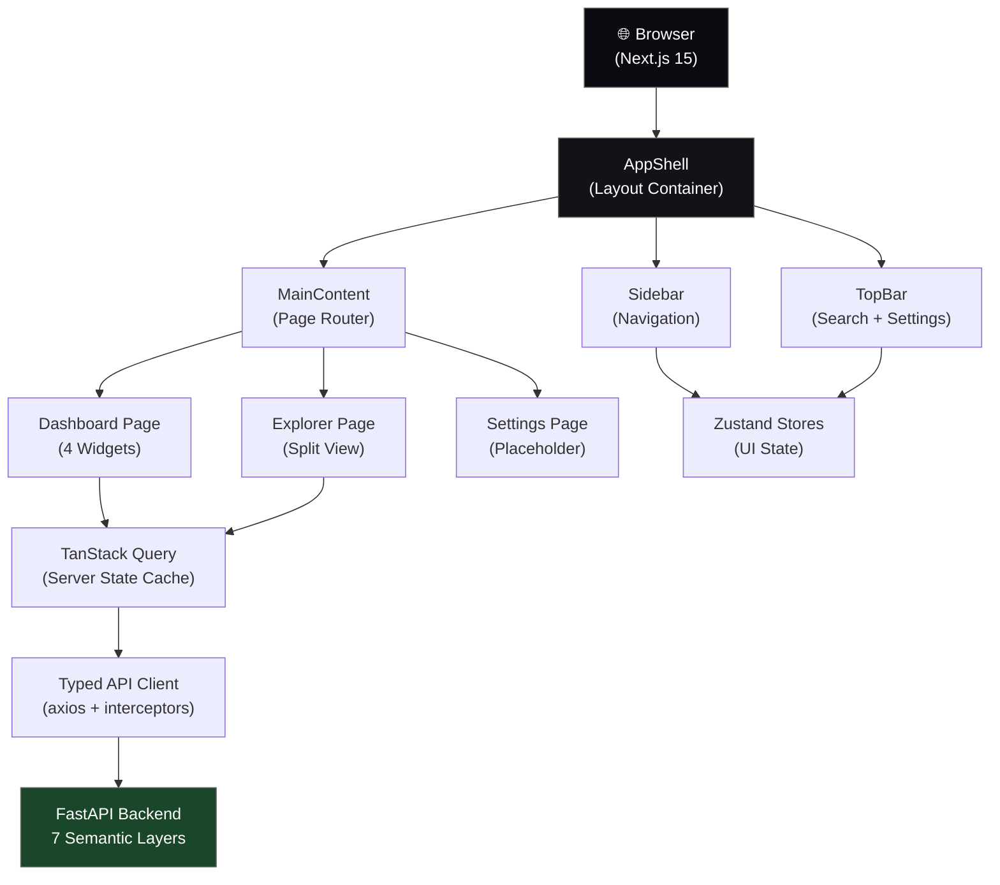

# Technical Design: Software Intelligence Platform Stage 1 Frontend

## Overview

This technical design document specifies a production-grade frontend architecture for the Software Intelligence Platform Stage 1—a Next.js 15 + React 19 application enabling semantic intelligence exploration across codebases via a FastAPI backend with 7 semantic layers.

**Key objectives:**
- Support exploration of 1000+ capabilities and 10000+ concepts without performance degradation
- Establish extensible architecture for Stages 2–4 without refactoring Stage 1 code
- Implement enterprise-grade design system, accessibility (WCAG AA), and error resilience
- Achieve <1s First Contentful Paint, <2s Largest Contentful Paint, <500KB gzipped bundle

**Scope:** Frontend application architecture, component design, state management, API integration, design system, accessibility, performance optimization, and extensibility patterns.

---

## Architecture

The application follows a three-tier layered architecture:

1. **UI Layer** (React components, Framer Motion, shadcn/ui)
   - AppShell layout with Sidebar, TopBar, MainContent
   - Pages: Dashboard, Capability Explorer, Settings
   - Modals: Search, Command Palette
   - Reusable component library with design tokens

2. **State Management Layer** (Zustand + TanStack Query)
   - Zustand stores for ephemeral UI state (selected item, active tab, sidebar toggle)
   - TanStack Query for server state (API responses, caching, background refetch)
   - URL query parameters for shareable/bookmarkable state

3. **API Integration Layer** (Typed axios client)
   - Type-safe endpoint functions
   - Automatic retry with exponential backoff
   - Error normalization and logging
   - Request/response interceptors

4. **Backend Service Layer** (FastAPI at localhost:8000/api/v1)
   - 7 semantic layers: Structural, Semantic, Behavior, Concept, Capability, Architecture, Decision
   - Endpoints for capabilities, concepts, entities, search, repository metadata

**Data flow example:** User filters capabilities → URL query params updated → Zustand selector triggers → useCapabilities() invalidates cache → TanStack Query fetches filtered results → component re-renders with new data.

---

## Components and Interfaces

### Core Components Hierarchy

```
AppShell (Layout container)
├── Sidebar (Navigation + Logo)
│   ├── NavLink (Dashboard)
│   ├── NavLink (Capabilities)
│   ├── NavLink (Settings)
│   └── ReservedPlaceholders (Architecture, Decisions, Reasoning, etc.)
├── TopBar (Global search + Settings button)
│   ├── SearchTrigger
│   └── SettingsMenu
├── MainContent (Page content)
│   ├── DashboardPage
│   │   ├── HealthWidget
│   │   ├── CapabilityInventoryWidget
│   │   ├── DependencyGraphWidget
│   │   └── RecentChangesWidget
│   ├── ExplorerPage (Split view)
│   │   ├── Navigator (Left 50%)
│   │   │   ├── SearchInput
│   │   │   ├── FilterPanel
│   │   │   └── CapabilityTree (virtualized)
│   │   └── DetailPanel (Right 50%)
│   │       ├── TabBar (7 tabs)
│   │       └── TabContent (lazy loaded)
│   │           ├── CapabilityTab
│   │           ├── StructuralTab
│   │           ├── SemanticTab
│   │           ├── BehaviorTab
│   │           ├── ConceptTab
│   │           ├── ArchitectureTab
│   │           └── DecisionTab
│   └── SettingsPage (Placeholder)
└── Modals
    ├── SearchModal (Cmd+K accessible)
    ├── CommandPalette (Ctrl+K accessible)
    └── ErrorBoundary (Global error handling)
```

### Key Interface Signatures

**Explorer component with split-view:**
```typescript
interface ExplorerLayoutProps {
  capabilities: Capability[]
  isLoading: boolean
  selectedCapabilityId: string | null
  onSelectCapability: (id: string) => void
  filters: CapabilityFilters
  onFiltersChange: (filters: CapabilityFilters) => void
}

interface DetailPanelProps {
  capability: Capability | null
  isLoading: boolean
  activeTab: string
  onTabChange: (tab: string) => void
}

interface NavigatorProps {
  capabilities: Capability[]
  selectedId: string | null
  isLoading: boolean
  onSelectCapability: (id: string) => void
  filters: CapabilityFilters
  onFiltersChange: (filters: CapabilityFilters) => void
}
```

**State management interfaces:**
```typescript
interface UIState {
  sidebarOpen: boolean
  selectedCapabilityId: string | null
  activeDetailTab: string
  expandedCategories: Set<string>
  reducedMotion: boolean
}

interface SearchState {
  recentSearches: Array<{ query: string; timestamp: number }>
  addRecentSearch: (query: string) => void
}

interface CommandPaletteState {
  isOpen: boolean
  recentCommands: Array<{ id: string; label: string; executionCount: number }>
  recordCommandExecution: (id: string, label: string) => void
}
```

---

## Data Models

### Domain Models

```typescript
interface Capability {
  id: string
  name: string
  description: string
  category: string
  risk_level: 'low' | 'medium' | 'high' | 'critical'
  risk_score: number
  dependency_count: number
  last_modified: string // ISO 8601
  child_capabilities?: Capability[]
  related_concepts: ConceptLink[]
  related_entities: EntityLink[]
  metadata: Record<string, any>
}

interface Concept {
  id: string
  name: string
  description: string
  semantic_layer: SemanticLayer
  related_capabilities: string[]
  related_entities: string[]
}

interface Entity {
  id: string
  name: string
  type: EntityType
  file_path: string
  line_number: number
  semantic_layer: SemanticLayer
}

interface Repository {
  id: string
  name: string
  health_status: 'healthy' | 'warning' | 'critical'
  health_message: string
  total_capabilities: number
  total_concepts: number
  last_analyzed: string
}

type SemanticLayer = 'structural' | 'semantic' | 'behavior' | 'concept' | 'capability' | 'architecture' | 'decision'
type EntityType = 'class' | 'function' | 'method' | 'property' | 'module' | 'file' | 'interface' | 'enum'
```

### API Response Models

```typescript
interface PaginatedResponse<T> {
  items: T[]
  total: number
  limit: number
  offset: number
  has_next: boolean
}

interface SearchResponse {
  capabilities: Capability[]
  concepts: Concept[]
  entities: Entity[]
  query: string
  total_results: number
}

interface DashboardResponse {
  repository: Repository
  capabilities_by_category: Array<{ category: string; count: number }>
  at_risk_dependencies: Array<{ name: string; severity: string }>
  recent_changes: Array<{ capability_id: string; change_type: string; timestamp: string }>
}

interface ErrorResponse {
  code: string
  message: string
  details?: Record<string, any>
}
```

### Type-Safe API Endpoints

```typescript
// All endpoints return typed responses
async function fetchCapabilities(filters: CapabilityFilters): Promise<PaginatedResponse<Capability>>
async function fetchCapability(id: string): Promise<Capability>
async function fetchConcepts(filters: ConceptFilters): Promise<PaginatedResponse<Concept>>
async function fetchSearchResults(query: string): Promise<SearchResponse>
async function fetchRepository(): Promise<Repository>
async function fetchDashboardData(): Promise<DashboardResponse>
```

---

## Correctness Properties

### Property 1: Cache Consistency with Stale Refetch

**Validates:** Requirements 8.9 (API caching strategy)

**Specification:**
When browser regains focus AND query data is >30 seconds old, TanStack Query automatically refetches in background without blocking the UI.

**Invariant:**
- User never sees severely stale data (>30 seconds old)
- Transparent refetch: no loading spinner during background refetch
- On completion, UI updates with fresh data via React query subscription

**Implementation:**
```typescript
useQuery({
  queryKey,
  queryFn,
  staleTime: 30 * 1000, // 30 seconds
  refetchOnWindowFocus: 'stale', // Only refetch if stale
})
```

### Property 2: Query Invalidation on Filter Change

**Validates:** Requirements 3.4 (Filter URL persistence), 3.6 (Detail panel update timing)

**Specification:**
When user modifies any filter, all cached results matching the old filter parameters must be invalidated, triggering automatic refetch if component is subscribed.

**Invariant:**
- Changing category filter → all capability lists with old category invalidated
- Applying multiple filters (AND logic) → cache key includes all filter values
- Filter removal → cache regenerated without that filter parameter

**Implementation:**
```typescript
const handleFilterChange = (newFilters) => {
  queryClient.invalidateQueries({
    queryKey: queryKeys.capabilities.lists(), // Invalidates ALL capability list variants
  })
}
```

### Property 3: URL State Persistence Across Navigation

**Validates:** Requirements 3.4 (Filter URL params), 5.5 (Search result navigation)

**Specification:**
All filter and search state encoded in URL query parameters (shareable, bookmarkable).

**Invariant:**
- Page refresh: all filters, search query, and pagination preserved
- URL modified directly: component re-renders with new filter state
- Back button: returns to previous filter state
- Users can share/bookmark URLs to restore exact view

**Example:** `/capabilities?category=auth&riskLevel=high&search=encryption`

### Property 4: Filter Response Time <150ms

**Validates:** Requirements 3.2 (150ms filter update), 9.4 (1000 capability filtering)

**Specification:**
Filtering 1000 capabilities against local data must complete within 150ms of user's last keystroke.

**Invariant:**
- Implemented via client-side fuzzy matching (no server round-trip)
- Debounced with 300ms delay to batch rapid keystrokes
- Peak latency: 150ms from last keystroke to UI update
- No blocking of main thread during filter computation

**Measurement:**
```typescript
const startFilter = performance.now()
const filtered = applyFilters(allCapabilities, filters)
const duration = performance.now() - startFilter
console.assert(duration < 150, `Filter took ${duration}ms (target <150ms)`)
```

### Property 5: Virtualized List Scrolling ≥55 FPS

**Validates:** Requirements 3.5 (Virtualization for >50 items), 9.3 (55 FPS frame rate)

**Specification:**
When scrolling virtualized lists with >50 items, maintain minimum average frame rate of 55 FPS.

**Invariant:**
- Only visible rows + overscan buffer rendered to DOM
- Smooth 2-second continuous scroll test averages ≥55 FPS
- No jank or frame drops during scrolling

**Implementation:**
```typescript
useVirtualizer({
  count: items.length,
  estimateSize: () => 40,
  overscan: 10, // Render 10 extra items outside viewport
})
```

### Property 6: Bundle Size <500KB Gzipped

**Validates:** Requirements 9.7 (500KB bundle target), 9.1 (Dashboard FCP/LCP metrics)

**Specification:**
Total JavaScript + CSS bundle (gzipped) never exceeds 500 KB, enabling <2s LCP on 4G.

**Invariant:**
- Initial JavaScript chunk <400 KB gzipped
- CSS (Tailwind + globals) <100 KB gzipped
- Route-level code splitting: `/dashboard`, `/capabilities`, `/settings` separate chunks
- Component-level dynamic imports: SearchModal, CommandPalette load on demand

**Monitoring:**
```typescript
// next.config.ts with bundle analyzer
const withAnalyzer = withBundleAnalyzer({
  enabled: process.env.ANALYZE === 'true',
})
```

### Property 7: Independent Widget Failure Isolation

**Validates:** Requirements 2.8 (Widget error recovery), 7.8 (Error boundary implementation)

**Specification:**
If one dashboard widget fails to load, all other widgets remain functional and render with previously cached data.

**Invariant:**
- Dashboard Error Boundary wraps individual widgets, not entire page
- Failed widget displays retry button, successfully loaded widgets unaffected
- TanStack Query cache persists across retries
- User can still navigate to other pages

**Implementation:**
```tsx
// Each widget has independent ErrorBoundary
<div className="grid grid-cols-2">
  <WidgetErrorBoundary>
    <HealthWidget />
  </WidgetErrorBoundary>
  <WidgetErrorBoundary>
    <CapabilityInventoryWidget />
  </WidgetErrorBoundary>
</div>
```

### Property 8: Automatic Retry with Exponential Backoff

**Validates:** Requirements 8.3 (API retry logic), 7.9 (Error-handling TanStack Query)

**Specification:**
Failed API requests automatically retry 2 times with exponential backoff (100ms, 200ms), totaling 10-second timeout.

**Invariant:**
- Transient network errors (5xx, timeout) trigger retry
- Client errors (400, 404) fail immediately without retry
- After 3 failed attempts, user-facing error displayed with manual retry button
- Retry logic transparent to components (handled by TanStack Query)

**Backoff formula:** `delay(n) = min(1000 * 2^n, 30000)` where n = attempt number

### Property 9: Graceful Offline Behavior

**Validates:** Requirements 9.10 (Slow connection handling), 11.12 (Accessibility + offline)

**Specification:**
When offline, cached data remains available; real-time operations (search, filter, commands) disabled with clear user messaging.

**Invariant:**
- Offline detected via `navigator.onLine` and Network Information API
- "You are offline" banner shown at top of page
- Previously loaded capabilities viewable, but no new API requests
- Network restored → automatic background refetch of stale data
- No data loss or corruption due to offline state

---

## Executive Summary (continued)

This design establishes a clear separation between UI state (Zustand), server state (TanStack Query), and URL state (Next.js Router). Future stages integrate via event bus communication and reserved directory structures, requiring no modifications to Stage 1 code. All component interfaces are typed with strict TypeScript, enabling compile-time safety and preventing runtime errors.

---

## Part 1: System Architecture

### 1.1 High-Level Component Topology



### 1.2 Data Flow Architecture

The application follows a three-tier data flow pattern:

1. **UI Interaction Layer** (React components, event handlers)
2. **State Management Layer** (Zustand for ephemeral UI state, TanStack Query for server state)
3. **API Client Layer** (type-safe endpoints, caching, retry logic)
4. **Backend Layer** (FastAPI, 7 semantic layers)

**Example: Filter flow in Capability Explorer**

```
User selects "category=auth" filter
    ↓
Zustand store updates URL query params
    ↓
useCapabilities() hook re-runs with new filters
    ↓
TanStack Query generates new cache key
    ↓
APIClient calls GET /capabilities?category=auth
    ↓
Backend returns filtered results
    ↓
Query cache stores response (5-minute TTL)
    ↓
Component re-renders with new data
```

### 1.3 State Management Philosophy

**Three categories of state, each managed differently:**

| State Type | Purpose | Tool | TTL | Sync Method |
|-----------|---------|------|-----|-------------|
| **UI State** | Ephemeral UX (sidebar open, active tab, hovered item) | Zustand | Session | localStorage (optional) |
| **Server State** | API data (capabilities, concepts, search results) | TanStack Query | 5 min | Background refetch on stale |
| **URL State** | Sharable, bookmarkable state (filters, search query) | Next.js Router | Permanent | Query params in URL |

**Critical rule:** Never duplicate server state in Zustand. Always derive it from TanStack Query hooks.

---

## Part 2: Folder Structure & Patterns

### 2.1 Directory Hierarchy with Rationale

```
frontend/
├── app/                          # Next.js App Router pages & layouts
│   ├── layout.tsx                # Root layout (AppShell wrapping)
│   ├── page.tsx                  # / → redirects to /dashboard
│   ├── dashboard/
│   │   ├── layout.tsx
│   │   └── page.tsx              # Dashboard with 4 widgets
│   ├── capabilities/
│   │   ├── layout.tsx
│   │   └── page.tsx              # Split-view Explorer
│   ├── settings/
│   │   ├── layout.tsx
│   │   └── page.tsx              # Placeholder for Stage 2+
│   ├── not-found.tsx             # 404 page
│   └── error.tsx                 # Global error boundary
│
├── components/                   # Reusable UI components
│   ├── app-shell/                # Layout components
│   │   ├── AppShell.tsx
│   │   ├── Sidebar.tsx
│   │   ├── TopBar.tsx
│   │   └── Breadcrumbs.tsx
│   ├── dashboard/                # Dashboard-specific components
│   │   ├── HealthWidget.tsx
│   │   ├── CapabilityInventoryWidget.tsx
│   │   ├── DependencyGraphWidget.tsx
│   │   └── RecentChangesWidget.tsx
│   ├── explorer/                 # Explorer split-view components
│   │   ├── ExplorerLayout.tsx    # Container for split view
│   │   ├── Navigator.tsx         # Left panel: tree + filters
│   │   ├── DetailPanel.tsx       # Right panel: tabs
│   │   ├── CapabilityTabs.tsx
│   │   └── TabContent/
│   │       ├── StructuralTab.tsx
│   │       ├── SemanticTab.tsx
│   │       ├── BehaviorTab.tsx
│   │       ├── ConceptTab.tsx
│   │       ├── CapabilityTab.tsx
│   │       ├── ArchitectureTab.tsx
│   │       └── DecisionTab.tsx
│   ├── search/                   # Search modal & results
│   │   ├── SearchModal.tsx
│   │   ├── SearchResults.tsx
│   │   └── RecentSearches.tsx
│   ├── command-palette/          # Command palette modal
│   │   ├── CommandPalette.tsx
│   │   └── CommandList.tsx
│   ├── common/                   # Shared atoms
│   │   ├── Button.tsx
│   │   ├── Input.tsx
│   │   ├── Badge.tsx
│   │   ├── Card.tsx
│   │   ├── Modal.tsx
│   │   ├── Skeleton.tsx
│   │   ├── EmptyState.tsx
│   │   ├── ErrorBoundary.tsx
│   │   └── LoadingSpinner.tsx
│   └── icons/                    # Icon components
│       ├── ChevronDown.tsx
│       ├── Search.tsx
│       └── ...
│
├── features/                     # Feature modules (future Stages 2–4)
│   ├── reserved-architecture/    # Placeholder directories for future stages
│   ├── reserved-decisions/
│   ├── reserved-reasoning/
│   ├── reserved-time-machine/
│   └── reserved-universe/
│
├── hooks/                        # Custom React hooks
│   ├── useCapabilities.ts        # TanStack Query wrapper
│   ├── useConcepts.ts
│   ├── useEntities.ts
│   ├── useSearch.ts
│   ├── useRepository.ts
│   ├── useFilteredCapabilities.ts
│   ├── useUIStore.ts             # Zustand store subscriptions
│   ├── useSearchStore.ts
│   ├── useCommandPaletteStore.ts
│   └── useDebounce.ts
│
├── stores/                       # Zustand store definitions
│   ├── ui-store.ts               # sidebar, active tab, selected capability ID
│   ├── search-store.ts           # search history, recent searches
│   ├── command-palette-store.ts  # command history, executed commands
│   └── index.ts                  # re-export all stores
│
├── api/                          # API client & query definitions
│   ├── client.ts                 # Axios instance with interceptors
│   ├── endpoints.ts              # Typed endpoint functions
│   ├── query-keys.ts             # TanStack Query key factory
│   └── interceptors.ts           # Request/response logging, auth
│
├── types/                        # TypeScript type definitions
│   ├── api.ts                    # Response shapes from backend
│   ├── domain.ts                 # Business domain types
│   ├── components.ts             # Component prop types
│   └── index.ts                  # Re-export all types
│
├── lib/                          # Utility functions
│   ├── cn.ts                     # classNameMerge (Tailwind classes)
│   ├── errors.ts                 # Error normalization
│   ├── fuzzy-search.ts           # Fuzzy matching algorithm
│   ├── formatting.ts             # Date, number formatting
│   └── constants.ts              # App-wide constants
│
├── styles/                       # Global styles & tokens
│   ├── tokens.ts                 # Design system tokens (exported as TS object)
│   ├── globals.css               # CSS variables & resets
│   ├── animations.css            # Framer Motion keyframes
│   └── tailwind.config.ts        # TailwindCSS config
│
├── middleware.ts                 # Next.js middleware (future auth)
├── package.json                  # Dependencies & scripts
├── tsconfig.json                 # TypeScript strict config
├── next.config.ts                # Next.js config
└── .env.local                    # Environment variables

```

### 2.2 Directory Rationales & Extensibility

| Directory | Purpose | Extensibility for Stages 2–4 |
|-----------|---------|------------------------------|
| `/app` | Routes & page layouts | Add new subdirectories for `/architecture`, `/decisions`, `/reasoning`, etc. without touching Stage 1 files |
| `/components` | Reusable UI building blocks | Add `components/architecture/`, `components/decisions/` for new feature components |
| `/features` | Feature modules (empty in Stage 1) | Fill with `features/architecture-studio/`, `features/decision-explorer/`, etc. |
| `/hooks` | TanStack Query wrappers + Zustand subscriptions | Add `useArchitectureGraph.ts`, `useDecisionReasoning.ts`, etc. |
| `/stores` | UI state (never server state) | Add `architecture-store.ts`, `decision-store.ts` for new feature UI state |
| `/api` | Backend integration | Add new query/mutation definitions; extend endpoint functions; no schema changes needed |
| `/types` | Domain types | Extend with new domain types; never mutate existing Stage 1 types |
| `/lib` | Utilities | Add new utility modules; existing utilities remain untouched |
| `/styles` | Tokens & globals | Extend tokens with new semantic colors/spaces; CSS variables support inheritance |

**Critical constraint:** Stage 1 code MUST NOT know about Stages 2–4. Reserved directories exist as placeholders to prevent merge conflicts when stages are integrated.

---

## Part 3: Component Architecture

### 3.1 AppShell & Layout Hierarchy

```tsx
// app/layout.tsx (Root layout)
export default function RootLayout({
  children,
}: {
  children: React.ReactNode
}) {
  return (
    <html lang="en" suppressHydrationWarning>
      <body className="bg-[#090B10] text-[#E5E7EB]">
        <ErrorBoundary>
          <QueryClientProvider client={queryClient}>
            <AppShell>
              {children}
            </AppShell>
          </QueryClientProvider>
        </ErrorBoundary>
      </body>
    </html>
  )
}

// components/app-shell/AppShell.tsx
export function AppShell({ children }: { children: React.ReactNode }) {
  return (
    <div className="flex h-screen">
      <Sidebar />
      <div className="flex flex-col flex-1">
        <TopBar />
        <main id="main-content" className="flex-1 overflow-auto">
          {children}
        </main>
      </div>
      <CommandPalette />
      <SearchModal />
    </div>
  )
}
```

**Key decisions:**
- Single AppShell wraps all routes (DRY, consistent layout)
- Command Palette & Search Modal rendered at AppShell level (globally accessible)
- Error Boundary at root (catches errors from any page)
- QueryClientProvider at root (all hooks access same cache)

### 3.2 Dashboard Widget Composition

Each widget is an independent TanStack Query consumer:

```tsx
// components/dashboard/HealthWidget.tsx
export function HealthWidget() {
  const { data: repository, isLoading, error } = useRepository()
  
  if (isLoading) return <WidgetSkeleton />
  if (error) return <WidgetError retry={() => {/* refetch */}} />
  
  return (
    <Card className="p-4">
      <h3 className="text-lg font-600">Health Overview</h3>
      <div className="flex items-center gap-2 mt-4">
        <HealthIndicator status={repository.health_status} />
        <span>{repository.health_message}</span>
      </div>
    </Card>
  )
}

// components/dashboard/CapabilityInventoryWidget.tsx
export function CapabilityInventoryWidget() {
  const { data: capabilityBreakdown, isLoading } = useCapabilityBreakdown()
  
  if (isLoading) return <WidgetSkeleton />
  
  return (
    <Card className="p-4">
      <h3 className="text-lg font-600">Capability Inventory</h3>
      <div className="mt-4 space-y-2">
        {capabilityBreakdown.map(cat => (
          <div key={cat.id} className="flex justify-between">
            <span>{cat.name}</span>
            <span className="text-gray-400">{cat.count}</span>
          </div>
        ))}
      </div>
      <Link href="/capabilities" className="mt-4 text-blue-500">
        View All →
      </Link>
    </Card>
  )
}
```

**Widget hierarchy principles:**
- Each widget is a self-contained TanStack Query consumer
- Widgets fail independently (one error doesn't break the dashboard)
- Skeleton loaders match final layout dimensions (prevents CLS)
- Retry buttons on errors use queryClient.invalidateQueries()

### 3.3 Explorer Split-View Architecture

```tsx
// components/explorer/ExplorerLayout.tsx
export function ExplorerLayout() {
  const [selectedCapabilityId, setSelectedCapabilityId] = useUIStore(
    state => [state.selectedCapabilityId, state.setSelectedCapabilityId]
  )
  
  return (
    <div className="flex gap-4 h-full">
      {/* Left panel: Navigator (50% width on desktop) */}
      <div className="w-1/2 border-r border-gray-700 overflow-hidden">
        <Navigator
          onSelectCapability={setSelectedCapabilityId}
          selectedId={selectedCapabilityId}
        />
      </div>
      
      {/* Right panel: Detail Panel (50% width on desktop) */}
      <div className="flex-1 overflow-hidden">
        {selectedCapabilityId ? (
          <DetailPanel capabilityId={selectedCapabilityId} />
        ) : (
          <EmptyState message="Select a capability to view details" />
        )}
      </div>
    </div>
  )
}

// components/explorer/Navigator.tsx
export function Navigator({
  onSelectCapability,
  selectedId,
}: {
  onSelectCapability: (id: string) => void
  selectedId: string | null
}) {
  const [searchQuery, setSearchQuery] = useState('')
  const [filters, setFilters] = useState<FilterState>({})
  const router = useRouter()
  
  // Sync filters to URL
  useEffect(() => {
    const params = new URLSearchParams(filters)
    router.push(`/capabilities?${params.toString()}`, { scroll: false })
  }, [filters, router])
  
  const { data: capabilities, isLoading } = useCapabilities({
    search: searchQuery,
    ...filters,
  })
  
  // Virtualize if >50 items
  const virtualizer = useVirtualizer({
    count: capabilities?.length || 0,
    getScrollElement: () => scrollElement,
    estimateSize: () => 40,
  })
  
  return (
    <div className="flex flex-col h-full">
      <SearchInput
        value={searchQuery}
        onChange={setSearchQuery}
        placeholder="Filter capabilities..."
      />
      <FilterPanel filters={filters} onChange={setFilters} />
      
      <div
        ref={scrollElement}
        className="flex-1 overflow-auto"
        onScroll={virtualizer.measure}
      >
        {isLoading ? (
          <div className="space-y-2 p-2">
            {Array(5).fill(0).map((_, i) => (
              <Skeleton key={i} className="h-10 w-full" />
            ))}
          </div>
        ) : capabilities?.length === 0 ? (
          <EmptyState filters={filters} onClear={() => setFilters({})} />
        ) : (
          <div style={{ height: `${virtualizer.getTotalSize()}px` }}>
            {virtualizer.getVirtualItems().map(virtualItem => (
              <CapabilityTreeItem
                key={virtualItem.key}
                capability={capabilities[virtualItem.index]}
                isSelected={capabilities[virtualItem.index].id === selectedId}
                onClick={() => onSelectCapability(capabilities[virtualItem.index].id)}
              />
            ))}
          </div>
        )}
      </div>
    </div>
  )
}

// components/explorer/DetailPanel.tsx
export function DetailPanel({ capabilityId }: { capabilityId: string }) {
  const [activeTab, setActiveTab] = useUIStore(
    state => [state.activeDetailTab, state.setActiveDetailTab]
  )
  
  const { data: capability, isLoading } = useCapability(capabilityId)
  
  if (isLoading) return <DetailPanelSkeleton />
  
  const tabs = [
    { id: 'capability', label: 'Capability', component: CapabilityTab },
    { id: 'structural', label: 'Structural', component: StructuralTab },
    { id: 'semantic', label: 'Semantic', component: SemanticTab },
    { id: 'behavior', label: 'Behavior', component: BehaviorTab },
    { id: 'concept', label: 'Concept', component: ConceptTab },
    { id: 'architecture', label: 'Architecture', component: ArchitectureTab },
    { id: 'decision', label: 'Decision', component: DecisionTab },
  ]
  
  return (
    <div className="flex flex-col h-full overflow-hidden">
      <div className="border-b border-gray-700 flex gap-2 overflow-x-auto p-2">
        {tabs.map(tab => (
          <button
            key={tab.id}
            onClick={() => setActiveTab(tab.id)}
            className={cn(
              'px-3 py-2 text-sm whitespace-nowrap',
              activeTab === tab.id
                ? 'border-b-2 border-blue-500 text-blue-500'
                : 'text-gray-400 hover:text-gray-300'
            )}
          >
            {tab.label}
          </button>
        ))}
      </div>
      
      <div className="flex-1 overflow-auto p-4">
        {(() => {
          const TabComponent = tabs.find(t => t.id === activeTab)?.component
          return TabComponent ? <TabComponent capability={capability} /> : null
        })()}
      </div>
    </div>
  )
}
```

**Split-view principles:**
- Navigator and DetailPanel have independent scroll contexts
- Selected capability ID stored in Zustand (persists across filter changes)
- URL query params reflect active filters (shareable state)
- Virtualization only applied to >50 items (Navigator)
- Tab selection persists in UI state across capability selections

---

## Part 4: Zustand Store Architecture

### 4.1 UI Store Definition

```typescript
// stores/ui-store.ts
import { create } from 'zustand'
import { persist } from 'zustand/middleware'

export interface UIState {
  // Sidebar
  sidebarOpen: boolean
  setSidebarOpen: (open: boolean) => void
  
  // Explorer
  selectedCapabilityId: string | null
  setSelectedCapabilityId: (id: string | null) => void
  
  // Detail Panel
  activeDetailTab: string
  setActiveDetailTab: (tab: string) => void
  
  // Filters
  expandedCategories: Set<string>
  toggleCategoryExpansion: (category: string) => void
  
  // Settings
  reducedMotion: boolean
  setReducedMotion: (enabled: boolean) => void
}

export const useUIStore = create<UIState>()(
  persist(
    (set) => ({
      sidebarOpen: true,
      setSidebarOpen: (open) => set({ sidebarOpen: open }),
      
      selectedCapabilityId: null,
      setSelectedCapabilityId: (id) => set({ selectedCapabilityId: id }),
      
      activeDetailTab: 'capability',
      setActiveDetailTab: (tab) => set({ activeDetailTab: tab }),
      
      expandedCategories: new Set(),
      toggleCategoryExpansion: (category) =>
        set(state => {
          const updated = new Set(state.expandedCategories)
          updated.has(category)
            ? updated.delete(category)
            : updated.add(category)
          return { expandedCategories: updated }
        }),
      
      reducedMotion: false,
      setReducedMotion: (enabled) => set({ reducedMotion: enabled }),
    }),
    {
      name: 'sip-ui-store',
      version: 1,
      // Only persist specific fields
      partialize: (state) => ({
        sidebarOpen: state.sidebarOpen,
        activeDetailTab: state.activeDetailTab,
        reducedMotion: state.reducedMotion,
        // Don't persist selectedCapabilityId (reset on refresh)
      }),
    }
  )
)
```

### 4.2 Search Store

```typescript
// stores/search-store.ts
export interface SearchState {
  recentSearches: Array<{
    query: string
    timestamp: number
    resultCount: number
  }>
  
  addRecentSearch: (query: string, resultCount: number) => void
  clearRecentSearches: () => void
}

export const useSearchStore = create<SearchState>()(
  persist(
    (set) => ({
      recentSearches: [],
      
      addRecentSearch: (query, resultCount) =>
        set(state => {
          // Remove duplicate if exists
          const filtered = state.recentSearches.filter(s => s.query !== query)
          // Add to front, keep last 10
          return {
            recentSearches: [
              { query, timestamp: Date.now(), resultCount },
              ...filtered,
            ].slice(0, 10),
          }
        }),
      
      clearRecentSearches: () => set({ recentSearches: [] }),
    }),
    {
      name: 'sip-search-store',
      version: 1,
    }
  )
)
```

### 4.3 Command Palette Store

```typescript
// stores/command-palette-store.ts
export interface CommandPaletteState {
  isOpen: boolean
  setIsOpen: (open: boolean) => void
  
  recentCommands: Array<{
    id: string
    label: string
    lastExecuted: number
    executionCount: number
  }>
  
  recordCommandExecution: (commandId: string, label: string) => void
}

export const useCommandPaletteStore = create<CommandPaletteState>()(
  persist(
    (set) => ({
      isOpen: false,
      setIsOpen: (open) => set({ isOpen: open }),
      
      recentCommands: [],
      
      recordCommandExecution: (commandId, label) =>
        set(state => {
          const existing = state.recentCommands.find(c => c.id === commandId)
          if (existing) {
            existing.lastExecuted = Date.now()
            existing.executionCount++
            return {
              recentCommands: [
                existing,
                ...state.recentCommands.filter(c => c.id !== commandId),
              ].slice(0, 20),
            }
          }
          return {
            recentCommands: [
              {
                id: commandId,
                label,
                lastExecuted: Date.now(),
                executionCount: 1,
              },
              ...state.recentCommands,
            ].slice(0, 20),
          }
        }),
    }),
    {
      name: 'sip-command-palette-store',
      version: 1,
    }
  )
)
```

**Zustand principles:**
- Stores hold ONLY UI state (sidebar, selected items, active tabs)
- NEVER store API responses in Zustand (use TanStack Query instead)
- Persist non-sensitive state (sidebar collapsed, recent searches)
- Use immutable updates (Set, Map cloned before mutation)
- Subscribe in components with `const [x, setX] = useStore(state => [state.x, state.setX])`

---

## Part 5: TanStack Query Architecture

### 5.1 Query Key Factory Pattern

The query key factory provides type-safe, hierarchical cache key generation:

```typescript
// api/query-keys.ts
export const queryKeys = {
  all: ['sip'] as const,
  
  repositories: {
    all: [...queryKeys.all, 'repositories'] as const,
    detail: (id: string) => [...queryKeys.repositories.all, id] as const,
  },
  
  capabilities: {
    all: [...queryKeys.all, 'capabilities'] as const,
    lists: () => [...queryKeys.capabilities.all, 'list'] as const,
    list: (filters: CapabilityFilters) =>
      [...queryKeys.capabilities.lists(), { ...filters }] as const,
    detail: (id: string) => [...queryKeys.capabilities.all, id] as const,
    breakdown: () => [...queryKeys.capabilities.all, 'breakdown'] as const,
  },
  
  concepts: {
    all: [...queryKeys.all, 'concepts'] as const,
    lists: () => [...queryKeys.concepts.all, 'list'] as const,
    list: (filters: ConceptFilters) =>
      [...queryKeys.concepts.lists(), { ...filters }] as const,
    detail: (id: string) => [...queryKeys.concepts.all, id] as const,
  },
  
  search: {
    all: [...queryKeys.all, 'search'] as const,
    results: (query: string) => [...queryKeys.search.all, query] as const,
  },
} as const

// Usage: invalidate all capabilities when a filter changes
queryClient.invalidateQueries({
  queryKey: queryKeys.capabilities.lists(),
})

// Usage: refetch only one capability
queryClient.refetchQueries({
  queryKey: queryKeys.capabilities.detail('cap-auth-001'),
})
```

**Benefits:**
- Type-safe: TypeScript autocomplete for nested keys
- Hierarchical: Invalidate entire branches (`capabilities.all`) or specific items
- Memoized: Same filter object returns same cache key

### 5.2 Hook Signatures & Implementations

```typescript
// hooks/useCapabilities.ts
import { useQuery } from '@tanstack/react-query'
import { queryKeys } from '@/api/query-keys'
import { fetchCapabilities } from '@/api/endpoints'

export interface CapabilityFilters {
  search?: string
  category?: string
  riskLevel?: 'low' | 'medium' | 'high' | 'critical'
  dependencyCount?: 'none' | '1-5' | '6-20' | '20+'
  recency?: 'today' | 'week' | 'month' | 'older'
  limit?: number
  offset?: number
}

export function useCapabilities(filters: CapabilityFilters = {}) {
  return useQuery({
    queryKey: queryKeys.capabilities.list(filters),
    queryFn: () => fetchCapabilities(filters),
    // Cache for 5 minutes
    staleTime: 5 * 60 * 1000,
    gcTime: 10 * 60 * 1000, // (garbage collect time)
    // Retry on mount if stale, but only if window has focus
    refetchOnWindowFocus: 'stale',
    // Retry failed requests 2 times with exponential backoff
    retry: 2,
    retryDelay: (attemptIndex) => Math.min(1000 * 2 ** attemptIndex, 30000),
  })
}

// hooks/useCapability.ts
export function useCapability(id: string) {
  return useQuery({
    queryKey: queryKeys.capabilities.detail(id),
    queryFn: () => fetchCapability(id),
    staleTime: 5 * 60 * 1000,
    gcTime: 10 * 60 * 1000,
    enabled: !!id, // Don't fetch if id is null/undefined
  })
}

// hooks/useSearch.ts
export function useSearch(query: string) {
  // Debounce search queries to avoid excessive API calls
  const debouncedQuery = useDebounce(query, 300)
  
  return useQuery({
    queryKey: queryKeys.search.results(debouncedQuery),
    queryFn: () => fetchSearchResults(debouncedQuery),
    staleTime: 2 * 60 * 1000, // 2 minutes (less aggressive cache)
    gcTime: 5 * 60 * 1000,
    retry: 1, // Lower retry count for user-facing queries
    enabled: !!debouncedQuery && debouncedQuery.length >= 2,
  })
}

// hooks/useRepository.ts
export function useRepository() {
  return useQuery({
    queryKey: queryKeys.repositories.detail('current'),
    queryFn: () => fetchRepository(),
    staleTime: 10 * 60 * 1000, // 10 minutes (repo metadata changes less)
    refetchOnWindowFocus: false, // Don't refetch on focus
  })
}

// hooks/useCapabilityBreakdown.ts
export function useCapabilityBreakdown() {
  return useQuery({
    queryKey: queryKeys.capabilities.breakdown(),
    queryFn: () => fetchCapabilityBreakdown(),
    staleTime: 10 * 60 * 1000,
  })
}
```

**Cache strategy rationale:**
- **5 minutes default:** Balances freshness with API load
- **Stale refetch on window focus:** Users expect fresh data when returning from other tabs
- **2 retries with exponential backoff:** Handles transient network failures without timeout
- **Debounced search:** Prevents API spam during rapid typing
- **Enabled flag:** Guards against redundant queries when dependencies are null

### 5.3 TanStack Query Configuration

```typescript
// lib/query-client.ts
import { QueryClient } from '@tanstack/react-query'

export const queryClient = new QueryClient({
  defaultOptions: {
    queries: {
      staleTime: 5 * 60 * 1000,
      gcTime: 10 * 60 * 1000,
      retry: 2,
      retryDelay: (attemptIndex) => {
        const delay = Math.min(1000 * 2 ** attemptIndex, 30000)
        if (process.env.NODE_ENV === 'development') {
          console.log(`Retrying query (attempt ${attemptIndex + 1}) after ${delay}ms`)
        }
        return delay
      },
      refetchOnWindowFocus: 'stale',
      refetchOnReconnect: 'stale',
      refetchOnMount: 'stale',
    },
    mutations: {
      retry: 1,
      retryDelay: (attemptIndex) => 1000 * 2 ** attemptIndex,
    },
  },
})
```

---

## Part 6: API Client Layer Design

### 6.1 Axios Base Client with Interceptors

```typescript
// api/client.ts
import axios, { AxiosInstance, AxiosError } from 'axios'

const API_BASE_URL = process.env.NEXT_PUBLIC_API_URL || 'http://localhost:8000/api/v1'
const REQUEST_TIMEOUT = 10000 // 10 seconds

class APIClientClass {
  private client: AxiosInstance
  private requestId: number = 0
  
  constructor() {
    this.client = axios.create({
      baseURL: API_BASE_URL,
      timeout: REQUEST_TIMEOUT,
      headers: {
        'Content-Type': 'application/json',
      },
    })
    
    this.setupInterceptors()
  }
  
  private setupInterceptors() {
    // Request interceptor: logging & request ID
    this.client.interceptors.request.use(
      (config) => {
        const requestId = ++this.requestId
        const startTime = performance.now()
        
        (config as any).requestId = requestId
        (config as any).startTime = startTime
        
        if (process.env.NODE_ENV === 'development') {
          console.log(`[${requestId}] ${config.method?.toUpperCase()} ${config.url}`, {
            params: config.params,
            data: config.data,
          })
        }
        
        return config
      },
      (error) => Promise.reject(error)
    )
    
    // Response interceptor: logging & error handling
    this.client.interceptors.response.use(
      (response) => {
        const { requestId, startTime } = (response.config as any)
        const duration = performance.now() - startTime
        
        if (process.env.NODE_ENV === 'development') {
          console.log(`[${requestId}] ${response.status} (${duration.toFixed(0)}ms)`, {
            data: response.data,
          })
        }
        
        return response
      },
      (error) => this.handleError(error)
    )
  }
  
  private handleError(error: AxiosError) {
    const { requestId } = (error.config as any) || {}
    
    if (process.env.NODE_ENV === 'development') {
      console.error(`[${requestId}] Error:`, {
        status: error.response?.status,
        message: error.message,
        data: error.response?.data,
      })
    }
    
    // Normalize error to domain error
    const domainError = this.normalizeDomainError(error)
    return Promise.reject(domainError)
  }
  
  private normalizeDomainError(error: AxiosError): DomainError {
    if (error.response) {
      // Server responded with error
      return {
        code: this.getErrorCode(error.response.status),
        message: this.getErrorMessage(error.response.status),
        status: error.response.status,
        details: error.response.data,
      }
    } else if (error.request) {
      // Request made but no response (network error)
      return {
        code: 'NETWORK_ERROR',
        message: 'Network request failed. Please check your connection.',
        status: 0,
      }
    } else {
      // Error in request setup
      return {
        code: 'REQUEST_ERROR',
        message: 'Failed to prepare request.',
        status: 0,
      }
    }
  }
  
  private getErrorCode(status: number): string {
    if (status === 400) return 'BAD_REQUEST'
    if (status === 401) return 'UNAUTHORIZED'
    if (status === 403) return 'FORBIDDEN'
    if (status === 404) return 'NOT_FOUND'
    if (status === 409) return 'CONFLICT'
    if (status === 429) return 'RATE_LIMITED'
    if (status >= 500) return 'SERVER_ERROR'
    return 'UNKNOWN_ERROR'
  }
  
  private getErrorMessage(status: number): string {
    const messages: Record<number, string> = {
      400: 'Invalid request. Please check your input.',
      401: 'Authentication required. Please refresh.',
      403: 'Access denied.',
      404: 'Resource not found.',
      429: 'Too many requests. Please wait.',
      500: 'Server error. Please try again.',
    }
    return messages[status] || 'An error occurred.'
  }
  
  getClient() {
    return this.client
  }
}

export const apiClient = new APIClientClass()
```

### 6.2 Type-Safe Endpoint Functions

```typescript
// api/endpoints.ts
import { apiClient } from './client'
import {
  Capability,
  Concept,
  Entity,
  Repository,
  SearchResult,
  PaginatedResponse,
} from '@/types/api'

const client = apiClient.getClient()

// Repositories
export async function fetchRepository(): Promise<Repository> {
  const { data } = await client.get<Repository>('/repositories/current')
  return data
}

// Capabilities
export async function fetchCapabilities(
  filters: CapabilityFilters
): Promise<PaginatedResponse<Capability>> {
  const { data } = await client.get<PaginatedResponse<Capability>>(
    '/capabilities',
    { params: filters }
  )
  return data
}

export async function fetchCapability(id: string): Promise<Capability> {
  const { data } = await client.get<Capability>(`/capabilities/${id}`)
  return data
}

export async function fetchCapabilityBreakdown(): Promise<Array<{
  category: string
  count: number
}>> {
  const { data } = await client.get<Array<{ category: string; count: number }>>(
    '/capabilities/breakdown'
  )
  return data
}

// Concepts
export async function fetchConcepts(
  filters: ConceptFilters
): Promise<PaginatedResponse<Concept>> {
  const { data } = await client.get<PaginatedResponse<Concept>>(
    '/concepts',
    { params: filters }
  )
  return data
}

// Search
export async function fetchSearchResults(query: string): Promise<SearchResult> {
  const { data } = await client.post<SearchResult>('/search', { query })
  return data
}

// Error handling wrapper for use in error boundaries
export function isNotFoundError(error: unknown): error is DomainError {
  return (
    typeof error === 'object' &&
    error !== null &&
    'code' in error &&
    (error as any).code === 'NOT_FOUND'
  )
}
```

### 6.3 API Response Type Definitions

```typescript
// types/api.ts
export interface Capability {
  id: string
  name: string
  description: string
  category: string
  risk_level: 'low' | 'medium' | 'high' | 'critical'
  risk_score: number
  dependency_count: number
  last_modified: string // ISO 8601
  related_concepts: Array<{ id: string; name: string; relation_type: string }>
  related_entities: Array<{ id: string; name: string; type: string }>
}

export interface Concept {
  id: string
  name: string
  description: string
  semantic_layer: string
  related_capabilities: Capability[]
  related_entities: Entity[]
}

export interface Entity {
  id: string
  name: string
  type: 'class' | 'function' | 'module' | 'file'
  file_path: string
  line_number: number
  semantic_layer: string
}

export interface Repository {
  id: string
  name: string
  health_status: 'healthy' | 'warning' | 'critical'
  health_message: string
  total_capabilities: number
  total_concepts: number
  last_analyzed: string
}

export interface SearchResult {
  capabilities: Capability[]
  concepts: Concept[]
  entities: Entity[]
  query: string
  total_results: number
}

export interface PaginatedResponse<T> {
  items: T[]
  total: number
  limit: number
  offset: number
}

export interface DomainError {
  code: string
  message: string
  status: number
  details?: any
}
```

---

## Part 7: Design System Implementation

### 7.1 Token Hierarchy & TypeScript Export

```typescript
// styles/tokens.ts
export const tokens = {
  // Colors: Base palette (no semantic meaning)
  colors: {
    // Dark theme: base colors
    background: {
      primary: '#090B10',    // Page background
      secondary: '#111318',  // Surface background (cards, panels)
      tertiary: '#1A1E2A',   // Hover/active backgrounds
    },
    
    // Neutrals: 10-tier gray scale
    neutral: {
      50: '#F9FAFB',
      100: '#F3F4F6',
      200: '#E5E7EB',
      300: '#D1D5DB',
      400: '#9CA3AF',
      500: '#6B7280',
      600: '#4B5563',
      700: '#374151',
      800: '#1F2937',
      900: '#111827',
    },
    
    // Semantic colors
    semantic: {
      success: '#10B981',
      warning: '#F59E0B',
      error: '#EF4444',
      info: '#3B82F6',
      critical: '#DC2626',
    },
    
    // UI layer colors
    ui: {
      border: '#374151',        // Subtle dividers
      borderStrong: '#4B5563',  // Emphasized borders
      text: {
        primary: '#E5E7EB',     // Main text
        secondary: '#9CA3AF',   // Muted text
        tertiary: '#6B7280',    // Very muted text
      },
      interactive: {
        default: '#3B82F6',
        hover: '#2563EB',
        active: '#1D4ED8',
        disabled: '#6B7280',
      },
    },
  },
  
  // Typography: Explicit font metrics
  typography: {
    h1: {
      fontSize: '2rem',        // 32px
      fontWeight: 700,
      lineHeight: 1.2,
      letterSpacing: '-0.02em',
    },
    h2: {
      fontSize: '1.75rem',     // 28px
      fontWeight: 700,
      lineHeight: 1.25,
      letterSpacing: '-0.02em',
    },
    h3: {
      fontSize: '1.5rem',      // 24px
      fontWeight: 700,
      lineHeight: 1.3,
    },
    h4: {
      fontSize: '1.25rem',     // 20px
      fontWeight: 600,
      lineHeight: 1.35,
    },
    h5: {
      fontSize: '1rem',        // 16px
      fontWeight: 600,
      lineHeight: 1.4,
    },
    h6: {
      fontSize: '0.875rem',    // 14px
      fontWeight: 600,
      lineHeight: 1.4,
    },
    body: {
      fontSize: '0.875rem',    // 14px
      fontWeight: 400,
      lineHeight: 1.5,
    },
    caption: {
      fontSize: '0.75rem',     // 12px
      fontWeight: 400,
      lineHeight: 1.4,
    },
    code: {
      fontSize: '0.8125rem',   // 13px
      fontFamily: "'Fira Code', monospace",
      fontWeight: 500,
      lineHeight: 1.6,
    },
  },
  
  // Spacing: 8px base unit
  spacing: {
    xs: '0.25rem',    // 4px
    sm: '0.5rem',     // 8px
    md: '0.75rem',    // 12px
    lg: '1rem',       // 16px
    xl: '1.5rem',     // 24px
    '2xl': '2rem',    // 32px
    '3xl': '3rem',    // 48px
    '4xl': '4rem',    // 64px
  },
  
  // Shadows: Elevation system
  shadows: {
    xs: '0 1px 2px rgba(0, 0, 0, 0.05)',
    sm: '0 1px 3px rgba(0, 0, 0, 0.1)',
    md: '0 4px 6px rgba(0, 0, 0, 0.1)',
    lg: '0 10px 15px rgba(0, 0, 0, 0.15)',
    xl: '0 20px 25px rgba(0, 0, 0, 0.2)',
  },
  
  // Radii: Border radius scale
  radii: {
    none: '0',
    sm: '0.25rem',    // 4px
    md: '0.5rem',     // 8px
    lg: '0.75rem',    // 12px
    xl: '1rem',       // 16px
    full: '9999px',   // Fully rounded
  },
  
  // Transitions: Animation timing
  transitions: {
    fast: '150ms ease-out',
    normal: '200ms ease-out',
    slow: '300ms ease-out',
  },
  
  // Z-index scale
  zIndex: {
    hide: -1,
    auto: 'auto',
    base: 0,
    dropdown: 1000,
    sticky: 1100,
    fixed: 1200,
    backdrop: 1300,
    modal: 1400,
    popover: 1500,
    tooltip: 1600,
  },
} as const

// Export type for component props
export type Token = typeof tokens
export type ColorToken = keyof typeof tokens.colors
export type TypographyToken = keyof typeof tokens.typography
export type SpacingToken = keyof typeof tokens.spacing
```

### 7.2 CSS Variables & Global Styles

```css
/* styles/globals.css */
@import 'tailwindcss/base';
@import 'tailwindcss/components';
@import 'tailwindcss/utilities';

@layer base {
  :root {
    /* Colors */
    --color-background-primary: #090B10;
    --color-background-secondary: #111318;
    --color-background-tertiary: #1A1E2A;
    
    --color-neutral-50: #F9FAFB;
    --color-neutral-100: #F3F4F6;
    --color-neutral-200: #E5E7EB;
    --color-neutral-300: #D1D5DB;
    --color-neutral-400: #9CA3AF;
    --color-neutral-500: #6B7280;
    --color-neutral-600: #4B5563;
    --color-neutral-700: #374151;
    --color-neutral-800: #1F2937;
    --color-neutral-900: #111827;
    
    --color-semantic-success: #10B981;
    --color-semantic-warning: #F59E0B;
    --color-semantic-error: #EF4444;
    --color-semantic-info: #3B82F6;
    --color-semantic-critical: #DC2626;
    
    /* Typography */
    --font-family-sans: -apple-system, BlinkMacSystemFont, 'Segoe UI', Roboto, sans-serif;
    --font-family-mono: 'Fira Code', monospace;
    
    /* Transitions */
    --transition-fast: 150ms ease-out;
    --transition-normal: 200ms ease-out;
    --transition-slow: 300ms ease-out;
  }
  
  * {
    @apply border-color-neutral-700;
  }
  
  html {
    @apply scroll-smooth;
  }
  
  body {
    @apply bg-color-background-primary text-color-neutral-200 font-sans;
    font-feature-settings: 'rlig' 1, 'calt' 1;
  }
  
  /* Accessibility: Reduced motion */
  @media (prefers-reduced-motion: reduce) {
    * {
      animation-duration: 0.01ms !important;
      animation-iteration-count: 1 !important;
      transition-duration: 0.01ms !important;
    }
  }
  
  /* Focus indicator */
  :focus-visible {
    @apply outline-2 outline-offset-2 outline-color-semantic-info;
  }
}

@layer components {
  /* Button variants */
  .btn-primary {
    @apply px-4 py-2 bg-color-semantic-info text-white rounded-md font-medium
           hover:bg-color-semantic-info/90 transition-colors duration-200
           disabled:opacity-50 disabled:cursor-not-allowed;
  }
  
  .btn-secondary {
    @apply px-4 py-2 bg-color-background-tertiary text-color-neutral-200
           border border-color-neutral-600 rounded-md font-medium
           hover:bg-color-background-secondary transition-colors duration-200;
  }
  
  /* Card */
  .card {
    @apply bg-color-background-secondary border border-color-neutral-700
           rounded-lg p-4;
  }
  
  /* Input */
  .input {
    @apply w-full bg-color-background-tertiary border border-color-neutral-700
           text-color-neutral-200 placeholder-color-neutral-500
           px-3 py-2 rounded-md
           focus:outline-none focus-visible:ring-2 focus-visible:ring-color-semantic-info
           transition-colors duration-200;
  }
  
  /* Skeleton loader */
  .skeleton {
    @apply bg-color-neutral-700 animate-pulse rounded-md;
  }
}

/* Animations */
@keyframes fadeIn {
  from { opacity: 0; }
  to { opacity: 1; }
}

@keyframes slideUp {
  from {
    opacity: 0;
    transform: translateY(20px);
  }
  to {
    opacity: 1;
    transform: translateY(0);
  }
}

@keyframes scale {
  from {
    opacity: 0;
    transform: scale(0.95);
  }
  to {
    opacity: 1;
    transform: scale(1);
  }
}
```

### 7.3 TailwindCSS Configuration

```typescript
// tailwind.config.ts
import type { Config } from 'tailwindcss'
import { tokens } from './src/styles/tokens'

const config: Config = {
  content: [
    './src/app/**/*.{js,ts,jsx,tsx,mdx}',
    './src/components/**/*.{js,ts,jsx,tsx,mdx}',
  ],
  theme: {
    extend: {
      colors: {
        // Background colors
        'bg-primary': tokens.colors.background.primary,
        'bg-secondary': tokens.colors.background.secondary,
        'bg-tertiary': tokens.colors.background.tertiary,
        
        // Neutral scale (maps to Tailwind's gray)
        'neutral': {
          50: tokens.colors.neutral[50],
          100: tokens.colors.neutral[100],
          200: tokens.colors.neutral[200],
          300: tokens.colors.neutral[300],
          400: tokens.colors.neutral[400],
          500: tokens.colors.neutral[500],
          600: tokens.colors.neutral[600],
          700: tokens.colors.neutral[700],
          800: tokens.colors.neutral[800],
          900: tokens.colors.neutral[900],
        },
        
        // Semantic colors
        'success': tokens.colors.semantic.success,
        'warning': tokens.colors.semantic.warning,
        'error': tokens.colors.semantic.error,
        'info': tokens.colors.semantic.info,
        'critical': tokens.colors.semantic.critical,
      },
      spacing: {
        xs: tokens.spacing.xs,
        sm: tokens.spacing.sm,
        md: tokens.spacing.md,
        lg: tokens.spacing.lg,
        xl: tokens.spacing.xl,
        '2xl': tokens.spacing['2xl'],
        '3xl': tokens.spacing['3xl'],
        '4xl': tokens.spacing['4xl'],
      },
      borderRadius: {
        sm: tokens.radii.sm,
        md: tokens.radii.md,
        lg: tokens.radii.lg,
        xl: tokens.radii.xl,
      },
      transitionDuration: {
        fast: '150ms',
        normal: '200ms',
        slow: '300ms',
      },
      boxShadow: {
        xs: tokens.shadows.xs,
        sm: tokens.shadows.sm,
        md: tokens.shadows.md,
        lg: tokens.shadows.lg,
        xl: tokens.shadows.xl,
      },
      zIndex: {
        dropdown: '1000',
        sticky: '1100',
        fixed: '1200',
        backdrop: '1300',
        modal: '1400',
        popover: '1500',
        tooltip: '1600',
      },
    },
  },
  plugins: [
    // Add custom plugins for component classes if needed
  ],
}

export default config
```

**Key principle:** Extend Tailwind's default theme rather than override it. This preserves shadcn/ui compatibility while exposing tokens through CSS classes.

---

## Part 8: Component Implementation Patterns

### 8.1 Example: CapabilityTreeItem Component

```tsx
// components/explorer/CapabilityTreeItem.tsx
import { ChevronDownIcon, ChevronRightIcon } from 'lucide-react'
import { useState } from 'react'
import { cn } from '@/lib/cn'

interface CapabilityTreeItemProps {
  capability: Capability
  isSelected: boolean
  onClick: () => void
  level?: number
}

export function CapabilityTreeItem({
  capability,
  isSelected,
  onClick,
  level = 0,
}: CapabilityTreeItemProps) {
  const [isExpanded, setIsExpanded] = useState(false)
  const hasChildren = capability.child_capabilities?.length > 0
  
  return (
    <>
      <div
        onClick={onClick}
        className={cn(
          'flex items-center gap-2 px-2 py-1.5 cursor-pointer',
          'transition-colors duration-fast',
          isSelected
            ? 'bg-neutral-700 text-neutral-100'
            : 'hover:bg-neutral-800 text-neutral-300'
        )}
        style={{ paddingLeft: `${level * 16}px` }}
        role="treeitem"
        aria-selected={isSelected}
        aria-expanded={isExpanded}
      >
        {hasChildren && (
          <button
            onClick={(e) => {
              e.stopPropagation()
              setIsExpanded(!isExpanded)
            }}
            className="flex-shrink-0 w-4 h-4 flex items-center justify-center"
            aria-label={isExpanded ? 'Collapse' : 'Expand'}
          >
            {isExpanded ? (
              <ChevronDownIcon className="w-4 h-4" />
            ) : (
              <ChevronRightIcon className="w-4 h-4" />
            )}
          </button>
        )}
        {!hasChildren && <div className="flex-shrink-0 w-4" />}
        
        <div className="flex-1 min-w-0">
          <div className="truncate font-medium text-sm">
            {capability.name}
          </div>
          <div className="truncate text-xs text-neutral-500">
            {capability.category}
          </div>
        </div>
        
        {capability.risk_level && (
          <RiskBadge level={capability.risk_level} />
        )}
      </div>
      
      {isExpanded && hasChildren && (
        <div role="group">
          {capability.child_capabilities.map((child) => (
            <CapabilityTreeItem
              key={child.id}
              capability={child}
              isSelected={isSelected}
              onClick={onClick}
              level={level + 1}
            />
          ))}
        </div>
      )}
    </>
  )
}

// RiskBadge component
function RiskBadge({ level }: { level: string }) {
  const colorMap = {
    low: 'bg-success text-black',
    medium: 'bg-warning text-black',
    high: 'bg-error text-white',
    critical: 'bg-critical text-white',
  }
  
  return (
    <span
      className={cn(
        'flex-shrink-0 px-2 py-0.5 rounded text-xs font-medium',
        colorMap[level as keyof typeof colorMap] || 'bg-neutral-600'
      )}
    >
      {level.charAt(0).toUpperCase() + level.slice(1)}
    </span>
  )
}
```

### 8.2 Example: DetailPanel Tab Content

```tsx
// components/explorer/TabContent/CapabilityTab.tsx
export function CapabilityTab({ capability }: { capability: Capability }) {
  if (!capability) {
    return (
      <div className="text-center py-8 text-neutral-400">
        No capability data available
      </div>
    )
  }
  
  return (
    <div className="space-y-6">
      {/* Overview section */}
      <section>
        <h3 className="text-lg font-600 mb-2">Overview</h3>
        <p className="text-neutral-300 text-sm leading-relaxed">
          {capability.description}
        </p>
      </section>
      
      {/* Metadata grid */}
      <section>
        <h3 className="text-lg font-600 mb-4">Metadata</h3>
        <div className="grid grid-cols-2 gap-4">
          <MetadataField label="Category" value={capability.category} />
          <MetadataField
            label="Risk Level"
            value={<RiskBadge level={capability.risk_level} />}
          />
          <MetadataField
            label="Dependencies"
            value={`${capability.dependency_count} dependencies`}
          />
          <MetadataField
            label="Last Modified"
            value={formatDate(capability.last_modified)}
          />
        </div>
      </section>
      
      {/* Related concepts */}
      {capability.related_concepts?.length > 0 && (
        <section>
          <h3 className="text-lg font-600 mb-3">Related Concepts</h3>
          <div className="space-y-2">
            {capability.related_concepts.map((concept) => (
              <div
                key={concept.id}
                className="flex items-center justify-between p-2 bg-neutral-800 rounded"
              >
                <span className="text-sm">{concept.name}</span>
                <span className="text-xs text-neutral-500">
                  {concept.relation_type}
                </span>
              </div>
            ))}
          </div>
        </section>
      )}
    </div>
  )
}

function MetadataField({
  label,
  value,
}: {
  label: string
  value: string | React.ReactNode
}) {
  return (
    <div>
      <dt className="text-xs font-500 text-neutral-500 mb-1">{label}</dt>
      <dd className="text-sm text-neutral-200">
        {typeof value === 'string' ? value : value}
      </dd>
    </div>
  )
}
```

### 8.3 Example: Search Modal

```tsx
// components/search/SearchModal.tsx
import { useEffect, useState } from 'react'
import { useSearch } from '@/hooks/useSearch'
import { useSearchStore } from '@/stores/search-store'
import { useRouter } from 'next/navigation'

export function SearchModal() {
  const [isOpen, setIsOpen] = useState(false)
  const [query, setQuery] = useState('')
  const router = useRouter()
  
  const { data: results, isLoading } = useSearch(query)
  const { recentSearches, addRecentSearch } = useSearchStore()
  
  // Listen for Cmd+K / Ctrl+K
  useEffect(() => {
    const handleKeyDown = (e: KeyboardEvent) => {
      if ((e.metaKey || e.ctrlKey) && e.key === 'k') {
        e.preventDefault()
        setIsOpen(!isOpen)
      }
    }
    
    window.addEventListener('keydown', handleKeyDown)
    return () => window.removeEventListener('keydown', handleKeyDown)
  }, [isOpen])
  
  if (!isOpen) return null
  
  return (
    <div className="fixed inset-0 z-modal bg-black/50 flex items-start justify-center pt-32">
      <div className="w-full max-w-2xl rounded-lg bg-bg-secondary shadow-xl">
        <input
          autoFocus
          type="text"
          placeholder="Search capabilities, concepts, entities..."
          value={query}
          onChange={(e) => setQuery(e.target.value)}
          className="w-full px-4 py-3 bg-bg-secondary text-neutral-200 border-b border-neutral-700 outline-none"
        />
        
        <div className="max-h-96 overflow-y-auto p-4">
          {query.length === 0 ? (
            <RecentSearches
              searches={recentSearches}
              onSelect={(q) => setQuery(q)}
            />
          ) : isLoading ? (
            <div className="text-center py-8 text-neutral-500">
              Searching...
            </div>
          ) : results ? (
            <SearchResults
              results={results}
              onSelect={(capability) => {
                addRecentSearch(query, results.total_results)
                router.push(`/capabilities/${capability.id}`)
                setIsOpen(false)
              }}
            />
          ) : (
            <div className="text-center py-8 text-neutral-500">
              No results found
            </div>
          )}
        </div>
      </div>
    </div>
  )
}
```

---

## Part 9: Routing & Navigation Architecture

### 9.1 Route Structure

```
/                           → Redirects to /dashboard
/dashboard                  → Repository Command Center
  └── layout.tsx (inherits AppShell from root layout)
  └── page.tsx (Dashboard 4-widget grid)

/capabilities               → Capability Explorer
  └── layout.tsx
  └── page.tsx (Split-view: Navigator + DetailPanel)

/settings                   → Settings (placeholder)
  └── layout.tsx
  └── page.tsx

# Unimplemented routes (404 with suggestions)
/architecture               → Reserved for Stage 2
/decisions                  → Reserved for Stage 2
/reasoning                  → Reserved for Stage 3
/time-machine               → Reserved for Stage 4
/universe                   → Reserved for Stage 4
```

### 9.2 Not-Found Handling

```tsx
// app/not-found.tsx
export default function NotFound() {
  return (
    <div className="flex flex-col items-center justify-center min-h-screen gap-4">
      <h1 className="text-4xl font-700">404 - Not Found</h1>
      <p className="text-neutral-400">
        This page hasn't been built yet.
      </p>
      
      <div className="mt-8 space-y-2">
        <p className="text-sm text-neutral-500 font-500">Available pages:</p>
        <nav className="flex gap-4">
          <Link href="/dashboard" className="btn-primary">Dashboard</Link>
          <Link href="/capabilities" className="btn-primary">Capabilities</Link>
          <Link href="/settings" className="btn-primary">Settings</Link>
        </nav>
      </div>
      
      <div className="mt-12 text-xs text-neutral-600 max-w-md">
        <p>🚀 Upcoming in future stages:</p>
        <ul className="list-disc list-inside mt-2 space-y-1">
          <li>/architecture - Architecture Explorer</li>
          <li>/decisions - Decision Reasoning</li>
          <li>/reasoning - Reasoning Assistant</li>
          <li>/time-machine - Historical Analysis</li>
          <li>/universe - 3D Universe View</li>
        </ul>
      </div>
    </div>
  )
}
```

---

## Part 10: Performance Optimization Strategies

### 10.1 Code Splitting & Lazy Loading

```typescript
// lib/dynamic-imports.ts
import dynamic from 'next/dynamic'
import { ComponentType } from 'react'

// Route-level code splitting
export const DashboardPageDynamic = dynamic(
  () => import('@/app/dashboard/page'),
  { loading: () => <DashboardSkeleton /> }
)

// Component-level code splitting
export const CommandPaletteModal = dynamic(
  () => import('@/components/command-palette/CommandPalette'),
  { loading: () => null } // Modal only loads when triggered
)

export const SearchModal = dynamic(
  () => import('@/components/search/SearchModal'),
  { loading: () => null } // Modal only loads when triggered
)

// Tab content lazy loading
export const DetailPanelTabs = {
  structural: dynamic(
    () => import('@/components/explorer/TabContent/StructuralTab')
  ),
  semantic: dynamic(
    () => import('@/components/explorer/TabContent/SemanticTab')
  ),
  behavior: dynamic(
    () => import('@/components/explorer/TabContent/BehaviorTab')
  ),
  // ... rest of tabs
}
```

### 10.2 Memoization Strategy

```tsx
// Memoize expensive list items
export const CapabilityTreeItem = React.memo(
  CapabilityTreeItemComponent,
  (prev, next) => {
    // Custom comparison: only re-render if capability data or selection changed
    return (
      prev.capability.id === next.capability.id &&
      prev.isSelected === next.isSelected &&
      prev.capability.updated_at === next.capability.updated_at
    )
  }
)

// Memoize FilterPanel to prevent parent re-renders
export const FilterPanel = React.memo(FilterPanelComponent)

// useCallback for event handlers passed to memoized children
export function Navigator({ onSelectCapability }: { onSelectCapability: (id: string) => void }) {
  const handleSelect = useCallback(
    (id: string) => onSelectCapability(id),
    [onSelectCapability]
  )
  
  const capabilities = useMemo(
    () => filterCapabilities(allCapabilities, filters),
    [allCapabilities, filters]
  )
  
  return <VirtualizedList items={capabilities} onSelect={handleSelect} />
}
```

### 10.3 Virtualization for Large Lists

```tsx
// hooks/useVirtualizer.ts - Wrapper around TanStack's useVirtualizer
import { useVirtualizer as useTanstackVirtualizer } from '@tanstack/react-virtual'

export function useVirtualizer(options: VirtualizerOptions) {
  return useTanstackVirtualizer({
    // Estimate: each tree item is ~40px tall
    estimateSize: () => 40,
    // Start loading next batch 10 items before end
    overscan: 10,
    ...options,
  })
}

// Component usage
export function CapabilityList({ items }: { items: Capability[] }) {
  const parentRef = useRef<HTMLDivElement>(null)
  
  const virtualizer = useVirtualizer({
    count: items.length,
    getScrollElement: () => parentRef.current,
    estimateSize: () => 40,
    overscan: 10,
  })
  
  const virtualItems = virtualizer.getVirtualItems()
  const totalSize = virtualizer.getTotalSize()
  
  return (
    <div
      ref={parentRef}
      className="h-[500px] overflow-auto"
    >
      <div style={{ height: `${totalSize}px` }}>
        {virtualItems.map((virtualItem) => (
          <CapabilityTreeItem
            key={virtualItem.key}
            capability={items[virtualItem.index]}
            style={{
              transform: `translateY(${virtualItem.start}px)`,
            }}
          />
        ))}
      </div>
    </div>
  )
}
```

### 10.4 Image & Asset Lazy Loading

```tsx
// Use Next.js Image component for optimization
import Image from 'next/image'

export function CapabilityIcon({ src, alt }: { src: string; alt: string }) {
  return (
    <Image
      src={src}
      alt={alt}
      width={24}
      height={24}
      loading="lazy"
      className="w-6 h-6"
    />
  )
}

// Lazy load non-critical scripts
import Script from 'next/script'

export function ThirdPartyAnalytics() {
  return (
    <Script
      src="https://example.com/analytics.js"
      strategy="lazyOnload"
    />
  )
}
```

### 10.5 Bundle Size Targets & Monitoring

```json
// package.json script for bundle analysis
{
  "scripts": {
    "build": "next build",
    "analyze": "ANALYZE=true next build"
  }
}
```

```javascript
// next.config.ts with bundle analysis
import { withBundleAnalyzer } from '@next/bundle-analyzer'

const withAnalyzer = withBundleAnalyzer({
  enabled: process.env.ANALYZE === 'true',
})

export default withAnalyzer({
  // Next.js config
})
```

**Target metrics:**
- Total bundle: <500 KB gzipped
- JavaScript: <400 KB gzipped
- CSS: <100 KB gzipped
- First Contentful Paint (FCP): <1s
- Largest Contentful Paint (LCP): <2s
- Cumulative Layout Shift (CLS): <0.1

---

## Part 11: Error Handling & Resilience

### 11.1 Global Error Boundary

```tsx
// components/common/ErrorBoundary.tsx
'use client'

import { Component, ErrorInfo, ReactNode } from 'react'
import { AlertTriangle } from 'lucide-react'

interface Props {
  children: ReactNode
  fallback?: (error: Error) => ReactNode
}

interface State {
  hasError: boolean
  error: Error | null
}

export class ErrorBoundary extends Component<Props, State> {
  constructor(props: Props) {
    super(props)
    this.state = { hasError: false, error: null }
  }
  
  static getDerivedStateFromError(error: Error): State {
    return { hasError: true, error }
  }
  
  componentDidCatch(error: Error, errorInfo: ErrorInfo) {
    // Log error for monitoring
    if (process.env.NODE_ENV === 'production') {
      console.error('Error caught by boundary:', error, errorInfo)
      // Send to error tracking service (e.g., Sentry)
    }
  }
  
  render() {
    if (this.state.hasError && this.state.error) {
      if (this.props.fallback) {
        return this.props.fallback(this.state.error)
      }
      
      return (
        <div className="flex items-center justify-center min-h-screen bg-bg-primary">
          <div className="max-w-md text-center">
            <AlertTriangle className="w-12 h-12 text-error mx-auto mb-4" />
            <h1 className="text-2xl font-700 text-neutral-100 mb-2">
              Something went wrong
            </h1>
            <p className="text-neutral-400 mb-6">
              {this.state.error.message || 'An unexpected error occurred'}
            </p>
            {process.env.NODE_ENV === 'development' && (
              <pre className="text-left text-xs bg-neutral-900 p-4 rounded overflow-auto mb-4 text-error">
                {this.state.error.stack}
              </pre>
            )}
            <button
              onClick={() => this.setState({ hasError: false, error: null })}
              className="btn-primary"
            >
              Try Again
            </button>
          </div>
        </div>
      )
    }
    
    return this.props.children
  }
}
```

### 11.2 Timeout Handling

```typescript
// lib/timeout.ts
export function withTimeout<T>(
  promise: Promise<T>,
  timeoutMs: number = 10000
): Promise<T> {
  return Promise.race([
    promise,
    new Promise<T>((_, reject) =>
      setTimeout(
        () => reject(new Error(`Request timeout after ${timeoutMs}ms`)),
        timeoutMs
      )
    ),
  ])
}

// Usage in TanStack Query hooks
export function useCapabilities(filters: CapabilityFilters = {}) {
  return useQuery({
    queryKey: queryKeys.capabilities.list(filters),
    queryFn: async () => {
      return withTimeout(fetchCapabilities(filters), 10000)
    },
    // ... other options
  })
}
```

### 11.3 Offline & Network Detection

```typescript
// hooks/useNetworkStatus.ts
import { useEffect, useState } from 'react'

export function useNetworkStatus() {
  const [isOnline, setIsOnline] = useState(true)
  const [effectiveType, setEffectiveType] = useState<'4g' | '3g' | '2g' | '1g'>('4g')
  
  useEffect(() => {
    setIsOnline(navigator.onLine)
    
    if ('connection' in navigator) {
      const conn = (navigator as any).connection
      setEffectiveType(conn.effectiveType)
      
      conn.addEventListener('change', () => {
        setEffectiveType(conn.effectiveType)
      })
    }
    
    const handleOnline = () => setIsOnline(true)
    const handleOffline = () => setIsOnline(false)
    
    window.addEventListener('online', handleOnline)
    window.addEventListener('offline', handleOffline)
    
    return () => {
      window.removeEventListener('online', handleOnline)
      window.removeEventListener('offline', handleOffline)
    }
  }, [])
  
  return { isOnline, effectiveType }
}

// Usage in AppShell
export function AppShell({ children }: { children: ReactNode }) {
  const { isOnline, effectiveType } = useNetworkStatus()
  
  return (
    <>
      {!isOnline && (
        <div className="fixed top-0 left-0 right-0 bg-error text-white px-4 py-2 z-[9999]">
          You are offline. Some features may not work correctly.
        </div>
      )}
      
      {effectiveType === '2g' && (
        <div className="fixed top-8 left-0 right-0 bg-warning text-black px-4 py-2 z-[9999]">
          Slow connection detected. Animations disabled.
        </div>
      )}
      
      {children}
    </>
  )
}
```

---

## Part 12: Type System Architecture

### 12.1 Domain Types

```typescript
// types/domain.ts
/**
 * Core domain types - represent business abstractions
 * These are stable across all API versions and persist in Zustand stores
 */

export interface Capability {
  id: string
  name: string
  description: string
  category: string
  risk_level: 'low' | 'medium' | 'high' | 'critical'
  risk_score: number // 0-100
  dependency_count: number
  last_modified: string // ISO 8601
  created_at: string // ISO 8601
  updated_at: string // ISO 8601
  child_capabilities?: Capability[] // Lazy loaded
  related_concepts: ConceptLink[]
  related_entities: EntityLink[]
  metadata: Record<string, any> // Extensible for Stages 2+
}

export interface Concept {
  id: string
  name: string
  description: string
  semantic_layer: SemanticLayer
  related_capabilities: string[] // Capability IDs
  related_entities: string[] // Entity IDs
  related_concepts: string[] // Concept IDs
}

export interface Entity {
  id: string
  name: string
  type: EntityType
  file_path: string
  line_number: number
  semantic_layer: SemanticLayer
  parent_entity?: string // For nested entities
}

export type SemanticLayer =
  | 'structural'
  | 'semantic'
  | 'behavior'
  | 'concept'
  | 'capability'
  | 'architecture'
  | 'decision'

export type EntityType =
  | 'class'
  | 'function'
  | 'method'
  | 'property'
  | 'module'
  | 'file'
  | 'interface'
  | 'enum'

export interface ConceptLink {
  id: string
  name: string
  relation_type: string
}

export interface EntityLink {
  id: string
  name: string
  type: EntityType
}

export interface Repository {
  id: string
  name: string
  health_status: 'healthy' | 'warning' | 'critical'
  health_message: string
  total_capabilities: number
  total_concepts: number
  total_entities: number
  last_analyzed: string
  analysis_duration_ms: number
}

// Extensible for future stages
export interface DecisionNode {
  id: string
  title: string
  description: string
  status: 'proposed' | 'approved' | 'implemented' | 'rejected'
  created_at: string
}

export interface ArchitectureComponent {
  id: string
  name: string
  description: string
  parent?: string
  children?: ArchitectureComponent[]
}
```

### 12.2 Component Prop Types

```typescript
// types/components.ts
import { ReactNode } from 'react'
import { Capability, Concept, Entity } from './domain'

// Widget props
export interface WidgetProps {
  title: string
  isLoading?: boolean
  error?: Error | null
  onRetry?: () => void
  children: ReactNode
}

// Explorer props
export interface ExplorerProps {
  capabilities: Capability[]
  isLoading: boolean
  onSelectCapability: (id: string) => void
  selectedCapabilityId: string | null
}

// Navigator props
export interface NavigatorProps {
  capabilities: Capability[]
  selectedId: string | null
  isLoading: boolean
  onSelectCapability: (id: string) => void
  filters: CapabilityFilters
  onFiltersChange: (filters: CapabilityFilters) => void
}

// DetailPanel props
export interface DetailPanelProps {
  capability: Capability | null
  isLoading: boolean
  activeTab: string
  onTabChange: (tab: string) => void
}

// Tab content props
export interface TabContentProps {
  capability: Capability
}

// Filter types
export interface CapabilityFilters {
  search?: string
  category?: string
  riskLevel?: 'low' | 'medium' | 'high' | 'critical'
  dependencyCount?: 'none' | '1-5' | '6-20' | '20+'
  recency?: 'today' | 'week' | 'month' | 'older'
  limit?: number
  offset?: number
}

// Ensure type safety across prop drilling
export type AllowedProps = WidgetProps | ExplorerProps | NavigatorProps | DetailPanelProps
```

### 12.3 API Response Types

```typescript
// types/api.ts
export interface APIResponse<T> {
  data: T
  meta?: {
    timestamp: string
    version: string
  }
}

export interface PaginatedResponse<T> {
  items: T[]
  total: number
  limit: number
  offset: number
  has_next: boolean
}

export interface SearchResponse {
  capabilities: Capability[]
  concepts: Concept[]
  entities: Entity[]
  query: string
  total_results: number
  execution_time_ms: number
}

export interface DashboardResponse {
  repository: Repository
  capabilities_by_category: Array<{ category: string; count: number }>
  at_risk_dependencies: Array<{
    name: string
    severity: 'low' | 'medium' | 'high' | 'critical'
    reason: string
  }>
  recent_changes: Array<{
    capability_id: string
    capability_name: string
    change_type: 'added' | 'modified' | 'removed'
    timestamp: string
  }>
}

// Error response
export interface ErrorResponse {
  code: string
  message: string
  details?: Record<string, any>
  timestamp: string
}
```

---

## Part 13: Accessibility & WCAG Compliance

### 13.1 ARIA Patterns Implementation

```tsx
// components/explorer/Navigator.tsx - Tree View ARIA Pattern
export function Navigator() {
  return (
    <div
      role="tree"
      aria-label="Capabilities hierarchy"
      className="space-y-1"
    >
      {capabilities.map((capability) => (
        <CapabilityTreeItem
          key={capability.id}
          capability={capability}
          role="treeitem"
          aria-expanded={isExpanded[capability.id] || false}
          aria-selected={selectedCapabilityId === capability.id}
          aria-level={1}
          aria-setsize={capabilities.length}
          aria-posinset={capabilities.indexOf(capability) + 1}
        />
      ))}
    </div>
  )
}

// components/explorer/DetailPanel.tsx - Tabs ARIA Pattern
export function DetailPanel() {
  return (
    <div>
      <div role="tablist" aria-label="Semantic layers">
        {tabs.map((tab, index) => (
          <button
            key={tab.id}
            role="tab"
            aria-selected={activeTab === tab.id}
            aria-controls={`tabpanel-${tab.id}`}
            id={`tab-${tab.id}`}
            tabIndex={activeTab === tab.id ? 0 : -1}
            onClick={() => setActiveTab(tab.id)}
          >
            {tab.label}
          </button>
        ))}
      </div>
      
      {tabs.map((tab) => (
        <div
          key={tab.id}
          role="tabpanel"
          id={`tabpanel-${tab.id}`}
          aria-labelledby={`tab-${tab.id}`}
          hidden={activeTab !== tab.id}
        >
          {/* Tab content */}
        </div>
      ))}
    </div>
  )
}

// components/command-palette/CommandPalette.tsx - Dialog ARIA Pattern
export function CommandPalette() {
  return (
    <div
      role="dialog"
      aria-modal="true"
      aria-labelledby="command-palette-title"
      className="fixed inset-0 bg-black/50 flex items-start justify-center"
    >
      <div className="bg-bg-secondary rounded-lg w-full max-w-2xl">
        <h1 id="command-palette-title" className="sr-only">
          Command Palette
        </h1>
        
        <input
          type="text"
          placeholder="Type a command..."
          role="combobox"
          aria-autocomplete="list"
          aria-controls="command-list"
          aria-expanded={isOpen}
        />
        
        <ul id="command-list" role="listbox">
          {/* Commands */}
        </ul>
      </div>
    </div>
  )
}
```

### 13.2 Focus Management

```tsx
// hooks/useFocusManager.ts
import { useRef, useEffect } from 'react'

export function useFocusManager() {
  const previousActiveElement = useRef<HTMLElement | null>(null)
  
  // Store previous focus before modal opens
  const storePreviousFocus = useCallback(() => {
    previousActiveElement.current = document.activeElement as HTMLElement
  }, [])
  
  // Restore focus after modal closes
  const restorePreviousFocus = useCallback(() => {
    previousActiveElement.current?.focus({ preventScroll: true })
  }, [])
  
  return { storePreviousFocus, restorePreviousFocus }
}

// Usage in CommandPalette
export function CommandPalette() {
  const { storePreviousFocus, restorePreviousFocus } = useFocusManager()
  
  useEffect(() => {
    if (isOpen) {
      storePreviousFocus()
    } else {
      restorePreviousFocus()
    }
  }, [isOpen])
  
  return (
    // Modal content
  )
}
```

### 13.3 Screen Reader Announcements

```tsx
// components/common/LiveRegion.tsx
export function LiveRegion({
  message,
  role = 'status',
  politeness = 'polite',
}: {
  message: string
  role?: 'status' | 'alert'
  politeness?: 'polite' | 'assertive'
}) {
  return (
    <div
      role={role}
      aria-live={politeness}
      aria-atomic="true"
      className="sr-only"
    >
      {message}
    </div>
  )
}

// Usage
export function SearchResults() {
  const { data: results } = useSearch(query)
  
  return (
    <>
      <LiveRegion
        message={`Found ${results?.total_results || 0} results for ${query}`}
        role="status"
        politeness="assertive"
      />
      
      {/* Results */}
    </>
  )
}
```

### 13.4 Keyboard Navigation

```tsx
// hooks/useKeyboardNavigation.ts
import { useEffect } from 'react'

interface KeyboardNavigationOptions {
  onArrowUp?: () => void
  onArrowDown?: () => void
  onEnter?: () => void
  onEscape?: () => void
  onTab?: (shiftKey: boolean) => void
}

export function useKeyboardNavigation(options: KeyboardNavigationOptions) {
  useEffect(() => {
    const handleKeyDown = (e: KeyboardEvent) => {
      switch (e.key) {
        case 'ArrowUp':
          e.preventDefault()
          options.onArrowUp?.()
          break
        case 'ArrowDown':
          e.preventDefault()
          options.onArrowDown?.()
          break
        case 'Enter':
          e.preventDefault()
          options.onEnter?.()
          break
        case 'Escape':
          e.preventDefault()
          options.onEscape?.()
          break
        case 'Tab':
          e.preventDefault()
          options.onTab?.(e.shiftKey)
          break
      }
    }
    
    window.addEventListener('keydown', handleKeyDown)
    return () => window.removeEventListener('keydown', handleKeyDown)
  }, [options])
}

// Usage in CommandPalette
export function CommandPalette() {
  const [selectedIndex, setSelectedIndex] = useState(0)
  
  useKeyboardNavigation({
    onArrowUp: () => setSelectedIndex(Math.max(0, selectedIndex - 1)),
    onArrowDown: () => setSelectedIndex(Math.min(commands.length - 1, selectedIndex + 1)),
    onEnter: () => executeCommand(commands[selectedIndex]),
    onEscape: () => closeCommandPalette(),
  })
  
  return (
    // Palette UI
  )
}
```

### 13.5 Color Contrast Verification

```typescript
// lib/contrast.ts
/**
 * Verify WCAG AA contrast ratios
 * Level AA: Normal text 4.5:1, Large text 3:1, UI components 3:1
 */

export function getLuminance(r: number, g: number, b: number): number {
  const [rs, gs, bs] = [r, g, b].map(val => {
    val = val / 255
    return val <= 0.03928 ? val / 12.92 : Math.pow((val + 0.055) / 1.055, 2.4)
  })
  return 0.2126 * rs + 0.7152 * gs + 0.0722 * bs
}

export function getContrastRatio(rgb1: [number, number, number], rgb2: [number, number, number]): number {
  const l1 = getLuminance(...rgb1)
  const l2 = getLuminance(...rgb2)
  const lighter = Math.max(l1, l2)
  const darker = Math.min(l1, l2)
  return (lighter + 0.05) / (darker + 0.05)
}

// Test design tokens
const tokens = {
  colors: {
    background: [9, 11, 16],     // #090B10
    text: [229, 231, 235],       // #E5E7EB
    error: [239, 68, 68],        // #EF4444
    textOnError: [255, 255, 255],// #FFFFFF
  },
}

const textContrast = getContrastRatio(tokens.colors.text, tokens.colors.background)
const errorContrast = getContrastRatio(tokens.colors.error, tokens.colors.background)

console.assert(textContrast >= 4.5, `Text contrast ${textContrast} < 4.5:1`)
console.assert(errorContrast >= 3, `Error contrast ${errorContrast} < 3:1`)
```

---

## Part 14: Future Extensibility Plan (Stages 2–4)

### 14.1 Stage 2: Architecture Studio Integration Points

```typescript
// Reserved structure for Stage 2
// /features/architecture-studio/
//   ├── hooks/
//   │   └── useArchitectureGraph.ts      # New TanStack Query hook
//   ├── stores/
//   │   └── architecture-store.ts        # Zustand store for UI state
//   ├── components/
//   │   ├── ArchitectureGraph.tsx        # React Flow integration
//   │   ├── ComponentNode.tsx
//   │   └── EdgeConfig.tsx
//   └── api/
//       └── architecture-endpoints.ts    # New API functions

// How Stage 2 integrates:
// 1. Create new route: /architecture (App Router)
// 2. Add new tabs to DetailPanel:
//    - Architecture (becomes interactive graph)
// 3. Extend API client with /architecture/* endpoints
// 4. Add React Flow as dependency (already reserved bandwidth)
// 5. No changes to Stage 1 code

export const queryKeys = {
  // ... existing Stage 1 keys ...
  
  // Stage 2 additions
  architecture: {
    all: [...queryKeys.all, 'architecture'] as const,
    graph: (capabilityId: string) =>
      [...queryKeys.architecture.all, capabilityId] as const,
  },
}

// Stage 2 component hierarchy
export function ArchitectureGraph({ capabilityId }: { capabilityId: string }) {
  const { data: graph } = useArchitectureGraph(capabilityId)
  const { data: nodes } = useArchitectureNodes(capabilityId)
  const { data: edges } = useArchitectureEdges(capabilityId)
  
  return <ReactFlowCanvas nodes={nodes} edges={edges} />
}
```

### 14.2 Stage 3: Decision Explorer Integration Points

```typescript
// Reserved structure for Stage 3
// /features/decision-explorer/
//   ├── hooks/
//   │   └── useDecisions.ts
//   │   └── useReasoningEngine.ts
//   ├── stores/
//   │   └── decision-store.ts
//   ├── components/
//   │   ├── DecisionGraph.tsx
//   │   ├── ReasoningPanel.tsx
//   │   └── DecisionTimeline.tsx
//   └── api/
//       └── decision-endpoints.ts

// How Stage 3 integrates:
// 1. Create new route: /decisions
// 2. Create new route: /reasoning
// 3. Add Decision tab to DetailPanel (becomes interactive)
// 4. Extend backend reasoning endpoints

export const queryKeys = {
  // ... Stage 1 & 2 keys ...
  
  decisions: {
    all: [...queryKeys.all, 'decisions'] as const,
    detail: (id: string) => [...queryKeys.decisions.all, id] as const,
    reasoning: (capabilityId: string) =>
      [...queryKeys.decisions.all, 'reasoning', capabilityId] as const,
  },
}

// Stage 3: Decision node component
export interface DecisionComponent {
  decision: DecisionNode
  reasoning: ReasoningOutput
  alternatives: AlternativeDecision[]
  approvalStatus: ApprovalStatus
}
```

### 14.3 Stage 4: Time Machine & 3D Universe Integration

```typescript
// Reserved structure for Stage 4
// /features/time-machine/
//   ├── hooks/
//   │   └── useCapabilityHistory.ts
//   │   └── useTimeline.ts
//   ├── components/
//   │   ├── Timeline.tsx
//   │   ├── HistoricalGraph.tsx
//   │   └── DiffViewer.tsx
//
// /features/universe/
//   ├── hooks/
//   │   └── useThreeScene.ts
//   │   └── useUniverseNavigation.ts
//   ├── components/
//   │   ├── UniverseView.tsx
//   │   ├── CapabilityOrb.tsx
//   │   └── ConnectionMesh.tsx

// How Stage 4 integrates:
// 1. Create /time-machine route
// 2. Create /universe route
// 3. Add Three.js as dependency (separate code chunk)
// 4. Extend Zustand stores with camera/view state
// 5. New query keys for historical data

export const queryKeys = {
  // ... Stages 1-3 keys ...
  
  timeMachine: {
    all: [...queryKeys.all, 'time-machine'] as const,
    history: (capabilityId: string) =>
      [...queryKeys.timeMachine.all, capabilityId] as const,
  },
  
  universe: {
    all: [...queryKeys.all, 'universe'] as const,
    scene: () => [...queryKeys.universe.all, 'scene'] as const,
  },
}

// Stage 4 universe component
export function UniverseView() {
  const { scene, camera } = useThreeScene()
  const { orbs } = useUniverseNavigation()
  
  return (
    <Canvas camera={camera}>
      {orbs.map(orb => (
        <CapabilityOrb key={orb.id} orb={orb} />
      ))}
      <ConnectionMesh />
    </Canvas>
  )
}
```

### 14.4 Cross-Stage Communication Patterns

```typescript
// lib/stage-communication.ts
/**
 * Communication between stages uses event-driven architecture
 * Never tight coupling between stage modules
 */

// Central event bus for cross-stage events
import mitt from 'mitt'

export type StageEvents = {
  'capability:selected': string // capability ID
  'capability:updated': Capability
  'architecture:node-clicked': { nodeId: string; capabilityId: string }
  'decision:made': DecisionNode
  'universe:view-changed': CameraState
}

export const eventBus = mitt<StageEvents>()

// Stage 1 capability selection triggers Stage 2/3/4 updates
export function useCapabilitySelection() {
  const handleSelectCapability = (id: string) => {
    eventBus.emit('capability:selected', id)
    // Stage 2+ listen to this event independently
  }
  return { handleSelectCapability }
}

// Stage 2 listens to Stage 1 events
export function ArchitectureGraphView() {
  useEffect(() => {
    eventBus.on('capability:selected', (capabilityId) => {
      // Load architecture graph for this capability
      queryClient.refetchQueries({
        queryKey: queryKeys.architecture.graph(capabilityId),
      })
    })
    
    return () => eventBus.off('capability:selected')
  }, [])
}

// Stage 2 emits events that Stage 3 listens to
export function ArchitectureNodeComponent() {
  const handleNodeClick = (nodeId: string) => {
    eventBus.emit('architecture:node-clicked', {
      nodeId,
      capabilityId: currentCapabilityId,
    })
  }
}

// Stage 3 Decision Explorer responds to Stage 2 events
export function DecisionReasoningPanel() {
  useEffect(() => {
    eventBus.on('architecture:node-clicked', ({ capabilityId }) => {
      // Load reasoning for this component
      loadReasoningData(capabilityId)
    })
  }, [])
}
```

### 14.5 Plugin Architecture for Custom Extensions

```typescript
// lib/plugin-system.ts
export interface StagePlugin {
  name: string
  version: string
  init: (context: PluginContext) => void
  routes?: RoutePlugin[]
  components?: ComponentPlugin[]
  stores?: StorePlugin[]
  queries?: QueryPlugin[]
}

export interface PluginContext {
  eventBus: EventBus
  queryClient: QueryClient
  zustandStore: ZustandStores
  registerRoute: (path: string, component: ReactNode) => void
  registerQueryKey: (namespace: string, keys: any) => void
}

// Stage 2 as plugin (hypothetical)
export const architectureStagePlugin: StagePlugin = {
  name: 'architecture-studio',
  version: '2.0.0',
  init(context) {
    // Register new routes
    context.registerRoute('/architecture', ArchitectureLayout)
    
    // Register new query keys
    context.registerQueryKey('architecture', architectureQueryKeys)
    
    // Subscribe to Stage 1 events
    context.eventBus.on('capability:selected', handleCapabilitySelected)
  },
  routes: [
    { path: '/architecture', component: ArchitectureLayout },
  ],
  components: [
    { name: 'ArchitectureTab', component: ArchitectureTab },
  ],
  stores: [
    { name: 'architecture-store', store: useArchitectureStore },
  ],
  queries: [
    { namespace: 'architecture', keys: architectureQueryKeys },
  ],
}
```

---

## Part 15: TypeScript Configuration & Build

### 15.1 TypeScript Strict Config

```json
{
  "compilerOptions": {
    "target": "ES2020",
    "lib": ["ES2020", "DOM", "DOM.Iterable"],
    "jsx": "react-jsx",
    "module": "ESNext",
    "moduleResolution": "bundler",
    "resolveJsonModule": true,
    "allowSyntheticDefaultImports": true,
    "esModuleInterop": true,
    
    "strict": true,
    "noImplicitAny": true,
    "noImplicitThis": true,
    "strictNullChecks": true,
    "strictFunctionTypes": true,
    "strictBindCallApply": true,
    "strictPropertyInitialization": true,
    "noImplicitReturns": true,
    "noFallthroughCasesInSwitch": true,
    "noUncheckedIndexedAccess": true,
    "noImplicitOverride": true,
    "noPropertyAccessFromIndexSignature": true,
    
    "declaration": true,
    "declarationMap": true,
    "sourceMap": true,
    "outDir": "./.next",
    
    "baseUrl": ".",
    "paths": {
      "@/*": ["./src/*"],
      "@/components/*": ["./src/components/*"],
      "@/hooks/*": ["./src/hooks/*"],
      "@/stores/*": ["./src/stores/*"],
      "@/types/*": ["./src/types/*"],
      "@/lib/*": ["./src/lib/*"],
      "@/api/*": ["./src/api/*"],
    }
  },
  "include": ["src/**/*", "next-env.d.ts"],
  "exclude": ["node_modules", ".next", "build", "dist"],
}
```

### 15.2 Next.js Configuration

```typescript
// next.config.ts
import type { NextConfig } from 'next'

const nextConfig: NextConfig = {
  // TypeScript support
  typescript: {
    tsconfigPath: './tsconfig.json',
  },
  
  // Compiler optimizations
  swcMinify: true,
  
  // Image optimization
  images: {
    formats: ['image/avif', 'image/webp'],
    deviceSizes: [640, 750, 828, 1080, 1200, 1920, 2048, 3840],
    imageSizes: [16, 32, 48, 64, 96, 128, 256, 384],
  },
  
  // Environment variables
  env: {
    NEXT_PUBLIC_API_URL: process.env.NEXT_PUBLIC_API_URL || 'http://localhost:8000/api/v1',
  },
  
  // Security headers
  async headers() {
    return [
      {
        source: '/:path*',
        headers: [
          {
            key: 'X-Content-Type-Options',
            value: 'nosniff',
          },
          {
            key: 'X-Frame-Options',
            value: 'DENY',
          },
          {
            key: 'X-XSS-Protection',
            value: '1; mode=block',
          },
          {
            key: 'Referrer-Policy',
            value: 'strict-origin-when-cross-origin',
          },
        ],
      },
    ]
  },
  
  // Redirects
  async redirects() {
    return [
      {
        source: '/',
        destination: '/dashboard',
        permanent: true,
      },
    ]
  },
}

export default nextConfig
```

---

## Summary: Architecture Decision Records

| Decision | Rationale | Impact |
|----------|-----------|--------|
| **Next.js 15 App Router** | Type-safe routing, automatic code splitting, built-in layout support | Enables Stage 2–4 routes without refactoring |
| **Zustand for UI state** | Minimal boilerplate, tree-shakeable, no selector overhead | Fast re-renders, small bundle impact |
| **TanStack Query for server state** | Industry standard, built-in caching & retry, eliminates state duplication | Reliable data synchronization, predictable cache behavior |
| **Typed API client layer** | Type safety, centralized error handling, request logging | Fewer runtime errors, easier debugging |
| **CSS variables + Tailwind** | Flexibility, theming support, design token consistency | Future theme extensions trivial |
| **Virtualization for >50 items** | Frame rate stability at 1000+ capabilities | Smooth user experience at scale |
| **ErrorBoundary at root** | Prevents white-screen crashes | Graceful failure, better UX |
| **Event bus for cross-stage communication** | Loose coupling, independent stage development | Stages can be developed/deployed separately |
| **Plugin architecture** | Extensible without core modification | Future stages integrate cleanly |


---

---

# STAGE 2: Architecture Studio Technical Design (PLANNING)

## Status

**Stage 1:** ✅ COMPLETE (All architecture components implemented)  
**Stage 2:** 📋 PLANNING IN PROGRESS

## Overview

Stage 2 extends the Software Intelligence Platform with interactive graph visualization for architecture exploration, dependency mapping, and pattern detection using React Flow and ELK.js.

**Integration Approach:** Non-breaking extension of Stage 1 architecture  
**New Dependencies:** reactflow, @elkjs/elk, d3-force, @visx/visx  
**Estimated Components:** 15-20 new components, 2-3 new stores, 5-7 new hooks

---

## Preliminary Architecture Design

### Stage 2 Component Additions

```
AppShell (Stage 1 - no changes)
├── MainContent
│   ├── ArchitectureStudio (NEW - Stage 2)
│   │   ├── ArchitectureCanvas (React Flow container)
│   │   │   ├── CustomNodes (Capability, Entity, Concept nodes)
│   │   │   ├── CustomEdges (Dependency, Relationship edges)
│   │   │   ├── Controls (Zoom, Fit, Minimap, Layout selector)
│   │   │   ├── Minimap (Overview of graph)
│   │   │   └── ContextMenu (Node actions)
│   │   ├── ImpactAnalysisPanel (Blast radius, dependencies)
│   │   ├── PatternDetectionPanel (Detected patterns, anti-patterns)
│   │   └── GraphToolbar (Layout mode, filters, export)
│   ├── DashboardPage (Stage 1 - minor additions)
│   │   └── DependencyGraphWidget (Add "View Graph" button)
│   └── ExplorerPage (Stage 1 - minor additions)
│       └── DetailPanel (Add "View in Graph" button to CapabilityTab)
```

### Stage 2 State Management Extensions

**New Zustand Store:**
```typescript
// stores/architecture-store.ts
interface ArchitectureState {
  selectedNodeIds: Set<string>
  layoutMode: 'hierarchical' | 'force' | 'radial'
  graphFilters: {
    showPatterns: boolean
    showAntiPatterns: boolean
    hideIsolatedNodes: boolean
    depthFilter: number // 1-5+
  }
  viewportState: { x: number; y: number; zoom: number }
  
  // Actions
  selectNode: (id: string) => void
  selectMultiple: (ids: string[]) => void
  deselectAll: () => void
  setLayoutMode: (mode: LayoutMode) => void
  updateFilters: (filters: Partial<GraphFilters>) => void
  updateViewport: (viewport: ViewportState) => void
  resetGraph: () => void
}
```

**New TanStack Query Hooks:**
```typescript
// hooks/useArchitectureGraph.ts
export function useArchitectureGraph(filters: GraphFilters) {
  return useQuery({
    queryKey: queryKeys.architecture.graph(filters),
    queryFn: () => fetchArchitectureGraph(filters),
    staleTime: 5 * 60 * 1000, // 5 minutes
  })
}

// hooks/useDependencyTree.ts
export function useDependencyTree(capabilityId: string, direction: 'upstream' | 'downstream' | 'both') {
  return useQuery({
    queryKey: queryKeys.dependencies.tree(capabilityId, direction),
    queryFn: () => fetchDependencyTree(capabilityId, direction),
  })
}

// hooks/usePatternDetection.ts
export function usePatternDetection(repositoryId: string) {
  return useQuery({
    queryKey: queryKeys.patterns.detect(repositoryId),
    queryFn: () => fetchPatternDetection(repositoryId),
    staleTime: 10 * 60 * 1000, // 10 minutes (patterns change infrequently)
  })
}
```

---

## React Flow Architecture

### Graph Node Types

**Custom Node Components:**
```typescript
// components/architecture/nodes/CapabilityNode.tsx
interface CapabilityNodeData {
  id: string
  name: string
  type: CapabilityType
  riskLevel: RiskLevel
  dependencyCount: number
  metrics: {
    maturity: number
    coverage: number
    confidence: number
  }
}

export function CapabilityNode({ data }: NodeProps<CapabilityNodeData>) {
  const isSelected = useArchitectureStore(state => 
    state.selectedNodeIds.has(data.id)
  )
  
  return (
    <motion.div
      className={cn(
        'capability-node',
        isSelected && 'ring-2 ring-primary'
      )}
      whileHover={{ scale: 1.05 }}
    >
      <div className="node-header">
        <RiskBadge level={data.riskLevel} size="sm" />
        <span className="node-title">{data.name}</span>
      </div>
      <div className="node-metrics">
        <MetricBar label="Maturity" value={data.metrics.maturity} />
        <MetricBar label="Coverage" value={data.metrics.coverage} />
      </div>
      <Handle type="source" position={Position.Right} />
      <Handle type="target" position={Position.Left} />
    </motion.div>
  )
}
```

### Graph Edge Types

**Custom Edge Components:**
```typescript
// components/architecture/edges/DependencyEdge.tsx
interface DependencyEdgeData {
  label: string
  type: 'uses' | 'implements' | 'extends' | 'aggregates'
  weight: number // 1-10
  isCircular: boolean
}

export function DependencyEdge({
  id,
  sourceX,
  sourceY,
  targetX,
  targetY,
  data,
}: EdgeProps<DependencyEdgeData>) {
  const [edgePath, labelX, labelY] = getBezierPath({
    sourceX,
    sourceY,
    targetX,
    targetY,
  })
  
  return (
    <>
      <path
        id={id}
        d={edgePath}
        className={cn(
          'dependency-edge',
          data.isCircular && 'stroke-red-500 stroke-dasharray-4'
        )}
        strokeWidth={Math.max(1, data.weight / 2)}
        markerEnd="url(#arrow)"
      />
      <EdgeLabelRenderer>
        <div
          style={{
            position: 'absolute',
            transform: `translate(-50%, -50%) translate(${labelX}px,${labelY}px)`,
          }}
          className="edge-label"
        >
          {data.label}
        </div>
      </EdgeLabelRenderer>
    </>
  )
}
```

---

## ELK.js Layout Integration

### Layout Engine Setup

```typescript
// lib/graph-layout.ts
import ELK from 'elkjs/lib/elk.bundled.js'

const elk = new ELK()

export async function calculateHierarchicalLayout(
  nodes: Node[],
  edges: Edge[],
  options: ELKLayoutOptions = {}
): Promise<{ nodes: Node[]; edges: Edge[] }> {
  const elkGraph = {
    id: 'root',
    layoutOptions: {
      'elk.algorithm': 'layered',
      'elk.direction': options.direction || 'DOWN',
      'elk.spacing.nodeNode': '80',
      'elk.layered.spacing.nodeNodeBetweenLayers': '100',
      ...options.layoutOptions,
    },
    children: nodes.map(node => ({
      id: node.id,
      width: node.width || 180,
      height: node.height || 80,
    })),
    edges: edges.map(edge => ({
      id: edge.id,
      sources: [edge.source],
      targets: [edge.target],
    })),
  }
  
  const layoutedGraph = await elk.layout(elkGraph)
  
  return {
    nodes: nodes.map((node, index) => ({
      ...node,
      position: {
        x: layoutedGraph.children![index].x!,
        y: layoutedGraph.children![index].y!,
      },
    })),
    edges,
  }
}

// Run layout in Web Worker for non-blocking execution
export function layoutGraphAsync(
  nodes: Node[],
  edges: Edge[],
  mode: LayoutMode
): Promise<LayoutResult> {
  return new Promise((resolve) => {
    const worker = new Worker(new URL('./layout.worker.ts', import.meta.url))
    
    worker.postMessage({ nodes, edges, mode })
    
    worker.onmessage = (e) => {
      resolve(e.data)
      worker.terminate()
    }
  })
}
```

---

## Performance Optimizations for Large Graphs

### Node Virtualization Strategy

```typescript
// components/architecture/ArchitectureCanvas.tsx
export function ArchitectureCanvas() {
  const nodes = useArchitectureStore(state => state.nodes)
  const [viewport, setViewport] = useState({ x: 0, y: 0, zoom: 1 })
  
  // Only render nodes within viewport + buffer
  const visibleNodes = useMemo(() => {
    const buffer = 200 // pixels
    const viewportBounds = {
      left: -viewport.x - buffer,
      right: (-viewport.x + window.innerWidth) / viewport.zoom + buffer,
      top: -viewport.y - buffer,
      bottom: (-viewport.y + window.innerHeight) / viewport.zoom + buffer,
    }
    
    return nodes.filter(node => 
      node.position.x > viewportBounds.left &&
      node.position.x < viewportBounds.right &&
      node.position.y > viewportBounds.top &&
      node.position.y < viewportBounds.bottom
    )
  }, [nodes, viewport])
  
  return (
    <ReactFlow
      nodes={visibleNodes}
      onViewportChange={setViewport}
      // ... other props
    />
  )
}
```

### Throttled Updates

```typescript
// Debounce viewport updates to reduce re-renders
const debouncedViewportUpdate = useMemo(
  () => debounce((viewport: Viewport) => {
    updateArchitectureStore({ viewportState: viewport })
  }, 300),
  []
)
```

---

## API Endpoint Extensions (Stage 2)

### New Backend Endpoints Required

```typescript
// types/api.ts (Stage 2 additions)

interface GraphNode {
  id: string
  type: 'capability' | 'entity' | 'concept'
  label: string
  data: CapabilityNodeData | EntityNodeData | ConceptNodeData
  position?: { x: number; y: number }
}

interface GraphEdge {
  id: string
  source: string
  target: string
  type: 'dependency' | 'relationship'
  data: DependencyEdgeData | RelationshipEdgeData
}

interface ArchitectureGraphResponse {
  nodes: GraphNode[]
  edges: GraphEdge[]
  patterns: DetectedPattern[]
  antiPatterns: AntiPattern[]
  metrics: GraphMetrics
}

interface DetectedPattern {
  id: string
  type: 'layered' | 'microservices' | 'event-driven' | 'monolithic'
  confidence: number
  affectedNodeIds: string[]
  description: string
}

interface AntiPattern {
  id: string
  type: 'god_object' | 'circular_dependency' | 'tight_coupling'
  severity: 'low' | 'medium' | 'high' | 'critical'
  affectedNodeIds: string[]
  recommendation: string
}

// api/endpoints.ts (Stage 2 additions)
export async function fetchArchitectureGraph(
  filters: GraphFilters
): Promise<ArchitectureGraphResponse> {
  const params = new URLSearchParams({
    capabilityIds: filters.capabilityIds?.join(',') || '',
    depth: String(filters.depth || 3),
    includePatterns: String(filters.includePatterns !== false),
  })
  
  const response = await apiClient.get<ArchitectureGraphResponse>(
    `/api/v1/architecture/graph?${params}`
  )
  return response.data
}

export async function fetchDependencyTree(
  capabilityId: string,
  direction: 'upstream' | 'downstream' | 'both'
): Promise<DependencyTreeResponse> {
  const response = await apiClient.get<DependencyTreeResponse>(
    `/api/v1/dependencies/tree?capabilityId=${capabilityId}&direction=${direction}`
  )
  return response.data
}

export async function fetchPatternDetection(
  repositoryId: string
): Promise<PatternDetectionResponse> {
  const response = await apiClient.get<PatternDetectionResponse>(
    `/api/v1/patterns/detect?repositoryId=${repositoryId}`
  )
  return response.data
}
```

---

## Integration Points with Stage 1

### 1. Dashboard Widget Integration

```typescript
// components/dashboard/DependencyGraphWidget.tsx (Stage 1 - add button)
export function DependencyGraphWidget() {
  const { data: dependencies } = useDependencies()
  const router = useRouter()
  
  const viewInGraph = () => {
    const ids = dependencies.slice(0, 5).map(d => d.id).join(',')
    router.push(`/architecture?selected=${ids}`)
  }
  
  return (
    <Card>
      <h3>Dependency Graph Summary</h3>
      {/* existing content */}
      <Button onClick={viewInGraph} variant="outline" className="mt-4">
        View in Architecture Graph →
      </Button>
    </Card>
  )
}
```

### 2. Capability Detail Integration

```typescript
// components/explorer/tabs/CapabilityTab.tsx (Stage 1 - add button)
export function CapabilityTab({ capability }: { capability: Capability }) {
  const router = useRouter()
  
  const viewInGraph = () => {
    router.push(`/architecture?selected=${capability.id}&focus=true`)
  }
  
  return (
    <div>
      {/* existing content */}
      <div className="mt-6">
        <Button onClick={viewInGraph} variant="secondary">
          <GraphIcon className="mr-2 h-4 w-4" />
          View in Architecture Graph
        </Button>
      </div>
    </div>
  )
}
```

### 3. Bidirectional Selection Sync

```typescript
// Sync selection between Navigator and Graph
useEffect(() => {
  const unsubscribe = useArchitectureStore.subscribe(
    (state) => state.selectedNodeIds,
    (selectedNodeIds) => {
      // Update Capability Navigator when graph selection changes
      if (selectedNodeIds.size === 1) {
        const [selectedId] = selectedNodeIds
        useUIStore.getState().setSelectedCapabilityId(selectedId)
      }
    }
  )
  
  return unsubscribe
}, [])
```

---

## Stage 2 Correctness Properties (Preliminary)

### Property 10: Graph Layout Calculation Performance

**Specification:** Layout calculation for 500 nodes SHALL complete in <2 seconds without blocking the UI thread.

**Invariant:**
- Layout runs in Web Worker
- Main thread remains responsive (<100ms tasks)
- User can interact with UI during layout
- Progress indicator shows calculation status

### Property 11: Graph Rendering Performance ≥30 FPS

**Specification:** Graph with 1000+ nodes SHALL maintain minimum 30 FPS during pan/zoom interactions.

**Invariant:**
- Only visible nodes rendered (viewport + buffer)
- Throttled viewport updates (300ms debounce)
- Memoized node/edge components
- Hardware-accelerated transforms (CSS transform)

### Property 12: Selection State Synchronization

**Specification:** Selecting node in graph SHALL immediately update Navigator selection and vice versa with <100ms latency.

**Invariant:**
- Bidirectional Zustand subscription
- No infinite loops
- URL state updates on selection
- Selection persists across page refreshes

---

## Next Steps for Stage 2 Design

1. **Finalize component architecture**
   - Detail all 15-20 new components
   - Define prop interfaces
   - Plan component hierarchy

2. **Complete API specifications**
   - Define all request/response types
   - Document query parameters
   - Plan error handling

3. **Design graph algorithms**
   - Blast radius calculation algorithm
   - Circular dependency detection
   - Pattern recognition heuristics
   - Clustering algorithms

4. **Performance testing strategy**
   - Synthetic 1000+ node graphs
   - FPS measurement tools
   - Layout calculation benchmarks
   - Memory profiling

5. **Accessibility plan for graphs**
   - Keyboard navigation in graph canvas
   - Screen reader descriptions for nodes
   - Alternative text-based views
   - ARIA labels for graph interactions

---

**Stage 1 Design:** ✅ COMPLETE (All architecture patterns implemented)  
**Stage 2 Design:** 📋 PLANNING (Preliminary architecture defined)  
**Next:** Complete detailed Stage 2 design document with full component specifications
